# Bluestorm (Black Pearl) Advanced Bucket Management (ABM)

## Executive Summary

> **Modernization in progress.** This document was originally authored 2014–2015 and described Bluestorm as it existed at that time. Sections are being updated incrementally as part of moving the spec into source control. Until a section has been reviewed, treat its contents as historically authoritative but not necessarily current. Known-stale sections are flagged inline with `> **STALE:**` callouts. See git history for the modernization timeline.

This document details the requirements for Advanced Bucket Management (ABM): Terminology, the various business domains involved, how they relate to each other, etc.

ABM supports combined tape and pool backends, tape-only backends, pool-only backends, multiple data copies, data migration, disaster recovery workflows, multi-tape-partition support, media ejection and ejected media management, and much, much more. Note that ABM does not include permissions and ACLs, which resides in the ACLs doc.

# Document Scope and Intended Audience

The purpose of this document is to describe the functional requirements surrounding Advanced Bucket Management from the perspective of the DS3 service API in the Bluestorm software stack, as shown below, and as such, should provide a sufficient understanding into the functional requirements for the purpose of developing requirements for DS3 clients, including the GUI, CLI, and SDKs, as well as understanding the functionality that will be available to an end user.

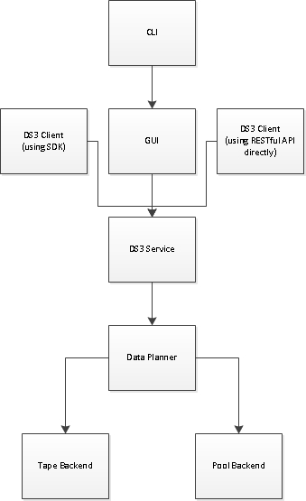

This document is intended to be read by any software engineer who is working with ABM, whether developing requirements for a component higher than the DS3 service or designing or implementing code solutions to meet the ABM requirements at or below the DS3 service. This document is also intended to be read by program managers and any other consumer that wants to understand ABM functionality that will be available to an end user, understanding that requirements in this document are UI-agnostic (e.g. this is not a GUI requirements doc), including docs and manufacturing. And last but not least, this document is intended to be used by DVT to develop test cases for ABM, with the understanding that this document does not include a scheduling roadmap, as noted below.

This document is not intended to enumerate UI requirements in the GUI or CLI, including but not limited to screen layout, action ordering in menus, or naming of new business domains, their attributes, or actions. Naming in this document refers to internal and API-level naming, which need not match exposed naming in the GUI or other DS3 service clients if, for example, marketing, executives, or others prefer a naming scheme different from the internal one. This document is permitted to specify some requirements (like recommended default values) for UIs and SDKs to use where it is important enough to denote, but such requirements will be sparse at best, and requirement documents for these components should be developed independently of this document.

This document is not intended to describe implementation details or designs, including but not limited to delegation of responsibilities between various internal components at or beneath the DS3 service, business domain structure definitions, or RPC API enhancements beneath the DS3 service.

This document is not intended to outline a roadmap or timeline as to when what will be done when. Sufficient to say, ABM will not be implemented in its entirety within a single release, but rather, over multiple releases, with basic functionality coming first and more complex functionality coming later. Specific requirements of what is coming when will live in the roadmap document, maintained by Barry Litt and Mark Paulson.

**  
**

# Terminology

**Black Pearl**: The marketing name for Bluestorm. Bluestorm and Black Pearl (BP) may be used interchangeably and are the same thing.

**Black Pearl Instance:** See Bluestorm instance.

**Blob**: A blob is a binary large object. Referring to its S3 object with an offset and length, a blob represents a piece of the data for an S3 object. An S3 object that is a folder or zero-length object has a single, zero-length blob associated to it; however, all other S3 objects have one or more non-zero-length blobs associated with it. Blobs are what are written to tapes and zpools, which allows an S3 object to be larger than any single tape or zpool.

**Bluestorm**: The engineering name for this product line that this spec is for.

**Bluestorm Instance:** A set of physical server nodes (one or more) that share the same namespace for buckets and objects which share the same physical resources such that every node in the instance is able to see all physical resources any other node in the instance can see. A multi-node instance is referred to as a clustered instance, whereas a single-node instance is referred to as a single-node instance, or as a simple instance.

**Bucket**: An S3 logical container for S3 objects. A bucket must be assigned to use a data policy. Multiple buckets can use the same data policy.

**Data Partition**: A tape partition or pool partition. Data partitions may be added to any number of storage domains (0, 1, or more). A data partition must be added to a storage domain for it to be used by Bluestorm.

**Data Policy**: A data policy defines data integrity policies, default job attributes, and persistence rules, which define where data should be persisted and for how long.

**DS3:** A Spectra-proprietary extension of S3, where both S3 and additional RESTful APIs are supported.

**DS3 Target**: A Bluestorm instance remote to the local Bluestorm instance that can be seen from and used by the local Bluestorm over the data path.

**Pool Partition**: A pool partition is a named collection of zero or more zpools.

**Job**: A job is the management container for I/O operations. A job consists entirely of reads or entirely of writes such that every read / write targets the same bucket. Write jobs create S3 objects in the targeted bucket. Read jobs get S3 objects from the targeted bucket.

**Persistence Rule**: A persistence rule is defined within the context of a data policy and targets a specified storage domain. It can be permanent, meaning that a copy shall be persisted in the specified storage domain at all times, or temporary, meaning that a copy shall be persisted in the specified storage domain for a given amount of time, and then it can be evicted from that storage domain. It may also be retired, meaning that no new data shall be written there.

**Replication Target**: A DS3 target or S3 target.**  
**

**S3:** Amazon S3 (Simple Storage Service) is an online file storage web service offered by Amazon Web Services. Amazon S3 provides storage through web services interfaces (REST, SOAP, and BitTorrent).

**S3 Target**: An S3-interfaced storage solution that can be seen from and used by the local Bluestorm over the data path.

**Storage Domain**: A storage domain is a named collection of one or more data partition / media type combinations. When a storage domain must allocate additional capacity, it must allocate an entire zpool or tape to itself out of the data partition / media type combinations that the storage domain is allowed to use.

**Tape**: A tape cartridge. When a storage domain needs to allocate additional capacity to itself from a tape partition, it must allocate an entire tape to itself.

**Tape Partition**: A tape partition is a physical tape library or a logical tape partition of a physical tape library. A tape partition contains a number of tapes and tape drives.

**Zpool**: A ZFS logical storage pool that is comprised of multiple physical rotating pools. When a storage domain needs to allocate additional capacity to itself from a pool partition, it must allocate an entire zpool to itself.

# Overview

The purpose of this section is to provide a high-level overview of ABM. Everything described in this section is covered later in the document, and with a higher level of detail.

## Introduction

The purpose of Bluestorm is to act as a DS3 gateway sitting in front of underlying storage, as shown below.

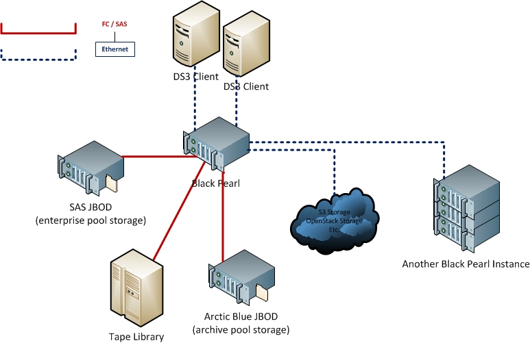

DS3 clients talk to Black Pearl in terms of DS3 object storage, where objects (think of objects as files and folders) reside in buckets (think of buckets as volumes), similar to Amazon’s AWS S3. The Bluestorm then deals with the underlying storage to write the data in compliance with the data policy that the bucket is configured to use.

Bluestorm provides value by abstracting all of the types of underlying storage into a simple, RESTful interface we call DS3. For example, instead of having to deal with the complexity of moving tapes around, etc. over FC or SAS, clients can communicate with Bluestorm over DS3 over Ethernet and let Bluestorm handle the complexities of tape.

Bluestorm shall support the following types of underlying storage:

1.  Tape libraries

2.  SAS DAS (enterprise pool storage; SAS direct-attached storage, either residing in a JBOD or in the main Bluestorm enclosure)

3.  Arctic Blue DAS (archive pool storage; SATA direct-attached storage, residing in a JBOD)

4.  Bluestorm (via DS3 targets)

5.  S3 and others (TBD)

## Data Path vs Management Path

In this document, we will refer to the data path and management path. These paths are network endpoints (e.g. the data path may have one IP address on one physical NIC, and the management path may have another IP address on another physical NIC).

The management path is used to configure and monitor the appliance. It is where the HTTP-based GUI can be accessed, as well as the SSH-based CLI.

The data path is the entry point to DS3, where I/O is performed and any other DS3 request can be made.

For example, the management path or data path could be used to setup data policies, buckets, etc. using the GUI and RESTful DS3 API respectively, but only the data path can be used to write objects into buckets.

## Buckets, Data Policies, and Persistence Rules

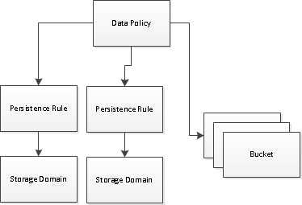

A data policy defines data integrity policies, default job attributes, and persistence rules, which define where data should be persisted. A data policy may be used by multiple buckets, but a bucket uses precisely one data policy. Note that a bucket must specify a data policy to use (this is not an optional attribute to specify) and changing the data policy for a bucket must follow strict rules described in detail later in the document.

A data policy consists of one or more permanent persistence rules, zero or more temporary persistence rules, and zero or more retired persistence rules. A persistence rule can be permanent, meaning that a copy shall be persisted in the specified storage domain at all times, or temporary, meaning that a copy shall be persisted in the specified storage domain under certain circumstances, and later that copy can be evicted from that storage domain. Existing permanent and temporary persistence rules may be “retired” so that the rule will not be applied for any new incoming data, but continue to retain data already persisted.

For example, referring to the diagram above, 3 buckets use a data policy. This data policy defines two persistence rules. Data is persisted in compliance with ALL persistence rules rather than ANY of the persistence rules, or in other words, data shall be persisted to every storage domain that there is a persistence rule for at the time the data is written, excepting retired persistence rules. Also, every persistence rule must target a unique storage domain (you cannot define multiple persistence rules within the same data policy that target the same storage domain).

If both persistence rules are permanent, that means that a copy shall be written to and maintained in both storage domains at all times (e.g. if a copy goes missing or is corrupted, the copy can be rebuilt from the good copy).

If one persistence rule is permanent and the other temporary, then a copy shall be written to and maintained in both storage domains until the retention period of the temporary persistence rule expires, at which point we will only maintain the single copy per the single permanent persistence rule.

If one persistence rule is permanent and the other retired, then a copy shall be written to only the storage domain targeted by the permanent persistence rule. No copy shall be written to the storage domain targeted by the retired persistence rule.

A persistence rule can point to a storage domain (meaning that the copy of data written for the rule will be persisted locally) or to a replication target, such as a DS3 target (meaning that the copy of data written for the rule will be replicated to the specified target rather than being persisted locally). If a local and replicated copy is desired, simply create a data policy with multiple permanent persistence rules – some pointing to storage domains and some pointing to replication targets.

Persistence rules that point to storage domains must specify the data isolation mode desired.

Persistence rules that point to replication targets must specify the replication conflict resolution mode desired.

Replication targets (unlike storage domains) are simple entities to understand and configure, and thus, will not be discussed further in the overview section.

## Storage Domains and Data Partitions

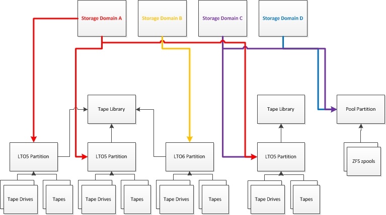

A storage domain is a named collection of one or more data partition / media type combinations. In the case of pool partitions, the media type is automatically inferred since a pool partition can only contain zpools of a particular media type. In the case of tape partitions, the media type must be specified by the user.

A storage domain contains one or more data partitions that it may allocate storage from. A data partition may be a member of zero, one, or more storage domains. Individual tapes and zpools in a data partition that are allocated to a storage domain are assigned exclusively to that storage domain. Individual tapes and zpools in a data partition not yet allocated to a storage domain are available to be allocated by any storage domain that contains the data partition as a member.

A tape belongs to precisely one tape partition. A tape drive belongs to precisely one tape partition. A tape partition belongs to precisely one tape library. A zpool may belong to zero or one pool partition. A zpool may be allocated to a storage domain provided that the zpool is a member of a pool partition that is a member of that storage domain. There are 2 types of zpools: enterprise SAS drives and consumer SATA drives. A pool partition may only contain zpools of a single type. A pool partition does not impose any physical location restrictions over the zpools it contains (e.g. a pool partition may contain zpools that span across JBODs).

For example, referring to the diagram above, we have the following storage domains:

1.  Storage domain A: LTO5 storage across all tape partitions

2.  Storage domain B: LTO6 storage across all tape partitions

3.  Storage domain C: Originally LTO5 storage on a particular library, but the customer wanted new data for that storage domain to go on pool, so it also includes a JBOD (pool partition)

4.  Storage domain D: Pool storage

If data must be persisted for storage domain A and the space needed is not already available on tapes already allocated to storage domain A, storage domain A shall allocate a tape out of one of the data partitions it can use. Once that tape is allocated, no other storage domain can use that tape. For example, if storage domain A selected a tape out of the LTO5 partition that storage domain C can use as well, then storage domain C cannot use that tape. Similarly, if storage domain C allocated a zpool in the pool partition to itself, storage domain D cannot use that zpool.

You should think of storage domains as providing storage isolation, or in other words, a storage domain is the mechanism by which you isolate some tapes and zpools from other tapes and zpools.

For example, if you wanted to have 2 copies of data for a particular bucket, you would use 2 different storage domains – each copy goes on a different storage domain. This ensures that one copy cannot live on the same tape or zpool as the other, since it would make no sense to have both copies on the same tape or zpool, which completely violates the need to achieve independence of faults. Furthermore, by isolating the storage in this manner, if we decide at a later time that we want the second copy ejected, we can eject it cleanly without migrating any data around since the first copy was already completely isolated from the second such that the set of media used by the first copy across all data is completely independent from the set of media used by the second copy across all data in the bucket.

Note that the guarantee in the example above is not necessarily made if we were to allow a user to specify that they want 2 copies in a particular storage domain, a request not supported by ABM. In this case, even if we guaranteed that both copies lived on different tapes or zpools for any single blob, we cannot guarantee that the set of media used by the first copy and second copy are completely independent, which significantly and adversely limits how the user can migrate or change this configuration down the road. This is why we require the copies to live in different storage domains.

You can imagine taking storage isolation to a greater extreme to provide even better fault tolerance in our example above by defining the two storage domains such that one uses one physical tape library and the other uses a different physical tape library. This would also improve availability since access to the data is not temporarily unavailable if a single tape library goes down. Similarly, you could define pool partitions such that each pool partition contains all the zpools of a particular JBOD, and then setup your storage domains so that no pool partition is used by more than one storage domain. That would ensure that no single JBOD failure could result in loss of access to the data.

## Putting it All Together

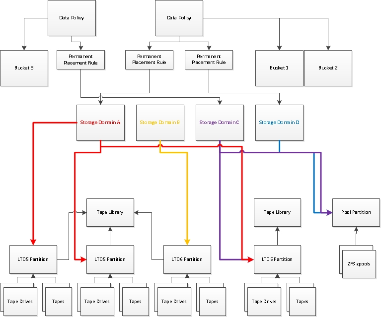

So now that we’ve covered all the parts, let’s look at the whole picture. In the example above, we have 3 buckets: bucket 1 and 2 will be persisted both on storage domain A and D. Bucket 3 will be persisted on storage domain C.

This means that, for buckets 1 and 2, we’ll maintain 2 copies at all times – one lives on LTO5 tape in any tape partition and the other lives on pool. For bucket 3, we’ll maintain a single copy at all times, living either on a specific LTO 5 partition or on pool. Note that this example is somewhat non-sensical for real customers, but it will allow us to demonstrate more complex behavior.

### Domain Model Associations and Multiplicities

The diagram below shows all the important domain models, their associations with each other, and the multiplicity behind every association.

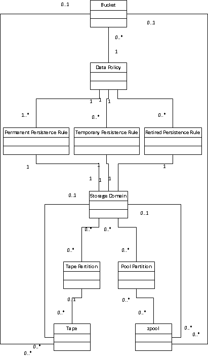

### End-to-End Configuration Example

Let’s walk through an example of how we would go through step-by-step configuring a brand new Bluestorm. Let’s assume that:

1.  We have two LTO 6 tape partitions: one is for Bluestorm and is named “BP” and the other is for another application and is named “Oracle DB” – both tape partitions are visible to the Bluestorm over FC and are physically connected to Bluestorm

2.  We have decided to create 2 buckets for engineering: Eng\_SCM and Eng\_Home\_Dirs
    
    1.  We want 1 copy of engineering data – one online
    
    2.  It is alright if data from one bucket is mixed with data from the other bucket on the same tape

3.  We have decided to create 2 buckets for finance: Finance\_Accounting and Finance\_Payroll
    
    1.  We want 2 copies of finance data – one offline and one online
    
    2.  We do not want data from one bucket to be mixed with data from the other bucket on the same tape

4.  We do not want any engineering data to be mixed with any finance data on the same tape

5.  We have just powered on the Bluestorm for the first time

So now that our Bluestorm is powered on, this is what we would do:

1.  Create a storage domain for engineering
    
    1.  Name it “Engineering ”
    
    2.  Set the object spanning policy to SPECTRA\_PROPRIETARY
    
    3.  Set the bucket isolation level to NONE
    
    4.  Set the write optimization to PERFORMANCE
    
    5.  Set the ejected media policy to DISALLOWED
    
    6.  Add as a member of the storage domain the BP tape partition for LTO 6 media

2.  Create a storage domain for finance
    
    1.  Name it “Finance Online Copy”
    
    2.  Set the object spanning policy to SPECTRA\_PROPRIETARY
    
    3.  Set the bucket isolation level to NEVER\_SHARE\_PHYSICAL\_MEDIA
    
    4.  Set the write optimization to PERFORMANCE
    
    5.  Set the ejected media policy to DISALLOWED
    
    6.  Add as a member of the storage domain the BP tape partition for LTO 6 media

3.  Create a storage domain for finance
    
    1.  Name it “Finance Offline Copy”
    
    2.  Set the object spanning policy to THIRD\_PARTY\_COMPATIBLE
    
    3.  Set the bucket isolation level to NEVER\_SHARE\_PHYSICAL\_MEDIA
    
    4.  Set the write optimization to CAPACITY
    
    5.  Set the ejected media policy to AUTO\_EJECT
        
        1.  Configure the storage domain to auto-eject every night at 3am
    
    6.  Add as a member of the storage domain the BP tape partition for LTO 6 media

4.  Create a data policy for engineering
    
    1.  Name it “Engineering”
    
    2.  Leave the defaults for default job attributes, data integrity policies, and rebuilt priority as is
    
    3.  Add a single permanent persistence rule for the “Engineering” storage domain

5.  Create a data policy for finance
    
    1.  Name it “Finance”
    
    2.  Leave the defaults for default job attributes, data integrity policies, and rebuilt priority as is
    
    3.  Add two permanent persistence rules
        
        1.  One for the “Finance Online Copy” storage domain
        
        2.  One for the “Finance Offline Copy” storage domain

6.  Create bucket for engineering
    
    1.  Name it “Eng\_SCM”
    
    2.  Set its data policy to “Engineering”

7.  Create bucket for engineering
    
    1.  Name it “Eng\_Home\_Dirs”
    
    2.  Set its data policy to “Engineering”

8.  Create bucket for finance
    
    1.  Name it “Finance\_Accounting”
    
    2.  Set its data policy to “Finance”

9.  Create bucket for finance
    
    1.  Name it “Finance\_Payroll”
    
    2.  Set its data policy to “Finance”

10. Start writing data

11. In the morning, eject and ship the tapes Bluestorm has queued for ejection

12. Continue writing data

13. In the morning, eject and ship the tapes Bluestorm has queued for ejection

14. Etc.

### Data Placement Example

Let’s walk through an example of how data could be placed. For simplicity, let’s say that every tape partition has 3 tapes and the user has created a single pool partition with 2 zpools. Each tape has 1TB capacity and each zpool has 5TB capacity. Let’s also name our LTO 5 partitions from left to right, so we have 3 LTO 5 partitions (\#1, \#2, and \#3).

1.  Bucket 2 has 1TB data written to it
    
    1.  Permanent persistence rule \#1
        
        1.  Tape \#1 in LTO partition \#3 is allocated to storage domain A
        
        2.  1TB data is written to this tape, it is now full
    
    2.  Permanent persistence rule \#2
        
        1.  Zpool \#1 in the pool partition is allocated to storage domain D
        
        2.  1TB data is written to this zpool, it now has 4TB space remaining

2.  Bucket 3 has 10GB data written to it
    
    1.  Permanent persistence rule \#1
        
        1.  Tape \#2 in LTO 5 partition \#3 is allocated to storage domain C
        
        2.  10GB data is written to this tape, it now has 990GB space remaining

3.  Bucket 1 has 1TB data written to it
    
    1.  Permanent persistence rule \#1
        
        1.  Tape \#3 in LTO partition \#3 is allocated to storage domain A
        
        2.  1TB data is written to this tape, it is now full
    
    2.  Permanent persistence rule \#2
        
        1.  Zpool \#1 in the pool partition is already allocated to storage domain D
        
        2.  1TB data is written to this zpool, it now has 3TB space remaining

4.  Bucket 3 has 10GB data written to it
    
    1.  Permanent persistence rule \#1
        
        1.  Tape \#2 in LTO 5 partition \#3 is already allocated to storage domain C
        
        2.  10GB data is written to this tape, it now has 980GB space remaining

5.  Bucket 1 has 10GB data written to it
    
    1.  Permanent persistence rule \#1
        
        1.  There is NO CAPACITY in LTO 5 partition \#3 available that storage domain A can get to
        
        2.  Tape \#1 in LTO partition \#2 is allocated to storage domain A
        
        3.  10GB data is written to this tape, it now has 990GB space remaining
    
    2.  Permanent persistence rule \#2
        
        1.  Zpool \#1 in the pool partition is already allocated to storage domain D
        
        2.  10GB data is written to this zpool, it now has 2990GB space remaining

6.  Bucket 3 has 10GB data written to it
    
    1.  Permanent persistence rule \#1
        
        1.  Tape \#2 in LTO 5 partition \#3 is already allocated to storage domain C
        
        2.  10GB data is written to this tape, it now has 980GB space remaining

## Example Configuration – Dual Copy, Single Tape Partition

This is how you would configure Bluestorm using ABM to achieve dual copy on a single tape partition.

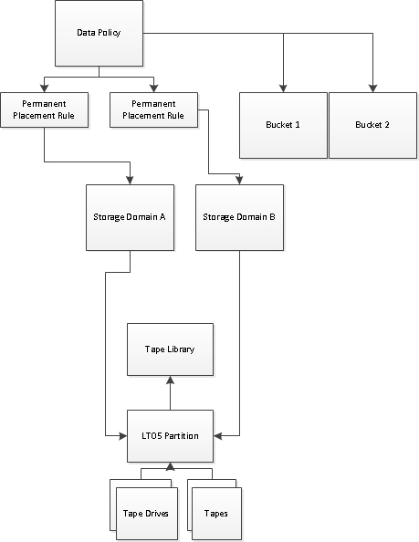

## Example Configuration – Triple Copy, Single Tape Partition

This is how you would configure Bluestorm using ABM to achieve triple copy on a single tape partition.

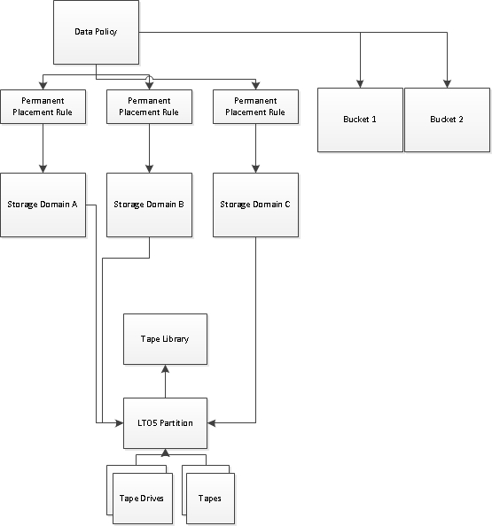

## Example Configuration – Dual Copy, Single Pool Partition

This is how you would configure Bluestorm using ABM to achieve dual copy on a single pool partition.

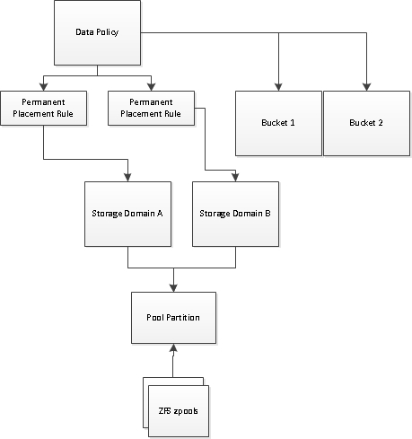

## Example Configuration – Dual Copy with Temporary Pool Copy 

This is how you would configure Bluestorm using ABM to achieve dual copy on tape plus a temporary pool copy.

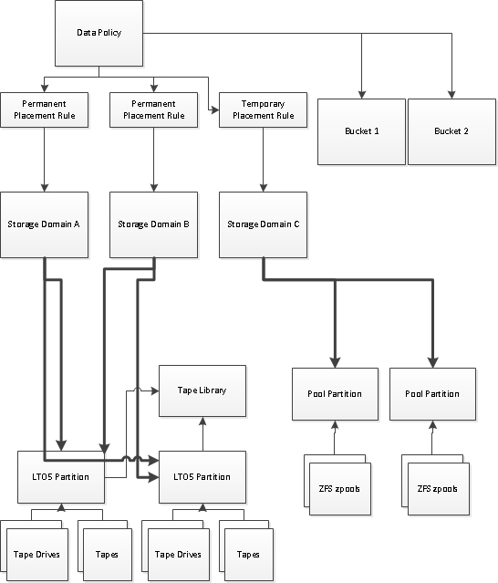

## Example Configuration – Dual Copy, Single Tape Partition, with DS3 Replication Target

This is how you would configure Bluestorm using ABM to achieve dual copy on a single tape partition, replicating to another Bluestorm instance.

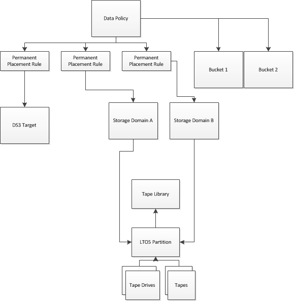

# Hardware Platform

> **STALE.** This section describes Black Pearl hardware as it stood in 2014–2015 (SuperMicro 2U/4U head-unit chassis, specific drive counts and slot layouts, RAID 10 cache on SAS, RAID Z2/Z3 archive zpools, Verde/Arctic-Blue product-line entanglement, etc.). Many specifics — drive sizes, SSD counts, head-unit chassis options, JBOD selection, supported tape drive families — have changed across hardware generations and are tracked separately in hardware specs and the platform team's documentation, not here. Read this section as historical/illustrative only. The data-management contracts in the rest of this document do not depend on the specific hardware described here.

A Black Pearl will consist of the following:

1.  A single head unit

2.  Zero or more JBODs for enterprise SAS drives connected to the head unit

3.  Zero or more JBODs for consumer-grade SATA drives connected to the head unit

4.  Zero or more tape drives connected to the head unit

5.  Zero or more enterprise-grade 400 GB SSDs

6.  10 or more enterprise-grade SAS drives (LFF)

7.  Zero or more consumer-grade SATA drives (LFF)

## Combined / Shared Platform

We have a combined / shared hardware platform and code base that supports multiple business product lines.

Combining Verde and Bluestorm on the same chassis creates numerous issues (both technical and human usability issues) that need to be addressed. Thus, we will not allow a DS3 product key to be installed if the Verde product key is installed. Similarly, we will not allow a Verde product key to be installed if a DS3 product key is installed. We may revisit this restriction at a later time to look into what would be involved to remove it.

## Data Persistence Backends

Bluestorm supports the following types of data persistence backends (places to store data long-term, excluding data caches):

1.  Tape

2.  Enterprise pool storage (on LFF SAS drives)

3.  Archive pool storage (on LFF consumer-grade SATA drives)

### Tape

Tape is the most cost-effective storage tier for large quantities of deep storage. Data may be stored across different types of media across multiple tape partitions and even physical tape libraries.

Tape provides an “air gap” to customers in that tapes can be ejected and physically stored in a protected, offsite location. Furthermore, if the primary data copy resides on pool, the customer also gains the advantage of having a completely different technology for backup copies on tape. A customer may want to consider double copy on tape for maximum protection. The second copy can reside in the library or stored offsite.

### Enterprise Pool Storage

Enterprise pool storage is not a cost-effective storage tier; however, it is useful as a temporary, high-performance storage tier.

### Archive Pool Storage

Archive pool storage is a cost-effective storage tier for deep storage, or as a temporary storage tier that’s higher performance than tape, but lower than the enterprise pool storage tier. Customers that want double copies to improve data protection may want to consider a copy on archive pool storage combined with a copy on tape.

Note that archive pool storage has restrictions surrounding its usage, due to the usage of consumer-grade SATA drives. These drives can only be power cycled so many times, and only so much data can be written/read to/from them per year. These restrictions limit how archive pool storage can be used. For example, it is not an appropriate medium to do frequent writes or reads from/to. This is part of why the enterprise pool storage tier exists.

## Head Unit

The head unit is a SuperMicro 2U or 4U chassis.

The 2U chassis has 12 slots (1 for the bezel, 11 remaining). The 2U chassis will contain 10 SAS drives. The database and cache will live on these 10 SAS drives on the same zpool, which will be configured in a RAID 10.

The 4U chassis has 36 slots (1 for the bezel, 35 remaining). The 4U chassis will contain 2N SSDs where N \>=1 in addition to 10C SAS drives where C \>=1. The database will live on the SSD drives, which will be configured in a RAID 10. The cache will live on the SAS drives.

There will be 2 default 4U configurations: the base model, which has 2 SSDs and 10 SAS drives, and the performance model, which has 2 SSDs and 20 SAS drives. SSDs are increased to meet the demands of higher object counts and not to drive increased throughput. SAS drives are added for the cache to meet the demands of increased throughput or higher cache capacity. The performance benefit of increasing the cache beyond 20 drives in a RAID 10 is minimal, and thus, not recommended. This means that a fully loaded 4U chassis could have 15 SSDs and 20 SAS drives, supporting both high throughput and high object counts (15 SSDs would scale to around 2B objects).

The database must live in the head unit. For example, for the 4U chassis, the SSDs must not be placed in an attached JBOD, but rather, in slots within the head unit.

The cache should live in the head unit whenever possible. For example, if enterprise pool storage is to be configured, SAS drives for the cache should live in the head unit, and the SAS drives for enterprise storage may go to the JBODs.

## SAS JBODs Connected to Head Unit

SAS JBODs are only required if additional slots are needed for SAS drives to support a larger Bluestorm cache, more drives for Verde NAS zpools, or Bluestorm enterprise pool storage zpools. Each SAS JBOD supports 45 drives. Drives for the database are strictly prohibited from residing in a JBOD. Drives for the Bluestorm cache should not be placed in a SAS JBOD, unless absolutely necessary. Drives for the Bluestorm cache may reside in a JBOD if either (i) so many SSDs are required in the head unit that there are insufficient remaining slots to place all drives for the cache in the head unit as well, or (ii) an extremely high-capacity cache is required (\>20 drives).

It is recommended that all SAS drives that will not be used for the Bluestorm cache be placed into JBODs and not the head unit, even if there is room in the head unit. This makes for simpler organization of the drives, making expansions simpler down the road, since cache and database expansions can usually be performed without having to relocate drives from the head unit.

## SATA JBODs Connected to Head Unit

SATA JBODs are only required if slots are needed for consumer-grade SATA drives to support Bluestorm archive pool storage zpools. A SATA JBOD supports up to 96 drives. Zpools on SATA JBODs will be created automatically.

RAID Z2 and RAID Z3 options are enumerated below (current plan is to go with RAID Z3 option).

### RAID Z2

1.  Groups of 24 drives
    
    1.  2 11-drive RAID Z2 zpools
    
    2.  2 spares that can be used by any zpool within the same physical enclosure as the spare

2.  Half-full 96-drive enclosure
    
    1.  4 11-drive RAID Z2 zpools
    
    2.  4 spares that can be used by any of these 4 zpools within the physical enclosure

3.  Full 96-drive enclosure
    
    1.  8 11-drive RAID Z2 zpools
    
    2.  8 spares that can be used by any of these 8 zpools within the physical enclosure

### RAID Z3

1.  Groups of 24 drives
    
    1.  23-drive RAID Z3 pool (20 data drives + 3 parity drives)
    
    2.  1 spare that can be used by any zpool within the same physical enclosure as the spare

2.  Half-full 96-drive enclosure
    
    1.  2 23-drive RAID Z3 zpools
    
    2.  2 spares that can be used by any of these two zpools within the physical enclosure

3.  Full 96-drive enclosure
    
    1.  4 23-drive RAID Z3 zpools
    
    2.  4 spares that can be used by any of these four zpools within the physical enclosure

The advantage of the RAID Z3 approach is that it minimizes the number of drives as overhead – 16 drives for 17% of the total number of drives.

The advantage of the RAID Z2 approach is (in order of criticality) that it:

1.  Makes each zpool allocation less monolithic with regards to logical pool operations (for example, full pools can take over a week to import on monolithically large RAID Z3 pools), management, and database lookups, improving scalability – especially for small objects

2.  Increases the number of global spares by 2X, thereby reducing the frequency of servicing

3.  Improves the granularity for storage domain zpool allocations (when a storage domain needs to allocate a zpool to itself, it gets a less monolithic entity, not carving out quite as much pool storage space, leaving more units of allocation available for other storage domains)

4.  Increases the duration a pool may go powered off on average since the pool is less monolithic, reducing the annual failure rate of the drives that much further, possibly further reducing servicing frequency.

5.  Improves rebuild times for every zpool

This is accomplished by increasing overhead from 16 drives to 24 drives (that’s an increase from 17% to 25% overhead).

When a spare is allocated to a degraded zpool, is rebuilt to, then the original bad drive in the zpool replaced with a healthy one, we should not rebuild back to the new drive to release the spare. Instead, it would be better to leave the spare allocated to the zpool, then make the replaced drive a spare. This would be more efficient, eliminating the need for a second rebuild.

Note that if there are no spares available to a zpool within that physical enclosure, it is disallowed to use a spare in another enclosure. This is primarily due to data isolation levels, where we need to know which drives and tapes data in a particular bucket has touched, so that that media can be physically destroyed, and the complexity that would arise from supporting a scheme where we would allow spares from other enclosures to be taken.

## Tape Drives Connected to Head Unit

Tape drives may be attached to a head unit via Fibre Channel (FC) or Serially Attached SCSI (SAS). Through the tape drives a head unit is connected to, the head unit will have access to see the tape partitions the tape drives reside in, and to:

1.  Discover which tapes are in each partition

2.  Discover which drives are in each partition

3.  Move tapes

4.  Perform other low-level commands to the tape library and its components

## Enterprise-Grade SSDs

SSDs may only be used for the Bluestorm database. The live data path database always lives on a RAID 10 zpool. Note that the management path database lives on the boot drive zpool, unlike the data path database. Also note that the data path database can scale to GBs or even TBs in size, whereas the management path database should always be very small (in the MBs).

The database is backed up to enterprise-grade SAS, using the same zpool that’s used for the cache. Note that the database backup ZFS volume must have both a quota and maximum size equal to each other to ensure that the cache does not shrink or expand dynamically as the data path database grows.

The database backup on SAS drives is backed up to tape or pool as described later in this doc via the database backup data policy.

## Enterprise-Grade SASs

SAS drives may be used for:

1.  The Bluestorm cache

2.  Bluestorm enterprise pool storage zpools

### Bluestorm Cache 

The Bluestorm cache is always created and initialized on first boot.

The Bluestorm cache, when the database does not live on SSD and must share the same zpool as the cache, is always RAID 10.

When the Bluestorm cache gets its own zpool out on SAS drives, we will default the cache to a RAID Z2 configuration using 10 drives, then expand the zpool by 10 drives at a time to consume as many drives as possible, up to 20. The Bluestorm cache’s RAID level is configurable between the default and RAID 10. The Bluestorm cache may be shrunk or expanded after its initial creation to free up drives for other uses in increments of 10 drives. Any hardware configuration with less than 10 drives for the cache will always be configured in RAID 10. RAID 10 delivers approximately 40% better performance over RAID Z2, whereas RAID Z2 delivers nearly twice the capacity over RAID 10. RAID 10 should be chosen for environments where sustained throughput matters. RAID Z2 should be chosen for environments where a large buffer to insulate clients against tape hardware problems is preferable, since a larger cache means that Bluestorm can ingress data for longer with nowhere to flush to cache out to.

Operations that shrink or destroy the Bluestorm cache require that the data path be safely quiesced and shut down. The shutdown API call on the data path allows a timeout to be specified, as well as a force flag. Disruptive cache operations should never use the force flag and should never use a long timeout – if the data path cannot be quickly shut down in a safe manner, the disruptive cache operation must not be performed and the failure reported to the user.

### Bluestorm Enterprise Pool Storage Zpools

Enterprise zpools can only be arranged in a finite number of configurations, as noted below. The user may configure there to be zero or more enterprise zpools of each allowed configuration.

An enterprise storage pool will report a valid mountpoint back to the data path front end at any time it is reported as a storage pool by the pool backend. The data path front end should be able to ls, write data to, and read data from this mountpoint immediately.

If a Bluestorm enterprise pool storage zpool is destroyed, the drives being used are released and may be used for another purpose.

#### Supported enterprise pool configurations

**10-drive RAID Z2**: The configuration that should be used in most circumstances, with 20% overhead and tolerant of 2 drive failures. Importing these pools when they are largely filled up is highly time consuming.

**2-drive Mirror**: A configuration that should be used for BP database backup (so that the pool can be imported rapidly when necessary since there won’t be a ton of data on it) or other data that either needs to be highly isolated (and is unable to leverage the capacity of a larger-capacity pool) or needs to be importable very quickly.

### Spares per Physical Enclosure

Any unallocated SAS drives should be used as spares for any zpool that degrades that contains SAS drives, provided that the degraded zpool is in the same physical enclosure as the spare.

A degraded zpool is never permitted to take a spare from another physical enclosure. This is for several reasons:

1.  Secure bucket isolation mode requirements stipulate that we keep track of every tape and disk drive that the data has ever touched. When you take recovery scenarios into effect, this becomes difficult to solve reliably if you don’t make the simplifying assumption that the only spares you could have ever touched are in the same enclosure.

2.  We don’t want to perform multiple rebuilds i.e. if a spare is needed, we want to take that spare and make it a permanent member of the zpool, which improves performance characteristics for rebuilds considerably. Having zpools span enclosures breaks fault isolation, decreasing overall system reliability and availability.

## Consumer-Grade SATAs

SATA drives may be used for:

1.  Bluestorm archive pool storage zpools

### Bluestorm Archive Pool Storage Zpools

Archive pool zpools are created automatically as aforementioned.

An archive storage pool will report a valid mountpoint back to the data path front end at any time it is reported as a storage pool by the pool backend. The data path front end should be able to ls, write data to, and read data from this mountpoint immediately.

Consumer SATA drives can only be written to so much before we void the warranty. Thus, any temporary persistence rule targeting consumer SATA drives will have a minimum persistence of 6 months.

Archive pool zpools cannot be explicitly deleted; however, they can be de-allocated from a storage domain. There is no guarantee as to when or even if the old data on the zpool from the old storage domain will be deleted, except that if compaction of the zpool becomes necessary, that that data will be deleted before any other data is considered for deletion.

# Tape Partitions

A tape partition is a physical tape library or a logical tape partition of a physical tape library. A tape partition contains a number of tapes and tape drives.

The tape partition will be configured outside of Bluestorm and must meet the following requirements:

1.  All tape drives in the partition must be able to read every tape in its partition
    
    1.  For example, you cannot mix LTO and TS tapes in a partition
    
    2.  For example, you cannot have any LTO 5 tapes in a partition with any LTO 8 tape drives

2.  There must be at least two tape drives in the partition
    
    1.  While Bluestorm will run on only one tape drive, some failure and recovery paths will stall if there is only one tape drive in a partition
    
    2.  Since tape drives can go bad, it is strongly discouraged to setup a partition with a single drive

3.  If any tape drive in a partition is able to write to a given tape in its partition, then all tape drives in that partition must be able to write to that tape
    
    1.  For example, if a partition has LTO 5 and LTO 6 tapes, it would be fine to have all LTO 6 tape drives, or all LTO 7 tape drives, but it would not be alright to have a mix of LTO 6 and LTO 7 tape drives since LTO 7 tape drives cannot write to LTO 5 tapes, whereas LTO 6 tape drives can
        
        1.  While it would be legal to have all LTO 7 tape drives, any LTO 5 media would be read-only in such a configuration (LTO can write back one generation and read back two generations, so an LTO 7 drive can write to LTO 6 and 7 media, and can read from LTO 5, 6, and 7 media)

4.  A tape partition cannot be shared across multiple consumers
    
    1.  Only a single Bluestorm instance may use a given partition
    
    2.  A partition being used by Bluestorm cannot be used by other non-Bluestorm applications

A tape partition failure will be generated if any of the above requirements are violated and Bluestorm is able to detect it.

The front panel should generally only be used for the purpose of physically removing tapes from EE slots, or physically inserting tapes into EE slots. Tape ejection (which will move tapes into EE slots) and onlining (which will move tapes out of EE slots into storage slots or drives) is done through Bluestorm and is discussed in greater detail in the Ejected Media Management (EMM) spec.

Any tape partition that is being used by Bluestorm should not have its tapes moved around by the tape library’s front panel at any time for any reason, unless the tape partition is in QUIESCED YES state. While the tape partition is quiesced, tapes can be moved around, and tapes or terapaks may be added into into the partition – whether they show up in EE or storage slots. Note that in r1.x (prior to tape partition quiesce support); using the front panel for anything other than the recommended use in the previous paragraph is strictly prohibited unless the Bluestorm is powered off.

Bluestorm will attempt to correct for violations of correct use stipulated above. In many cases, Bluestorm will auto-correct for these cases; however, it is also possible that a tape’s state will be corrupted by violating correct use. If this occurs, the front panel must be used to physically remove the tape from the library. Once the tape shows up as LOST, it can be re-inserted into the partition and the corrupted state will be corrected.

## Name and Serial Number

Each tape partition will have a serial number and name. Only the name can be changed by the user.

The serial number can be used to uniquely identify a tape partition and associate it with the Bluescale partition, as the serial number reported for a tape partition comes from the tape library.

The partition name comes from Bluescale as well (Bluescale supports having a customer-supplied partition name that is friendlier to use to identify the partition). Modifying a partition name in Bluestorm will result in an API call being made to Bluescale to modify the partition’s name.

Note that in order to accomplish the above; the tape backend will need to be enhanced to talk over the XML interface with Bluescale. This integration is necessary regardless of this single requirement due to many other requirements that mandate this XML communication, including but not limited to, getting error, state, and extended attributes for tapes, tape drives, partitions, and failures. This information is needed by the data planner, DS3 service, and Bluestorm GUI. GUI dependencies on XML information can likely be satisfied via existing communication mechanisms between the S3 server and the GUI, eliminating the need to perform this integration in multiple software components.

An example of a tape partition serial number that is reported from Bluescale is the following:

9114005126

## Partition State

Tape partitions can be in the following states:

NORMAL

OFFLINE

ERROR

A tape partition is OFFLINE if we can no longer see it. It is in state ERROR if we can see it and an error is reported by the tape backend for the partition. In all other circumstances, the tape partition is in state NORMAL.

If the partition goes missing:

1.  And the partition is referenced in some way by a blob or storage domain; its state will change to OFFLINE. When the partition comes back up, it will revert back to its previous state. Note that OFFLINE tape partitions can be removed explicitly by the customer, but that Bluestorm will not automatically do this in this case.

2.  And the partition is not referenced as aforementioned; the offlined partition will be summarily removed. If it comes back at a later time, we’ll re-add it as if we saw it for the first time.

## Partition Quiesced

See the “Partition and Replication Target Quiescing” section for requirements surrounding tape partition quiescing.

## Handling Destroyed Partitions

If a tape library is physically destroyed or damaged, it may be necessary to replace it with a new physical library. In this case, the media and/or drives will likely be moved from the offline tape partition into a new tape partition with a different serial number. We will need to re-associate storage domain partition memberships and tape-tape partition memberships to the new partition. This can be done without any special actions by going through the following steps:

1.  The new partition will come online in state QUIESCED
    
    1.  It does not matter if the partition does or doesn’t have tapes in it (they can be added initially or later)

2.  The new partition should be brought online, to come into state NORMAL

3.  The new partition should be added as a member to every storage domain that was using the destroyed partition with the same attributes / settings as the old partition

4.  The user must wait until every tape has been re-associated with the new partition (which will be very quick and does not require inspections to complete)

5.  Once all the tapes have been re-associated with the new partition, every storage domain that was using the destroyed partition should have that membership removed

Rather than requiring the user to go through this process manually, we will offer a “Replace Permanently Offline Partition” action. Using this action, the following steps will accomplish the same thing as above:

1.  The new partition will come online in state QUIESCED
    
    1.  It does not matter if the partition does or doesn’t have tapes in it (they can be added initially or later)

2.  The “Replace Permanently Offline Partition” action should be invoked on the new partition
    
    1.  We will automatically re-associate all tapes, tape drives, storage domains, etc. from the old partition to the new one
    
    2.  The user should be prompted as to whether or not they want to bring the partition online if it’s quiesced

## Handling Partitions Bluestorm Should Not Use

Optimally, the customer has configured his FC or SAS network so that tape partitions, drives, etc. that Bluestorm should not use are not visible to Bluestorm. This can be accomplished using zoning, which is a way to control which initiators can see which devices.

If the customer has not or is unable to configure his FC or SAS network as aforementioned, the customer can achieve a similar result by leaving tape partitions Bluestorm shouldn’t use in the QUIESCED state once they come online and become visible in Bluestorm and never add those partitions to any storage domains.

All the tapes and tape drives in any tape partition that is not in the QUIESCED state may be used by Bluestorm at any time. Even if there are no active I/O requests, Bluestorm may still use tapes and drives to perform inspections and other tasks. Attempting to use tapes or tape drives in such partitions outside of Bluestorm is strictly prohibited (**WARNING**: This cannot be enforced by Bluestorm due to lack of underlying support from the library, so the customer is responsible for complying with this requirement). This includes (but is not limited to) explicitly moving tapes in the library using Bluescale, or allowing other applications to use tape drives in the tape partition.

## Media Densities

Unlike LTO media, TS media can be formatted in a number of different densities, depending on the TS media and drive being used to format the TS media.

For example, TS1140 tapes have a capacity of 4TB when formatted by a TS1140 drive; however, if formatted by a TS1150 drive, the tape can either be formatted in a TS1140 drive style yielding a capacity of 4TB, or be formatted in a higher-density format to have a capacity of 7TB, but in this higher-density format, only TS1150 drives can read the tape.

### Media Density Directives

Users will be able to configure any number of media density directives. A density directive applies to a particular tape partition and includes:

1.  The media type the compatibility mode should apply to

2.  The tape drive type that tapes must be formatted to target (the density)
    
    1.  Tapes must be formatted in the highest density format that the specified tape drive type can support

For example, a user could create a media density directive for TS\_JC media to use TS1140 density. In this example, TS1150 drives will handle TS\_JC tapes as follows:

1.  If the tape is blank and unformatted, it will be formatted in the low-density format

2.  If the tape is blank and formatted in the low-density format, it will be left alone

3.  If the tape is blank and formatted in the high-density format, it will be left alone; however, if the user explicitly asks to format the tape, it will be formatted in the low-density format

4.  If the tape is non-blank and formatted in the low-density format, it will be left alone

5.  If the tape is non-blank and formatted in the high-density format, it will be left alone

Without the media density directive as described above, TS1150 drives will handle TS\_JC tapes as follows (this is the default behavior):

1.  If the tape is blank and unformatted, it will be formatted in the high-density format

2.  If the tape is blank and formatted in the low-density format, it will be left alone; however, if the user explicitly asks to format the tape, it will be formatted in the high-density format

3.  If the tape is blank and formatted in the high-density format, it will be left alone

4.  If the tape is non-blank and formatted in the high-density format, it will be left alone

5.  If the tape is non-blank and formatted in the low-density format, it will be left alone

Note that if a user created a media density directive for TS\_JC media to use TS1150 density, the default behavior described above is what would occur. Furthermore, TS1140 drives would be unable to format TS\_JC media since they are not capable of formatting the tape at the highest density that a TS1150 drive supports.

The data path will send the desired density down (which is null if there is no directive specifying an explicit density) to the tape backend if a directive is configured for that partition and media type and rely on the tape backend to decide how to format the tape based on the specified density. If null is sent down since there is no directive, the highest density possible shall be used.

If the specified density is nonsensical or otherwise invalid, the tape backend shall throw an error back to the data path front end, which will result in a tape failure being generated explaining to the user what the error is.

## Data Compression

Tape drives will always have compression enabled. In this mode, tape drives detect as they’re writing data if the data being written is compressible. If the data is compressible, it will be compressed. Else, it will not be. This determination is completely automatic and we will not have any configurable params that allow a customer to tune or disable data compression.

# Pool Partitions

A pool partition is a named collection of zpools.

Note that pool partitions and zpools are non-ejectable. This is because the JBOD we plan to use for pool partitions does not provide the nice, hot-swap architecture we have with Verde (you cannot simply pull the drives from the front or rear in hot-swap sleds while the unit stays up). Furthermore, even if that weren’t an issue, ensuring the customer doesn’t pull the wrong drives is unreliable at best.

## Name

Each pool partition will have a user-supplied name. This name can be changed at any time by the end user. The name is required and must be non-null and non-empty.

## The Pool Backend

Zpool creation will be an activity completely outside of the front end and will be driven via the pool backend.

The reporting of zpools, taking ownership of zpools, etc. will be supported in an RPC manner similar to how the data path front end integrates with the tape backend for those operations.

Furthermore, the pool backend will take on all locking responsibilities to ensure that data path requests made concurrently with other user-driven requests are transactionally and atomically correct. For example, if the data path attempts to allocate a zpool to a storage domain at the same time a user tries to delete the zpool, the pool backend must either (i) fail the user delete request, or (ii) fail the data path allocate request, and it cannot allow any part of the failed request to succeed or commit changes to the system that would result in a final, incorrect or inconsistent state.

Since the pool backend is responsible for reporting the status of all zpools, it is implied that the pool backend will manage all zpool allocations (automatic or explicit), zpool discovery, etc. The data path front end is oblivious to any and all of these operations and will rely on the pool environment reported by the pool backend.

The datapath front end will directly write and read data to/from pools, and may perform other pool operations (the pool backend, unlike the tape backend, is not responsible for performing any I/O, data verification, etc.). These operations require that the pool be powered on. Consequently, the pool backend must supply powerOn and powerOff RPC API capabilities. This will enable the datapath front end to control the power state of all zpools.

The datapath front end will be responsible for keeping track of which pools must be powered on vs which can be powered off for the purposes of performing said I/O and other pool operations. The front end shall send down power command as frequently as the power needs change for a pool, even if that pool cannot or should not be powered on and off so frequently. If there are hardware reasons for throttling power events, those must be supported by the pool backend. For example, the pool backend may choose to ignore powerOff commands for a day so that if a powerOn command comes in before then, it can immediately return success and not have had to power down and back up the pool.

The design and internal requirements of the pool backend are beyond the scope of this requirements spec, provided that the functional and API requirements defined herein are met.

## Zpool State

Zpools can be in the following states:

NORMAL

LOST

FOREIGN

IMPORT\_PENDING

IMPORT\_IN\_PROGRESS

As a separate attribute, pools can be in the following health modes:

OK

DEGRADED

If the zpool goes missing, its state will change to LOST. When the zpool comes back up, it will transist back to a non-LOST state (e.g. if the pool is NORMAL, it will change to normal; if it is foreign, it will change to FOREIGN).

If the zpool becomes degraded, its health state will change to DEGRADED. When the zpool returns to a normal state, it will revert back to OK.

## Partition Quiesced

See the “Partition and Replication Target Quiescing” section for requirements surrounding pool partition quiescing.

## Media Type

Pool partitions may only contain zpools of the same type. Types supported are:

ARCHIVE

ENTERPRISE

## Handling Destroyed JBODs

If a JBOD is physically destroyed or damaged, it may be necessary to replace it with a new JBOD. In this case, the pool drives will likely be moved from the dead JBOD into a new JBOD with a different serial number. We need to support moving the drives from the failed JBOD into a new JBOD.

This handling is done automatically since each zpool has a UUID identifier that never changes. So, even if the zpool’s host id changes from performing a zpool import (which would only happen if the drives were moved from a JBOD attached to one Bluestorm node to another), the identifier does not change, and thus, once the drives are powered on inside a JBOD that is attached to the Bluestorm, we will automatically identify that that zpool has come online within the new JBOD. Thus, for pools, no re-association or action of any kind is required from the user via the API to handle destroyed JBODs.

## Pool Partition Members

A pool partition may have zpools added to it as members at any time.

### Pool Partition Member Inclusion

The user may select zpools and include them into a pool partition at any time. A zpool may belong to zero or one pool partition.

### Pool Partition Member Exclusion

A zpool may only be excluded from a pool partition if no data migration is required and no storage domain membership contracts are violated. Or, specifically, a zpool can only be excluded from a pool partition if and only if the zpool is not actively assigned to (allocated by) a storage domain

## Delete Pool Partition

A pool partition can only be deleted if it contains no members.

## Data Compression

ZFS detects as it’s writing data if the data being written is compressible. If the data is compressible, it will be compressed. Else, it will not be. This determination is completely automatic and we will not have any configurable params that allow a customer to tune or disable data compression.

When the data isn’t compressible, the performance impact of writing it to a compressed destination is negligible. Using LZ4, we can compress data to the tune of at least 500MB/sec per CPU core, and we can decompress data to the tune of at least 1500MB/sec per CPU core.

On the other hand, when the data is compressible, we achieve both a capacity savings as well as a performance improvement. The performance improvement is a little counter-intuitive, but essentially, we can decompress data faster than we can read uncompressed data from a pool. Consequently, we actually observe improved bandwidth when reading compressed data from a pool. Furthermore, we improve the life of our consumer-grade SATA drives by writing and reading less data to/from them.

Finally, by approaching compression for pools in a manner similar to tape, we can create a consistent message to customers of compressing data as necessary automatically.

# DS3 Targets

A DS3 target is a Bluestorm instance remote to the local Bluestorm instance that can be seen from and used by the local Bluestorm over the data path, as shown below.

Communication made with the DS3 target will occur entirely over the DS3 API over the data path – the same way any DS3 client communicates with Bluestorm. This means that the local Bluestorm and DS3 target do NOT share the same database, nor do they have access to directly query, update, or connect to the other’s database in any way.

No resources visible to the local Bluestorm may be shared with the DS3 target. Or in other words, DS3 targets are NOT to be confused with a “local clustering solution” to enable performance scale-out, resource sharing between multiple nodes, etc.

The diagram below shows an example configuration using DS3 targets. In this case, note that no single tape partition is used by both BP instances. For the tape library both BP instances can see, BP instance A uses partition 2 and BP instance B uses partition 1.

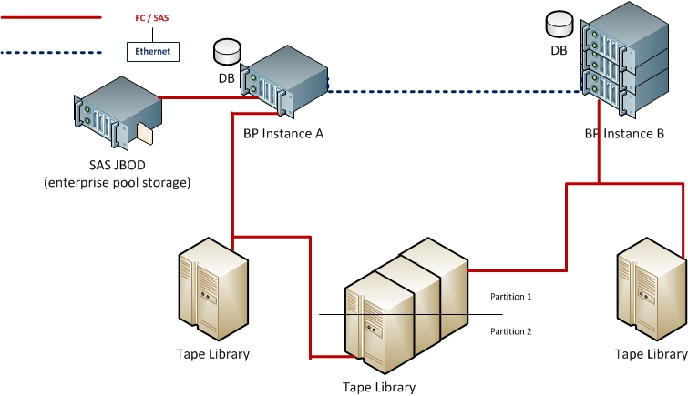

The most common use case of DS3 targets will be to replicate bi-directionally between 2 sites, as shown below.

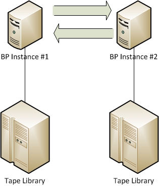

In this configuration, both BP instances will contain a copy of the data at its site. Clients will be able to talk to either BP instance to get or put data and will have the feel of a global namespace shared between both BP instances, since once data is written to BP instance \#1, it is replicated to BP instance \#2, and once data is written to BP instance \#2, it is replicated to BP instance \#1. This replication is asynchronous and does not require a low-latency networking pipe.

When data is written to BP instance \#1, the corresponding PUT job for the data is not completed until the replication is completed.

DS3 targets can be used for more than 2 sites, as shown below. In general, to achieve a global namespace feel across N sites, every site should be configured to know about and replicate to all N-1 other sites, as shown below.

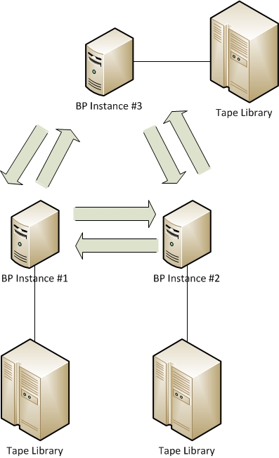

While the most common use case of DS3 targets will be to replicate bi-directionally between all sites, there may be cases where this is undesirable. For example, consider the case where we have two geographic sites as shown below. Both BPs in site B are within close physical proximity – at least sufficiently close to where the network pipe between them is of no meaningful cost to use. On the other hand, data movement between site A and site B is expensive. Site B may have 2 BPs rather than a single BP making dual copies if a customer wants to improve availability of their BP solution by having site B have active/active targets. It may also be because these instances are in separate buildings and the two tape libraries cannot be attached to the same BP over FC. In this situation, we only want one replication path between Site A and Site B, rather than having every site replicate to each other.

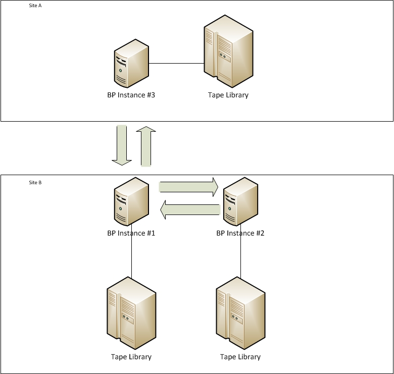

Finally, consider the case where site A only cares about the data they produce from that site. In this case, it may be desirable to have uni-directional replication where site A replicates to site B, but site B does not replicate to site A.

## ID

The ID of the DS3 target shall be the target’s instance ID. Each Black Pearl instance must have a unique identifier that is not tied to the system serial number of physical platform. This is for several reasons, including:

1.  Clustered BP instances will have multiple nodes and serial numbers

2.  A BP instance could be restored upon a box with a different serial number

Furthermore, note that there must be a mechanism to reset a BP instance’s instance identifier. Resetting the instance identifier is only necessary in rare circumstances where there are two branches of an instance running at the same time. One of the two branches must have its instance identifier reset if the two instances are to replicate between each other.

The most common occurrence of this is when one instance is initially configured with dual copy where one copy goes on one library and the other copy goes on the other, then a new Black Pearl is added and one library and the new BP moved to another physical location. In this case, both BPs would start with the same database and each would have the persistence rule and storage domain for the remote library converted to a replication rule. This requires that one or both sites have their instance identifier reset first.

## Name

Each DS3 target will have a user-supplied name. This name can be changed at any time by the end user. The name is required and must be non-null and non-empty.

## State

DS3 targets can be in the following states:

ONLINE

OFFLINE

## Data Path

In order for a Bluestorm to communicate with a DS3 target, the local Bluestorm must be able to see the remote Bluestorm’s data path. The data path configuration of the target may be changed at any time, but only if the source can see the target with the changes being made.

### Data Path End Point

The IP address or DNS name for the data path of the remote Bluestorm.

### Data Path Port

Optional. The port to connect to for the target’s data path.

If null, HTTP connections will be attempted over port 80 and HTTPS connections over port 443.

### Data Path HTTPS

If true, HTTPS connections will be used. Else, HTTP connections will be used.

### Data Path Proxy

Optional. If specified, the specified proxy will be used to connect to the target.

### Data Path Verify Certificate

If true and HTTPS is enabled, the SSL certificate of the target will be fully validated. If the certificate is not trusted or is problematic in any way, it will not be honored.

## Target Quiesced

See the “Partition and Replication Target Quiescing” section for requirements surrounding DS3 target quiescing.

## Permit Going out of Sync

By default, local actions taken that must be replicated will fail if replication to the target(s) isn’t possible. This prevents targets from going out-of-sync with each other; however, there may be some circumstances where an administrator may temporarily need to permit a target to go out-of-sync, in order to operate in a full capacity locally while one or more targets is downed for a prolonged period of time.

## Default Read Preference

A DS3 target can be used to read data into cache, as an alternative to going to local pool / tape storage to read the data. A DS3 target cannot be used to verify data, as an alternative to verifying the data locally, so the read preference only applies to GET jobs.

### Understanding Read Preferences

For example, if a given DS3 target stores its data on enterprise pool and moving large data from the DS3 target to the local Bluestorm isn’t a problem, the read preference for that DS3 target should be high (perhaps the local Bluestorm should go to the DS3 target for reads prior to going to its own local tape storage). On the other hand, if the DS3 target stores its data on tape, or if it is expensive or otherwise problematic to service large data reads from the DS3 target to the local Bluestorm, the read preference for that DS3 target should be low (perhaps the local Bluestorm should go to the DS3 target for reads only as a last resort).

Keep in mind that any time a GET must be serviced from a DS3 target, that resources are being utilized on both DS3 instances, which may adversely affect overall throughput capabilities.

We prioritize how reads are serviced as follows:

1.  Local cache

2.  Enterprise pool storage

3.  Archive pool storage

4.  Non-ejectable tape

5.  Ejectable tape

The read preference may be:

MINIMUM\_LATENCY

AFTER\_ONLINE\_POOL

AFTER\_NEARLINE\_POOL

AFTER\_NON\_EJECTABLE\_TAPE

LAST\_RESORT

NEVER

In most circumstances, MINIMUM \_LATENCY, LAST\_RESORT, or NEVER should be used.

### Minimum Latency Read Preference

MINIMUM \_LATENCY should be used whenever (i) the cost of the network link to the target is of no cost, (ii) minimizing latency of servicing GET and VERIFY jobs is paramount, and (iii) the network throughput to the target is much higher than the tape backend throughput (for example, if the network link to the target is 1gbps, but the tape backend consistents of 8 LTO 7 drives, it is very possible that it would be faster to service requests locally, even though we must go to tape, since the pipe to the tape backend far exceeds that to the target).

In this mode, the target will be analyzed for where the data resides. If, for example, the source has the data on tape, but the target has the data on pool, the target will be used to service the request. If however, the source and target both have the data on pool, the source will be used to service the request.

### After Online Pool Read Preference

Unless data is available locally on cache or online pool, the DS3 target will be used to read the data if possible.

### After Nearline Pool Read Preference

Unless data is available locally on cache, online pool, or nearline pool, the DS3 target will be used to read the data if possible.

### After Non-Ejectable Tape Read Preference

Unless data is available locally on cache, online pool, nearline pool, or non-ejectable tape, the DS3 target will be used to read the data if possible.

### Last Resort Read Preference

LAST\_RESORT is the default since it should be used in most circumstances. Specifically, LAST\_RESORT is usually the best choice when (i) the cost of the network link to the target has some non-trivial cost, or (ii) it is desirable to maximize overall system throughput at the cost of potentially increasing latency of individual requests, or (iii) the target and source have homogeneous storage types (e.g. both persist data to tape), or (iv) the local data persistence store has bandwidth that exceeds the network bandwidth to the target.

In this mode, the target will only be used to service a read request as a last resort (if it cannot be serviced locally).

### Never Read Preference

NEVER should be used whenever the target should never be used to service GETs or VERIFYs. This may make sense when (i) the cost of the network link to the target is very high, or (ii) for data integrity verification purposes, the administrator wants to ensure that all GET and VERIFY requests can be serviced locally.

In this mode, the target is never allowed to service a read request.

### Per-Bucket Read Preferences

Buckets may optionally be configured with a read preference different from the default configured on the DS3 target, for circumstances where some buckets may be persisted on different media compared to different buckets.

For example, buckets A and B may both get replicated to a given DS3 target, but A could be written to pool and tape, whereas B could be written to tape only. In this case, we may want a higher read preference for bucket A compared to B, to avoid reading off tape when possible.

## Access Control Replication

Local access control changes can be replicated to a DS target. The following replication levels are possible:

NONE

USERS

FULL

### NONE

In the NONE replication level, no access control dao types will be replicated to the DS3 target.

### USERS

In the USERS replication level, user creation, modification, and deletion will be replicated to the DS3 target. For example, secret key re-generation, user deletion, and user creation will all be replicated. If a change cannot be replicated to every target, the change will fail and not be made locally.

Note that the USERS replication level is more powerful than it may appear to be when combined with implicit bucket owner requirements. Specifically, consider the case where a new user and bucket get created on BP A and USERS replication is being used to BP B. When the user gets created on A, it gets replicated to B. Then, when the bucket gets created on A, the bucket gets created on B under the user previously created on B. Furthermore, this bucket will have the new user as the owner with a bucket owner ACL on both A and B. The only time the access control effectively replicated to B is inaccurate is when non-default bucket ACL access must be defined, which is not the norm. USERS replication will also work seamlessly in non-default bucket ACL access cases where non-default bucket ACL access must be granted via global bucket ACLs (since the ACL applies across all buckets).

### FULL

In the FULL replication level, user, group, and bucket ACL creation, modification, and deletion will be replicated to the DS3 target. If a change cannot be replicated to every target, the change will fail and not be made locally.

If the change being made does not apply to the target (for example, the bucket does not exist on the target), then the change shall not be replicated.

Note that, in the FULL access control replication level, data policy ACLs are not replicated. This is because data policies are specific to each BP and are not shared.

The FULL access control replication level requires significantly increased permutative complexity and will likely never be supported in a product release. This is largely due to the USERS replication level generally being sufficient for access control replication.

### Replicated User Default Data Policy

A DS3 target may optionally specify a data policy to use as the default data policy for any users replicated to the target. If this isn’t specified, we will replicate users with no default data policy. For example, even if a local user has a default data policy, if the replicated user default data policy isn’t configured, the user created on the target will have no default data policy.

Note that the replicated user default data policy is a free-typed field, meaning that the user can specify a data policy that doesn’t exist, and that the configuration of a replicated user default data policy on the source does not prohibit deletion of that data policy on the target, nor does deletion of said data policy on the target replicate any changes back to the source. If the replicated user default data policy is invalid at the time we attempt to create a user, an error shall be raised that must be addressed.

## Administrator Credentials

DS3 targets must have administrator credentials to operate properly. Credentials for a DS3 target include:

1.  User logon name or authorization id

2.  User secret key

Administrator credentials are used to configure and maintain the target relationship. They are not used for user-driven replication operations.

For example, when registering a replication target, that target may optionally be paired back with the source such that the source points to the target and the target points to the source (enabling bi-directional replication). The administrator credentials are used to perform this pair back.

While either the admin user login name or authorization id will be accepted for the admin user identification, the authorization id will always be reported. Specifically, credentials will be attempted assuming the identification is the authorization id first, then, if that fails, we will convert the identification to an authorization id assuming the identification was the user’s name and retry.

## Replication Credentials

Data replication shall not use the administrator credentials, but rather, will use other credentials. For example, a user that creates a PUT job that must be replicated will need to have that PUT job replicated to the target; however, the administrator credentials cannot be used for this.

By default, the user’s credentials on the local system will be passed through to the target (pass-through authentication). The administrator may however configure mapped authentication, as described below.

### Pass-Through Authentication

All data replication operations shall use pass-through authentication. With pass-through authentication, credentials used by a DS3 client on the local Bluestorm are used for the DS3 target. For example, if user bob creates a PUT job where data in that job must be replicated to a DS3 target, bob’s credentials on the local Bluestorm shall be used for the remote Bluestorm.

If user bob does not exist on the DS3 target or if the secret key is different between the DS3 target and local Bluestorm, an error will be generated and the job will not complete until the credentials are fixed to match, since we will not be able to meet the requirements of the data policy to replicate the data to the DS3 target.

Usually, the secret key is auto-generated by the system and returned; however, Bluestorm must also provide a mechanism to configure the secret key. This mechanism must be used in conjunction with pass-through authentication mode to permit the creation of users with the same secret key on different Bluestorm instances.

### Automatic Creation of Buckets

If the bucket being written to locally does not exist at the DS3 target, the bucket will be created automatically using pass-through credentials determined as dictated herein.

If the bucket cannot be created at the DS3 target since a data policy to use at the DS3 target cannot be determined implicitly (if the user used at the DS3 target doesn’t have a default data policy defined, and the user is permitted to use a number of data policies other than 1), an error will be generated and either the bucket will need to be created manually at the DS3 target, or the user at the DS3 target will need to be modified so that a data policy can be determined implicitly to allow the local Bluestorm to create the bucket at the DS3 target automatically.

Note that data replication rules can override the default behavior aforementioned for determining the data policy to use for any newly-created buckets (see that section for further details).

## Register DS3 Target

In order to create a DS3 target, we must confirm that we can communicate with that DS3 target. When registering a DS3 target, pairing the target back to the source is optional. The same BP instance cannot be registered multiple times.

If a DS3 target has its instance identifier reset after it’s been registered on other BPs, the replication link will forever become invalid and must be deleted and re-created.

## Delete DS3 Target

A DS3 target can only be deleted if it is not in use by any data policies.

## Target Job Priority

When jobs are created on a target, the priority of that job will default to the priority of the local job.

## Clock Synchronization

DS3 targets must have clocks that are synchronized within 10 minutes of the source.

Note that all times are in UTC to avoid issues with different time zones.

## Creation Date Synchronization

Normally, the creation date is set once an object has been entirely uploaded to cache. This works fine for a single DS3 instance; however, in replicated environments, we want to ensure creation date consistency across all DS3 instances.

## Data Deletion

Deletes that take place inside a bucket are not part of a job, and thus, are not replicated to any targets by default. If the user desires to delete data and replicate that deletion to all the targets, the REPLICATE HTTP query parameter must be used with the delete request being made.

## DS3 Out Structure

The blob structure of the source shall be identically maintained on the target. All blob IDs, object IDs, and any other identifier on the source that is persisted to media (e.g. tape or pool) shall be preserved on the target and persisted with the same values on media on the target.

## Compatibility across Multiple, Differing Versions

In order to mitigate risk and dramatically reduce the test and verification permutative complexity for DS3 targets, a target will only be able to be used by a source if the target is running the exact same software version as the source.

### Registering an Incompatible DS3 Target

Any attempt to register a DS3 target incompatible due to it having a different software revision will result in an error message stating so.

### Communicating with a Now-Incompatible DS3 Target

Any DS3 target registered while it was compatible that became incompatible due to either (i) the source revision changing, or (ii) the target revision changing, will be reported as OFFLINE. Furthermore, a target failure and notification shall be generated stating the software incompatibility.

### Upgrading Multiple DS3 Instances that Replicate with Each Other

In order to upgrade multiple DS3 instances that replicate with each other to a newer software version, the following steps should be taken:

1.  Ensure that no DS3 instances are running any active jobs

2.  Upgrade all DS3 instances in any order desired (at the same time or otherwise)

3.  Before running any I/O, ensure all DS3 instances have been upgraded

## Verify Target

There are 2 verify commands that can be performed on a target: standard and full.

### Standard Verify

A standard verify ensures that we can communicate with the DS3 target as it is configured, and that the admin credentials we have for it are valid on the target.

Standard verifies are designed to complete quickly, performing only basic validations to ensure connectivity.

Note: If we don’t have clock synchronization with the target, the short verify will fail since we aren’t allowed to communicate with the target.

### Full Verify

A full verify does everything a standard verify does, plus verifies that all content we expect to reside on the target does in fact reside on the target. Any missing data will result in recording bad blobs requiring the user to confirm blob loss.

As a part of full verification, we do not read the data or verify the data to ensure it can be read and has not been corrupted or tampered with. This is different from pool and tape, where we support verify media commands that do exactly that. For targets however, we do not support these “verify media” style commands. If this level of verification is desired, it must be performed on the target itself.

### Verify Jobs

Verify media commands aren’t supported for DS3 targets, nor can verify jobs use DS3 targets. For example, if you wanted to verify the contents of a bucket on the target, you cannot create a verify job on the source, since that verify job must be serviceable locally on the source. Rather, a verify job should be created on the target, which will be serviced locally on the target.

## Replication Conflict Resolution and Force Flag Usage

Unlike import operations, there is no replication-specific conflict resolution. What this means is that only the data policy versioning policy can be used to resolve conflicts.

For example, assuming two bi-directionally replicating DS3 instances A and B, if an object M1 is written to A, then replicated to B, then an object M2 is written to B (M2 has the same name and resides in the same bucket as M1), the creation and replication of M2 will fail unless KEEP\_LATEST is the versioning policy on both A and B.

To avoid creating replication conflicts, a PUT job that requires replication will fail to be created if the creation of the objects cannot be performed upfront on all targets the PUT job must be replicated to. This upfront creation ensures that we’re able to safely create, replicate, and complete the PUT job everywhere.

To override the aforementioned safety mechanism, the force flag can be used when creating the PUT job. Alternatively, the “always force PUT job creation” flag can be set on the data policy. The latter approach is likely more useful, since it permits clients to be completely unaware of this force flag.

It is strongly discouraged to use the force flag when creating PUT jobs on multiple DS3 instances replicating with each other at the same time, as this is the easiest way to run into replication conflicts. If possible, it is best and safest to never use the force flag when creating PUT jobs. It may however be necessary to temporarily enable the “always force PUT job creation” flag if the network link between replicating DS3 instances goes down and the user needs to be able to start putting data and cannot wait for the link to come back up. Again, if possible, it is safer to have the client wait until the link comes up so that the PUT job can be created without the force flag, ensuring there is never any replication conflict.

Let’s take a look at how a replication conflict can occur in our bi-directional replication example we used earlier between A and B…

Assuming the force flag isn’t used and the network link is up between A and B, assume a client writes M1 to A. The job successfully creates, but before it can be uploaded to A, another client writes M2 to B. Assuming KEEP\_LATEST is the data policy for both A and B, the PUT job for M2 will also succeed. The reason why is that the PUT job for M1 resulted in M1 being created as an object on both A and B with version number 1. When M2 was written to B, this resulted in M2 being created as an object on both A and B with version number 2. M2 is registered as the latest version on both A and B. This means that there is no replication conflict.

Now let’s assume that the link is down between A and B and let’s look at the same scenario. When a client tried to write M1 to A, they get an error since we can’t create M1 on B upfront. Let’s assume the client repeats the request with the force flag and uploads M1 to A. The job for M1 can’t complete since we can’t replicate to B. While we’re waiting for the job for M1 to complete, another client writes M2 to B – again, with the force flag. Now, we have M1 on A with version 1 and M2 on B with version 1. As soon as the link comes up, we will discover the replication conflict. Either M1 on A or M2 on B must be deleted, and then the other MX will be able to be created on the other DS3 instance, be replicated, and have its PUT job complete.

# Public Cloud Out Data Structure

> **Partially stale: a second cloud naming mode has since been added.** This section was written assuming Bluestorm always wraps S3 with its own key hierarchy (the `OBJECT_ID` structure described below — `data/`, `meta/`, `index/`, `/spectra.blackpearl.bucket`). A *native* mode has since been added in code (`CloudNamingMode.AWS_S3`, dispatched to `S3NativeConnectionImpl`) in which Bluestorm exposes S3 objects directly without the wrapping. The cloud-naming mode is selected per S3 target. The bulk of this section continues to describe the wrapped (`CloudNamingMode.BLACK_PEARL` / `OBJECT_ID`) structure, which remains accurate for that mode. Native-mode constraints — what bucket-name and key-name restrictions apply, what blobbing options are compatible, and how cross-Black-Pearl ownership (see "Cloud Bucket Single Ownership" below) interacts with native mode — should be derived from `S3NativeConnectionImpl` and its tests until this section is rewritten. The hypothetical "future OBJECT_NAME structure" discussed below in the **Objectives** subsection has, in effect, been built; that paragraph is historical.

Unlike DS3 targets where the structure of data on the source can be identically maintained on the target, different public cloud providers (e.g. AWS S3 or Microsoft Azure) will have restrictions not present in BP. Furthermore, different public cloud providers may have different restrictions. Restrictions may be hit surrounding object size, object name length, object name characters, etc.

## Objectives

There are at least two use cases for public cloud out:

1.  Backup and disaster recovery of a Black Pearl. Workflows of this type do not have any dependency on the structure of the data on the public cloud, since only BP will ever consume data replicated to the cloud.

2.  Distribution of content from Black Pearl over the public cloud. Workflows of this type do depend on the structure of the data on the public cloud, since clients besides BP will need to consume data replicated to the cloud.

The objective behind the public cloud out data structure is to enable workflows that fall under both of these cases, while not having to strictly impose any public cloud out restrictions in BP or to clients of BP. Or in other words, customers can execute workflows for case (1) without restriction or limitation out-of-the-box. For case (2), if the customer follows conventions of the public cloud provider, distribution workflows will be made possible. Specifically, the customer must adhere to object and bucket name length and character restrictions. Customers who disable blobbing may find it easier to write clients that consume content replicated to a public cloud provider, as will make more sense later in this section.

Note that the objective behind the public cloud out data structure is **not** to write data to the cloud in a manner such that any native client of that cloud provider will be capable of consuming content without any knowledge of the BP public cloud out data structure. Enabling native client use of this nature would require strict adherence to the public cloud provider’s restrictions, requiring BP to limit what it accepts. To support this, BP limitations would include, but not necessarily be limited to, disabling blobbing (and thus, disallowing multi-part uploads to BP), restricting characters used for object names, restricting bucket and object name lengths, and restricting maximum object sizes. While native client support may become an objective for the public cloud out data structure in the future, it is not an objective at this time. If it is ever added, we would support two structures: the original structure (OBJECT\_ID) meeting the objectives in the previous paragraph, and a new structure (OBJECT\_NAME) designed specifically for distribution with the restrictions aforementioned. Supporting OBJECT\_NAME would be a significant effort since it greatly increases the test burden to integrate against cloud providers – existing and new. It also greatly increases the risk of correctness, since the BP would need to identically and correctly enforce all restrictions for each cloud provider at the DS3 API level, etc.

## OBJECT\_ID Structure

data/...  
All blob data and metadata.

meta/…

All metadata for every object (custom user metadata as well as object properties).  
  
index/...  
"best attempt"\* to record object names and their translation into object ids  
\* We do not guarantee the index to be reliable. For example, if the object name is too long for the cloud provider, it won't be recorded at all in the index. Also, as another example, the index can only index a single (latest) version of an object, whereas the data area can contain multiple versions.  
  
/spectra.blackpearl.bucket  
contains info about data structure  
  
Note: Only /spectra.blackpearl.bucket, data/..., and meta/… are required to reconstruct everything. index/... is provided as a convenience for cloud clients that want to restore a single object by name. index/... shall only ever be written to by a BP (for example, it shall never be used by BP for getting data or importing data from the cloud).  
  
Note: The index/... enables this structure to be used for distribution, although this structure isn't out-of-the-box distribution-friendly since the object names are pointers for a client to retrieve the data. Distribution use cases can be simplified by (i) disabling blobbing, (ii), using 1TB as the max blob piece size, and (iii) using object names short enough to go into index/..., since in the case all three of these are followed, the index pointer can specify an object and blob id and the cloud client can deterministically and 1:1 determine the cloud REST paths for object metadata and data from the pointer record in the index. Note however that (iii) is the only strict requirement for distribution. Not following (i) or (ii) only increases complexity in the client using the cloud for distribution – it does not in any way prevent it.

### Blob Pieces

Blobs will be broken up into 1GB (configurable between 100MB and 1TB, the maximum blob size) pieces:  
{blob id}.data.0  
{blob id}.data.1  
.  
.  
.  
{blob id}.data.N  
{blob id}.meta  
  
Where N = CEILING( blob length in bytes / 1GB )

### Detailed Structure with Examples

Example for 3 GB object named foo/bar with 2 blobs: 1 with 2GB and 1 with 1GB  
  
/spectra.blackpearl.bucket:  
zero-length object with metadata:  
{custom metadata prefix for all spectra metadata}version=1 (this implies OBJECT\_ID data structure)

{custom metadata prefix for all spectra metadata}ownerid={DS3 instance identifier as a UUID}  
  
/index/foo/bar:  
zero-length object with metadata:  
{custom metadata prefix for all spectra metadata}objectid={object's uuid}  
{custom metadata prefix for all spectra metadata}objectmeta={path to object’s metadata}  
{custom metadata prefix for all spectra metadata}objectdata={path to first part of one of the object’s blobs}\*  
\* if there are multiple blobs for the object, then this metadata entry shall not appear  
  
/meta/{object id}.props:  
object where data is a key-value text file:

name={object's name}  
version={object's version number}  
creationDate={object's creation date}  
totalBlobCount={object's total blob count}  
\[other entries for user custom metadata\]  
  
data/{object id}/{blob 1 id}.0\*\*:  
first 1GB of blob 1  
  
data/{object id}/{blob id 1}.1\*\*:  
last 1GB of blob 1

data/{object id}/{blob 2 id}.0\*\*:  
blob 2 (1GB)

\*\* metadata for this object:  
{custom metadata prefix for all spectra metadata}byteOffset={blob's byte offset}  
{custom metadata prefix for all spectra metadata}checksumType={blob's checksum type}  
{custom metadata prefix for all spectra metadata}checksum={blob's checksum}

(etc.)

### Cloud Bucket Single Ownership

Cloud-hosted buckets cannot be replicated to by multiple Black Pearls, nor can they be written to outside of Black Pearl (a cloud bucket cannot be shared between a Black Pearl and other clients where the other clients are in any way modifying the cloud bucket).

Just as media (e.g. tapes and pools) have the concept of an owner and are declared to be foreign if the owner isn’t the Black Pearl inspecting it, cloud-hosted buckets can only be used by a single Black Pearl at a time. This eliminates a number of potential concurrency and race conditions in the PUT case, and eliminates a number of out-of-sync and race conditions in the GET case.

While a bucket hosted in the cloud can only be owned by a single Black Pearl at a time, this does not prohibit chaining replication across multiple Black Pearls in combination with cloud out. For example, consider the case where a customer wants to replicate one tape copy on BP A, one tape copy on BP B, and one cloud copy on AWS S3. The customer can achieve this by configuring BP A and BP B as follows:

1.  BP A Data Policy
    
    1.  Permanent persistence rule
        
        1.  Targets local storage domain containing tape
    
    2.  Permanent DS3 replication rule
        
        1.  Targets BP B
    
    3.  Permanent S3 replication rule
        
        1.  Targets the cloud

2.  BP B Data Policy
    
    1.  Permanent persistence rule
        
        1.  Targets local storage domain containing tape
    
    2.  Permanent DS3 replication rule
        
        1.  Targets BP A

# S3 Targets

An S3 target is an AWS S3 instance (or a cloud provider instance that exposes an AWS S3 API) remote to the local Bluestorm instance that can be seen from and used by the local Bluestorm over the data path.

Communication made with the S3 target will occur entirely over the DS3 API over the data path.

## Name

Each S3 target will have a user-supplied name. This name can be changed at any time by the end user. The name is required and must be non-null and non-empty.

## State

S3 targets can be in the following states:

ONLINE

OFFLINE

## Data Path

In order for a Bluestorm to communicate with an S3 target, the local Bluestorm must be able to see the remote S3 instance over its data path.

### HTTP Protocol

Connections can be made over HTTPS or HTTP.

### Endpoint

Either a region or DNS/IP endpoint must be configured. If a DNS/IP endpoint is configured, the region setting is ignored.

### Proxy

Optional. If specified, the specified proxy will be used to connect to the target. Note: there are multiple optional configuration params for the proxy, including a username, password, and domain.

### Changing Existing Target Data Path Endpoint

If changing the endpoint of an existing target, be sure to put in information for the same target. Unlike DS3 targets which use unique identifiers to guarantee we’re talking with the right one, S3 targets don’t have any such mechanism. Thus, if you modify the endpoint to point to a different S3 instance, we will think data has been lost until this mistake is corrected.

## Bucket Name Mapping

Bucket names in Black Pearl must be unique within Black Pearl, but bucket names in AWS S3 must be unique across the world. For this reason, a straight 1:1 mapping between Black Pearl bucket name and S3 bucket name is only appropriate or acceptable if a customer is willing to use longer bucket names on the local BP to guarantee the name is available globally with the cloud provider. For example, “docsbackup” is a legal name, but is probably already taken by another user on AWS S3.

To permit friendlier, shorter local bucket names on the Black Pearl while avoiding naming conflicts with the cloud provider, a cloud bucket name prefix and suffix can be defined. Furthermore, custom bucket name mappings may be defined.

Note that cloud bucket names are always lower-case, unless the cloud provider requires all-uppercase.

Examples:

| **Local Bucket Name** | **Cloud Bucket Name Prefix** | **Cloud Bucket Name Suffix** | **Custom Bucket Name** | **Cloud Bucket Name** |
| --------------------- | ---------------------------- | ---------------------------- | ---------------------- | --------------------- |
| Episode1              |                              |                              | n/a                    | episode1              |
| Episode1              | itv-                         |                              | n/a                    | itv-episode1          |
| Episode1              | Itv-                         | \-BP                         | n/a                    | itv-episode1-bp       |
| Episode1              | Itv-                         |                              | Sharktank-episode1     | sharktank-episode1    |

## Target Quiesced

See the “Partition and Replication Target Quiescing” section for requirements surrounding S3 target quiescing.

## Default Read Preference

See the “Default Read Preference” subsection in the “DS3 Targets section” for details.

## S3 Credentials

The access key and secret key must be configured for every S3 target. All operations performed against the S3 instance will be performed using these credentials.

## Auto Verification Frequency

If set, a full verify will be scheduled at the designated frequency. This feature is particularly useful when used in combination with “replicate deletes” to ensure that deletes are replicated in a timely manner.

## Register S3 Target

In order to create an S3 target, we must confirm that we can communicate with that S3 target.

## Delete S3 Target

An S3 target can only be deleted if it is not in use by any data policies.

## Clock Synchronization

S3 targets must have clocks that are synchronized “closely” to the BP. Closely is in quotes since the cloud provider determines how close it needs to be.

## Data Deletion

Deletes that take place inside a bucket are not part of a job, and thus, are not replicated to any targets by default.

To avoid latency penalties from replicating delete operations synchronously to the cloud, deletes will be performed as part of a full verify target command if the “replicate deletes” attribute of the target is true.

## Verify Target

There are 2 verify commands that can be performed on a target: standard and full.

### Standard Verify

A standard verify ensures that we can communicate with the S3 target as it is configured, and that the credentials we have for it are valid on the target.

Standard verifies are designed to complete quickly, performing only basic validations to ensure connectivity.

Note: If we don’t have clock synchronization with the target, the short verify will fail since we aren’t allowed to communicate with the target.

### Full Verify

A full verify does everything a standard verify does, plus verifies that all content we expect to reside on the target does in fact reside on the target. Any missing data will result in recording bad blobs requiring the user to confirm blob loss.

As a part of full verification, we do not read the data or verify the data to ensure it can be read and has not been corrupted or tampered with. This is different from pool and tape, where we support verify media commands that do exactly that. For targets however, we do not support these “verify media” style commands. If this level of verification is desired, it must be performed on the target itself (assuming the target supports such an API call).

A full verify will however check to ensure that data expected to reside in the cloud is present and intact. Some validations may also be performed, such as checking for blob part contiguousness and blob part length.

### Verify Jobs

Similar to DS3 targets, verify media commands aren’t supported for S3 targets, nor can verify jobs use S3 targets. If verification of an S3 target is desired, then a verify operation should be performed on the target (assuming the target supports such an API call, or if it doesn’t, you must manually get and verify the data from the S3 target).

## Object Naming Scheme Used on Target

There are no requirements to use a specific, human-friendly object naming scheme on the target. For example, if a bucket is created on a DS3 instance with objects “foo” and “bar”, and replicated to an S3 target, there is no requirement that “foo” and “bar” show up on the S3 target as objects “foo” and “bar”. They may show up as blob UUIDs, for example, with “foo” and “bar” appearing nowhere in the object name, folder name, or bucket name hierarchy. 

## Self-Description and Importability Requirement

Objects replicated to an S3 target must be entirely self-describing and importable (even though there is not currently a requirement to import from an S3 target, there will likely be in the future).

This means that an object’s name, metadata, and anything else normally persisted and known to the DS3 instance must be persisted to the S3 target so that it can be reconstructed and imported.

See the “Public Cloud Out Data Structure” section for more details.

## Servicing GETs from Glacier

When reading data from AWS S3, BP must be capable of reading data from AWS S3 Glacier.

Unlike STANDARD and STANDARD\_IA storage classes where data is stored on disk and available immediately, data stored on Glacier must be restored from tape to disk, which can take several hours (on average, 3-5 hours). Note: While there is a Glacier API to read the data directly from Glacier, for simplicity, BP will issue “restore object” commands so that the data in glacier is “pre-staged” to S3 and can be gotten in an S3-standard manner.

Amazon’s pricing model **strongly** penalizes clients of Glacier who request restores in a burst fashion. Or, put in other words, it is an order of magnitude cheaper to request 1TB of data over a 48-hour period than it is to request it all upfront. For this reason, BP must throttle GETs from Glacier.

### Staged Data Expiration

When data is pre-staged to S3 so that it can be gotten in an S3-standard manner, an expiration period in days must be specified. This represents the number of days that must elapse before the pre-staged copy in S3 can be expired. If the BP cannot get all the data before the S3 copy is expired, it will have to go through the process of pre-staging it again, incurring additional delays and costs.

By default, the staged data expiration is 30 days. It can be configured to any value between 1 and 365 days.

It is strongly discouraged to configure an expiration of less than 7 days as any potential cost savings are dwarfed by the possibility of multiple stagings.

### Glacier Working Window

S3 targets shall be configured with a Glacier “working window”. This working window defines how much data can be in the process of being restored from Glacier to S3 at any given time. This window is a maximum that cannot be exceeded at any time, where the actual working window may be less than the working window specified.

The purpose of the working window to stage offline data to be online and ready for retrieval by BP is:

1.  Bust staging is strongly discouraged by AWS’s pricing model, as noted in the previous section, making throttling an always-desired constraint, even if the throttle is relatively large to permit maximum throughput through the BP.

2.  Data staged from Glacier to S3 is only available on S3 for so many days until it is deleted. This means that the BP has X days from when the data is staged to download it completely, per the previous section. This introduces the concept of “minimum download internet bandwidth” (see examples below), where if the download bandwidth to AWS S3 drops too low, delays and fees will be incurred due to multiple stagings.

The working window is specified in TBs, where 1 is the smallest value allowed and default, and 64 is the largest value allowed. 1TB is the maximum blob and chunk size, which means that even the smallest working window allowed will be sufficiently large to process any chunk.

The working window will limit both the Amazon bill as well as the data ingress rate. Here are some examples (assumes restores from Glacier take 4 hours and that all data being retrieved resides in Glacier):

| Glacier Working Window | Max Throughput | Min Bandwidth @ 7 | Min Bandwidth @ 30 |
| ---------------------- | -------------- | ----------------- | ------------------ |
| (default) 1TB          | 70 MB/sec      | 50 mbps           | 12 mbps            |
| 2TB                    | 140MB/sec      | 100 mbps          | 24 mbps            |
| 4TB                    | 280MB/sec      | 200 mbps          | 50 mbps            |
| 8TB                    | 560MB/sec      | 400 mbps          | 100 mbps           |
| 16TB                   | 1120MB/sec     | 800 mbps          | 200 mbps           |
| 32TB                   | 2240MB/sec     | 1600 mbps         | 400 mbps           |
| 64TB                   | 4480MB/sec     | 3200 mbps         | 800 mbps           |

In the examples above, the minimum bandwidth assumes that BP needs to retry each GET from S3 once on average and that BP gets at least 70% on average of the download bandwidth for the purpose of downloading staged data. If no retries for GETs are required, BP only needs at least 35% on average of the download bandwidth for the purpose of downloading staged data. If the minimum download internet bandwidth is not met as described, data may be released from S3 prior to its consumption by BP, which will result in significant delays in getting the data back and increased fees from AWS S3 for multiple stagings.

The “Min Bandwidth @7” is for a staged data expiration of 7 days.

The “Min Bandwidth @ 30” is for a staged data expiration of 30 days.

## Feature Key Requirement

Replicating data to an AWS S3 target requires a feature key to be installed. Installation of the AWS S3 target feature key on the data path is not customer-visible i.e. it shall be the management path’s responsibility to expose a customer-facing product key feature, and to correlate customer-visible keys to this product key as necessary and install said key against the data path. Feature key support will be provided by the data path in the form of feature key creation/deletion only as “spectra internal” requests (there will be no update function, nor can multiple keys be defined for the same key type in an additive fashion).

Note that, since the management path has complete control over how feature keys are configured against the data path, there does not have to be a 1:1 mapping between customer-facing feature keys and data path feature keys. For example, a generic “cloud out” feature key could be customer-facing that maps to both an S3 and Azure data path feature key.

### Operations Restricted by Feature Key

Only the writing of data to a cloud target is restricted by this feature key. GETs, imports, etc. are all permitted regardless as to whether or not this feature key is installed.

A limit is defined for the AWS S3 feature key, which is the maximum logical capacity (in bytes) tracked by BP across all AWS S3 targets.

For example, if 10TB is written to a BP such that there are 2 copies on tape and 2 copies in the cloud, only 10TB is required from a feature key licensing standpoint. If that same 10TB is written to a BP such that there is 1 copy on tape and 1 copy in the cloud, the same 10TB is required from a feature key licensing standpoint. If the customer then goes directly to the S3 target and deletes 4TB of data, 10TB is required from a feature key licensing standpoint until a full verify target action is completed as defined herein, and the data loss confirmed by the customer, at which point, we’ll update our database and only 6TB is required from a feature key licensing standpoint moving forward.

#### Current Value

The data path will report the current value, which will be updated at least once per day.

#### Limit

Once the limit is reached, the feature key is invalidated and write replications to S3 targets will fail (in-progress chunk replications will be suspended indefinitely and new PUT jobs will fail).

#### Expiration Date

An optional expiration date can be configured for a feature key. Once expired, the feature key is invalidated.

### Feature Key Validation

Determining an up-to-date “current value” for each feature key type can be a very expensive operation, especially if we’re managing tens or hundreds of millions of blobs in the cloud. For this reason, when a feature key has to be looked up to determine if it’s still valid, this is done looking at a cached “current value” and “error message” on the feature key. An error message of null indicates the feature key is still valid. An error message of non-null specifies the reason the feature key is no longer valid.

#### Automatic Validation Frequency

A thread runs once per day in the background to validate feature keys and update the “current value” for each feature key. There is also a single-day delay from when a BP starts up to when it performs validation of its feature keys for the first time.

#### Manual Validation

Any administrator or internal process may request synchronous manual validation of feature keys at any time. For example, the management path could invoke manual validation outside of the data planner’s automated once per day schedule.

#### Malicious Key Abuse

A customer who has been issued a key for cloud out can overrun the key’s “limit” or “expiration date” indefinitely by restarting their BP every 24 hours or more frequently (even a millisecond past 24 hours puts the malicious customer at risk of having their key invalidated).

On the plus side, this delay gives support 24 hours from when the BP starts up to register and update any keys as necessary before cloud out begins to fail. The primary purpose of this delay however is to ensure that, for the cases when validating the feature keys is expensive, that we give BP a chance to fully come up and cache critical parts of the database before we hammer it with a feature key validation.

This loophole for malicious key abuse requires a significant inconvenience to the customer – restarting the BP regularly, and thus, it is not anticipated that customers would be willing to use this loophole even if they were aware of it unless possibly for the purpose of trying out the product in consideration of purchasing it or some other non-production use. Furthermore, the customer in question would have had to have been issued a valid key at some point, since this loophole does not work for customers who never received any key for cloud out.

# Azure Targets

An Azure target is a Microsoft Azure instance (or a cloud provider instance that exposes an Azure API) remote to the local Bluestorm instance that can be seen from and used by the local Bluestorm over the data path.

Communication made with the Azure target will occur entirely over the DS3 API over the data path.

## Name

Each Azure target will have a user-supplied name. This name can be changed at any time by the end user. The name is required and must be non-null and non-empty.

## State

Azure targets can be in the following states:

ONLINE

OFFLINE

## Data Path

In order for a Bluestorm to communicate with an Azure target, the local Bluestorm must be able to see the remote Azure instance over its data path.

### HTTP Protocol

Connections can be made over HTTPS or HTTP.

### Endpoint

No endpoint can be configured (only the Microsoft cloud can be targeted).

### Proxy

The use of HTTP proxies is not supported for Azure targets.

### Changing Existing Target Data Path Endpoint

If changing the endpoint of an existing target, be sure to put in information for the same target. Unlike DS3 targets which use unique identifiers to guarantee we’re talking with the right one, Azure targets don’t have any such mechanism. Thus, if you modify the endpoint to point to a different Azure instance, we will think data has been lost until this mistake is corrected.

## Container Name Mapping

See the “Bucket Name Mapping” section for “S3 Targets”. An AWS S3 bucket is the same thing as a Microsoft Azure container.

## Target Quiesced

See the “Partition and Replication Target Quiescing” section for requirements surrounding Azure target quiescing.

## Default Read Preference

See the “Default Read Preference” subsection in the “DS3 Targets section” for details.

## Azure Credentials

The account name and key must be configured for every Azure target. All operations performed against the Azure instance will be performed using these credentials.

## Auto Verification Frequency

If set, a full verify will be scheduled at the designated frequency. This feature is particularly useful when used in combination with “replicate deletes” to ensure that deletes are replicated in a timely manner.

## Register Azure Target

In order to create an Azure target, we must confirm that we can communicate with that Azure target.

## Delete Azure Target

An Azure target can only be deleted if it is not in use by any data policies.

## Clock Synchronization

Azure targets must have clocks that are synchronized “closely” to the BP. Closely is in quotes since the cloud provider determines how close it needs to be.

## Data Deletion

See the “Data Deletion” section of “S3 Targets” for more details. Azure targets behave the same way as S3 targets.

## Verify Target

See the “Verify Target” section of “S3 Targets” for details. Azure targets behave the same way as S3 targets.

## Object Naming Scheme Used on Target

There are no requirements to use a specific, human-friendly object naming scheme on the target. For example, if a bucket is created on a DS3 instance with objects “foo” and “bar”, and replicated to an Azure target, there is no requirement that “foo” and “bar” show up on the AZURE target as objects “foo” and “bar”. They may show up as blob UUIDs, for example, with “foo” and “bar” appearing nowhere in the object name, folder name, or bucket name hierarchy.

## Self-Description and Importability Requirement

Objects replicated to an Azure target must be entirely self-describing and importable (even though there is not currently a requirement to import from an Azure target, there will likely be in the future).

This means that an object’s name, metadata, and anything else normally persisted and known to the DS3 instance must be persisted to the Azure target so that it can be reconstructed and imported.

See the “Public Cloud Out Data Structure” section for more details.

## Feature Key Requirement

Replicating data to a Microsoft Azure target requires a feature key to be installed.

See the “Feature Key Requirement” section of “S3 Targets” for details. Azure targets behave the same way as S3 targets, except they use the Azure feature key rather than the S3 feature key.

# Partition and Replication Target Quiescing

For the purposes of this section, we will refer generically to tape partitions, pools, and replication targets as persistence targets.

There are two levels of quiescing: global (referred to as backend activation) and persistence target.

## Backend Activation

The global quiesced state applies to all persistence targets and is referred to as “backend activation”. This is a boolean attribute and singleton across all nodes for a single BP instance.

The user may activate the backend, but may not deactivate it (the user can however quiesce individual persistence targets at any time, including after activating the backend to take a persistence target offline for any reason). See the “Automatic Deactivation of the Backend” section for details on when the backend is deactivated and the purpose of backend deactivation.

## Persistence Target Quiesced State

The persistence target quiesced state can be different for each persistence target and applies only to its persistence target. There are 3 possible quiesced states for a persistence target:

NO

PENDING

YES

### New Persistence Targets

New tape partitions that come online (partitions that Bluestorm can see that it couldn’t see before) will go into quiesced YES. Note that even if there are tapes in drives, this means that Bluestorm will not unload those tapes or modify the partition in any way, since this is only done if the partition is moved into quiesced state PENDING first (see the “Restrictions Applied for Effectively Quiesced Persistence Targets” section for full details surround restrictions on effectively quiesced persistence targets).

New pools that come online will go into quiesced YES if they are network-attached, or NO if they are direct-attached.

New targets that come online will go into quiesced NO.

### User-Driven Quiescing

Users may “quiesce” a persistence target, which puts it into the quiesced PENDING state. This may be done if the user does not want Bluestorm to do anything in a particular persistence target so that maintenance operations can be performed without interference from Bluestorm. Once in the quiesced PENDING state, we will not allow any more operations go to the persistence target. The user can either cancel out of that state back to quiesced NO, or we will eventually complete outstanding operations, move tapes in drives to storage slots (for tape partitions), and the state will go to quiesced YES.

## Computing Effective Quiesced State

To determine the effective quiesced state of a given persistence target, the highest quiesce value between the global and per-persistence target state takes precedence. The backend not being activated counts as quiesced=YES.

For example, in a hardware configuration where there are 2 tape partitions A and B such that A is quiesced=NO and B is quesced=YES, but the backend isn’t activated, then both A and B are effectively quiesced=YES. If on the other hand the backend is activated, then A is effectively quiesced=NO and B is effectively quiesced=YES.

## User Notification of Effectively Quiesced Persistence Targets

A partition failure will be generated for persistence targets that are effectively quiesced (or quiesce-pending) as a reminder to the user that they have a persistence target that cannot be used. This failure shall be generated if the persistence target isn’t able to be used for any reason, shall include the reason why the persistence target cannot be used, and shall be deleted automatically once the persistence target can be used again.

## Restrictions Applied for Effectively Quiesced Persistence Targets

In effective quiesced NO, the persistence target may be used (e.g. tape moves may occur, pools may be powered up and down) by Bluestorm normally. Bluestorm is not allowed to talk to any tape drives or to perform any tape moves unless the effective quiesced state is NO or PENDING.

In effective quiesced PENDING, tapes in drives will be removed from their drives once the active task (if any) that the drive is working on completes. Once all tapes have been unloaded from drives into storage slots, the quiesced state will automatically change to YES. For all other types of persistence targets, the quiesced state will automatically change to YES as soon as the active task (if any) completes.

While a user may change the global or persistence target quiesced state to NO or PENDING at any time, the user cannot change the quiesced state to YES.

Note that quiescing a persistence target does NOT have any impact on whether or not we will accept new jobs or continue running I/O. All that it means is that we treat the quiesced persistence target as temporarily unavailable. Data needing to be written to the persistence target will be held in cache until it can be, and any other operations needing to be performed in the quiesced persistence target will be temporarily suspended, until the persistence target is unquiesced.

## Automatic Deactivation of the Backend

Whenever the data planner is started up, it will deactivate the backend. This means that the backend will be deactivated when:

1.  Bluestorm is rebooted

2.  The database is replaced by the management path, since the data planner must be shut down prior to the database replacement, then started back up again afterwards

Automatic backend deactivation is necessary to ensure that certain disaster recovery and failure recovery scenarios are handled properly (examples below). Note that, since user notification of quiesced partitions is a requirement, when the backend is deactivated, it should be called out to the user’s attention to correct it when it.

To see why auto-deactivation is so important, consider the use case below. While the use case below is for clustering, this case applies for single-node configurations as much as it does for clustering. You can also imagine permutations of this workflow where auto-deactivation for reboots becomes critical.

Consider a customer who requires both fault tolerance and high availability across two geographically diverse sites. There is a tape library at each site and a copy of the data is persisted at both sites. There is also a Bluestorm at each site, but only one Bluestorm is actually “active” at any given time. The Bluestorm at each site is able to see both tape libraries across both sites.

Initially, the local BP cluster is active and the remote BP cluster is offline. While in this state, the local BP cluster is writing data to both the local and remote sites. While the remote site is down, data will fill up in cache until it can be flushed out to the remote site. The diagram below demonstrates this configuration.

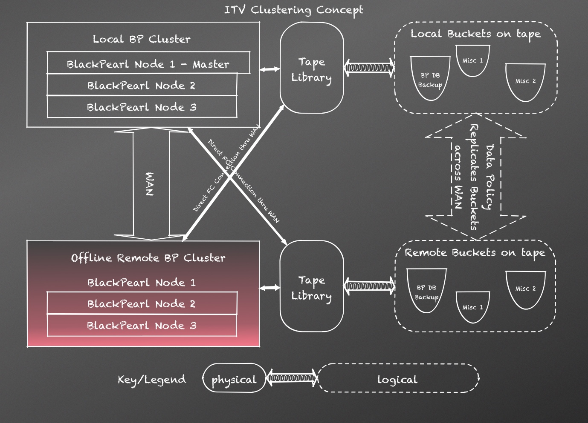

Next, consider that the local site has gone down and will stay down for a long duration and the customer wants to switch over to the remote site.

The customer has a client that has been running at the remote site that downloads the database from the local BP cluster, then replaces the database on the remote BP cluster. It does this periodically (perhaps triggered by job completion). Even though both clusters can see all the tape hardware, because the remote BP cluster is quiesced on every tape partition, it will never attempt to interfere with the active site (and it is quiesced since the database replace operation results in every partition being quiesced).

In this case, all the customer has to do is:

1.  Ensure the local BP cluster is truly dead (or at least all its partitions have been changed to quiesced YES)

2.  Configure the partitions at the remote BP cluster to quiesced NO, at which time, the remote BP cluster can go live, as demonstrated in the diagram below.

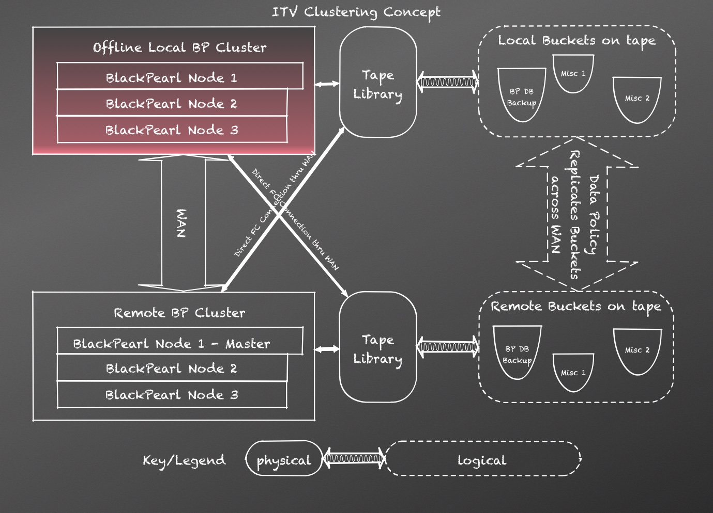

Note that what we are trying to avoid in this example is having multiple Bluestorms connected to the same tape hardware thinking they can use it.

It is critical that at most one Bluestorm connected to the same tape hardware has a quiesced state other than YES. Otherwise, multiple appliances may issue conflicting requests to robots and tape drives. This can result in data corruption or data loss.

It is also critical that whichever Bluestorm is active is active with the latest database (rather than an older one), which would result in data loss since we would roll back tapes to previous points in time consistent with the database on that Bluestorm.

## Automatically Activating the Backend

Most customers will not fall under the use case described in the “Automatic Deactivation of the Backend” section, and thus, do not need to worry about having the backend automatically deactivate when it comes up.

For this reason, customers may configure an automatic activation timeout. If configured and the data path comes up within the configured timeout, the backend will be automatically activated. If configured and the data path comes up after the configured timeout, the automatic activation timeout value will be cleared.

For example, if the automatic activation timeout is configured to 30 minutes, the data path runs for 1 month, then the Bluestorm is rebooted and 10 minutes elapse between when the data path shuts down and comes back up, the data path will automatically activate. If however, 40 minutes elapse, the data path will not automatically activate and will clear the automatic activation timeout.

Customers who know they do not fall under the use case above can safely configure the automatic activation timeout to an arbitrary large number (e.g. 1 year). Customers who know they fall under the use case above should consider configuring the automatic activation timeout to null to prevent any kind of automatic activation, although a reasonably short timeout of 30 minutes or so is still “mostly” safe. Spectra support should advise customers to make said configuration change to prevent the possibility of data loss during manual failovers between different independent head units.

The default configuration on new Bluestorms will be to enable automatic activation with a 30-minute timeout. This mostly eliminates the annoyance of having to activate the data path backend for users who don’t need the protection, while still providing reasonable (although not full) protection to users who do need the protection using the use case above, since it is highly unlikely that in a 2-node passive failover configuration, that node \#1 would come down, node \#2 would come up and take over, node \#2 would come down, and node \#1 would be brought back up again all in the span of 30 mins. We can probably increase this default as high as an hour and still be safe and may make this change if 30 mins is found to be too short of a default.

# Buckets

A bucket is an S3 logical container for S3 objects.

## Data Policy

A bucket must specify the one and only data policy that it uses. Multiple buckets can use the same data policy, but a single bucket cannot use multiple data policies.

The data policy for a bucket can be changed to another data policy provided that all of the criteria below are met:

1.  The checksum type of the new data policy is the same as the old

2.  All persistence rules in the old data policy must be fully included (they cannot be include-in-progress)

3.  All persistence rules in the new data policy must be fully included (they cannot be include-in-progress)

4.  The set of storage domains targeted by permanent persistence rules is identical between the source and destination, and the isolation levels match identically for each storage domain targeted

5.  The set of storage domains targeted by temporary persistence rules is identical between the source and destination, and the isolation levels match identically for each storage domain targeted

6.  The set of storage domains targeted by retired persistence rules is identical between the source and destination, and the isolation levels match identically for each storage domain targeted

Note that the data policy for a bucket can be changed to another data policy even if:

1.  Degradation exists in the source data policy

2.  Degradation exists in the destination data policy

3.  Attributes other than the checksum type are different between the old and new data policies

## Scalability

Exceeding 100K buckets is discouraged.

Exceeding 1M buckets is strongly discouraged.

# Blobs

A blob is a binary large object. Referring to its S3 object with an offset and length, a blob represents a piece of the data for an S3 object. An S3 object that is a folder or zero-length object has a single, zero-length blob associated to it; however, all other S3 objects have one or more non-zero-length blobs associated with it. Blobs are what are written to tapes and zpools, which allows an S3 object to be larger than any single tape or zpool.

## Scalability

Both the blob size and blob count matter with regards to scalability.

### Blob Size

The average blob size across all blobs in the system is far more critical than the maximum or minimum blob sizes. Thus, the average blob size is what we are referring to inside this section.

Blob sizes less than 5MB are strongly discouraged (data throughput rate drops almost linearly once blob sizes drop below 5MB). Blob sizes less than 50MB are discouraged (data throughput rate drops by a little over half between 50MB and 5MB blob sizes).

Blob sizes between 1GB and 64GB are the sweet spot – where we perform and scale the best. The closer to 64GB, the better we scale. Note that going from 1GB to 64GB blob sizes only improves performance marginally, but it has a significant impact to our ability to scale the quantity of data we manage, especially if attempting to scale to exabytes of data, since the number of blobs we support is independent of the blob size, which means we can manage more data with the same number of blobs if the blob size is larger.

Blob sizes above 64GB have positive and negative impacts, as they can adversely impact rebuild times and performance for partial blob reads, but they do improve our ability to scale the quantity of data we manage as noted above. For example, if every blob is 1TB, we can scale to 100+ exabytes.

The default, preferred blob size used when breaking an object up into blobs is 64GB. The maximum blob size is 1TB.

Note that clustering will bump the blob size thresholds up to achieve good scalability and performance. For example, in a 10-node cluster where sustained performance of 8GB/sec is required, we would discourage a blob size less than perhaps 200MB rather than 50MB (the increase would likely not be linear, which would bump it to 500MB from 50MB).

### Blob Count

Increasing the blob count requires additional SSDs.

Scaling the blob count is a bit tricky in that we can either talk about realistic scaling or theoretical scaling. Supporting larger blob counts (especially beyond a billion) is theoretically possible with the existing architecture, but the reality is that this requires performance optimizations in the software stack, requiring an upfront and recurring investment by engineering and test to achieve and maintain – and a substantial one at that. Since achieving better scalability is an iterative process and given the permutative complexity involved to try to flush out all problematic pieces of the software stack requiring optimization, the reality is that we will very rarely if ever achieve the theoretical capabilities, unless we are willing to devote dedicated resources and substantial time to flush them out after a release is otherwise done. Or in other words, enhancing scalability must be done after the release would otherwise be complete, and not in parallel with feature and bug work for it to be most effective, since adding features or fixing bugs can have significant regression risk when it comes to blob count scalability. The more time we spend vetting a release for blob count scalability, the higher the blob count we should be able to achieve without significant issues coming up in the field.

Blob counts less than 10M will perform best.

Blob counts greater than 10M and less than 100M will perform well, although some operations may be sluggish.

Blob counts greater than 100M and less than 1B should perform decently, although some operations will be sluggish. There is also low to moderate risk that non-scalable pieces of the software stack could be hit in a given release that would result in significant adverse impact. Blob counts greater than 500M are discouraged for this reason, unless the release in question has been specifically vetted by engineering and DVT for scalability.

Blob counts greater than 1B are theoretically supported; however, many operations will be sluggish. There is also moderate to high risk that non-scalable pieces of the software stack could be hit in a given release that would result in significant adverse impact. Blob counts greater than 1B are strongly discouraged for this reason, unless the release in question has been specifically vetted by engineering and DVT for scalability. The more blobs we want to scale to, the longer the vetting process needs to take to avoid problems in the field.

Note that the initial release of ABM, since it adds significant new functionality and permutative complexity, should not be scaled beyond 100M objects and certainly not beyond 300M objects until some amount of vetting can occur. Object counts less than 10M are recommended when possible as a conservative number to avoid any scaling issues.

In general, major releases that add significant new functionality should not be deployed into environments that require higher blob count scalability, since these releases will be most likely to be problematic scaling the blob count.

#### RAM and Blob Count

Scaling the blob count beyond 100M and especially beyond 500M would benefit from increased system RAM (going beyond the 128GB we currently ship). Increasing RAM allows for better caching of Postgres index data, which can tremendously improve performance. Increasing RAM to achieve better scalability is not however an alternative to having engineering and DVT vet a build for scalability, since this vetting process will weed out scalability bugs that may not necessarily be worked around by increasing RAM.

Furthermore, increasing system RAM will have a non-linear performance impact, or in other words, increasing system RAM may not have a notable impact up to a point P, but then, getting to P, an incredible performance improvement may be observed, and then increases beyond P will have no notable further impact. Or in other words, system RAM is critical insofar as we are able to get a reasonable working set to fit entirely into RAM. The RAM capacity required to achieve this is P. There may be multiple thresholds (P1, P2, P3) where performance improved dramatically as each one is hit, but the point is that performance will not increase linearly with RAM increases. It will be a relatively flat graph with one or more spikes upward.

# Jobs

A job is the management container for I/O operations. A job consists entirely of reads or entirely of writes such that every read / write targets the same bucket. Write jobs create S3 objects in the targeted bucket. Read jobs get S3 objects from the targeted bucket. Verify jobs get S3 objects from the targeted bucket, but throw away the data, only computing checksums to verify that they match.

## Native S3 Operations

Since all I/O operations must be contained within a job, native S3 commands result in “naked job creation” in that we must create a job to wrap the naked I/O request. For example, once a native S3 PUT appears to complete to the client (it’s been written to cache), we must track the fact that it’s not been persisted to tape yet. This tracking must be persisted and survive process interruption to ensure we don’t lose customer data. This is where the job comes in – it tracks the I/O work that must be performed to meet these requirements. Once the data is persisted, the job is marked as completed and deleted out of the active job list.

Whenever possible, multiple naked operations will be aggregated into a single job, since having each individual operation have its own job would result in horrendous native S3 performance and scalability (especially given that there is a limit of several thousand active jobs at any given time). Re-shaping naked jobs so that we optimize the chunking of a set of native S3 commands results in multiple orders of magnitude improved scalability and performance for PUT and multi-part upload operations over the R1.x code base, especially for smaller object sizes.

Some native S3 operations are restricted in their usage due to architectural differences between AWS and DS3. Those restrictions are noted below.

### PUTs

An S3 PUT is the simplest mechanism to create and write a single object. A single checksum is generated for the entire object, and a single blob created for the entire object. Since an S3 PUT results in a 1:1 mapping between blob and object, its size is restrained by the maximum size of a blob, which is 1TB.

S3 PUTs of objects greater than 64GB is somewhat discouraged since a blob must be read or written in its entirety. Also, very large blobs can be cumbersome to rebuild, and may result in lower performance for partial object GETs. There are environments however where very large blobs can be advantageous, especially when relying on native S3 GETs to always work (see that section for more details). It can also be useful in environments where objects never exceed 1TB in size and clients want to assume a 1:1 mapping between blobs and objects for simplification purposes.

If cache space for the PUT isn’t sufficient, the PUT will fail with a 307 redirect asking the client to come back later and try again, hoping there may be more cache space available at a later time.

### Multi-Part Upload

Multi-part upload can be thought of as an AWS approach to DS3 blobbing. It allows a single object to be broken up into multiple, smaller pieces, where each piece has its own checksum and is uploaded independently. Unlike the simple PUT command, a multi-part upload is restricted to 5TB. This is an AWS limitation – not a DS3 limitation.

Since AWS multi-part upload does not provide for a total upload size upfront, DS3 must create a job equal in size to the maximum possible of 5TB. Consequently, if all 5TB cannot be allocated at the time the multi-part upload is initiated, the initiate will fail with a 307 redirect asking the client to come back later and try again, hoping there may be more cache space available at a later time. Once the multi-part upload completes (which is the time we can compute the actual object size), whatever space out of the initial 5TB cache allocation isn’t needed is released and made available.

Using multi-part upload extensively (especially for objects much smaller than the 5TB maximum) can effectively starve out other clients from getting cache space, since a big chunk of the cache will be rendered unusable for any in-progress multi-part-uploads. Even worse, any multi-part upload initiated must be explicitly aborted or completed. Any multi-part uploads that are initiated and not cleaned up will linger, along with their 5TB cache reservation. An abandoned multi-part upload will eventually be detected and cleaned up just like any job, but this will take at least many hours and possibly even several days.

Using multi-part upload with excessively small upload parts can introduce scalability issues. Keep in mind that every part of a multi-part upload turns into a blob once the multi-part upload is completed.

### GETs

An S3 GET is a mechanism to get an object. Since an object has no size limitation in DS3, the Bluestorm cache is finite, an S3 GET returns a single, contiguous byte stream, and the very nature of tape disallows Bluestorm from being able to have a guarantee that data can be read within a short window, it is impossible to reliably satisfy this operation if an object is composed of multiple blobs. Rather than having complex, obtuse logic to try to make this work in some cases where we do have a guarantee, which would result in non-deterministic behavior for clients and a permutative complexity explosion burdening both engineering and DVT, we simply disallow this case. Consequently, an S3 GET may only work against objects with a single blob.

If an S3 GET is sent for an object that doesn’t live in cache or on pool storage, a 307 redirect will occur and will continue to occur until we can fetch the data needed from its persistence store and load it into cache. A job is created so that we can perform this fetching and know the data cannot be purged from cache until it is read, or until the naked job times out. Any object that resides in cache or on pool storage (regardless as to whether it’s enterprise or archive storage) will be serviced without a 307, 503, or other delaying return on the request.

If the data resides on a pool that must be powered up or that is locked by another operation, a synchronous delay will occur until the pool is in a valid state for the GET to proceed. This synchronous delay will normally be on the order of several seconds; however, it could be on the order of several minutes in rare circumstances as described below.

Multiple read locks may be acquired in parallel for a pool and any number of read locks may be acquired in parallel with a write lock; however, read locks cannot be acquired on a pool that is locked exclusively, which is required for some operations, such as pool compactions that reached a phase in the compaction algorithm to where old data eligible for deletion may be deleted off the pool.

Pool compactions that get to the point to where they delete old data are the worst case for stalling a get synchronously, which could stall the get for many minutes. Fortunately, this is a rare cornercase that will only occur if the pool’s capacity utilization exceeds 85% and deleting unknown data (e.g. deleted objects) wasn’t enough to drop below that threshold.

Native S3 GETs are particularly non-performant and non-scalable when the objects being gotten aren’t in cache, especially for smaller objects. The reason why is that the only way Bluestorm has of servicing the GET is to use up server-side threads to 307-block in a loop with the client until data is loaded from its persistence store. Furthermore, the client will usually have some finite workpool, and we will eat up all the threads in the client’s thread workpool while we perform long-running fetches into cache.

### Partial Object GETs

Similar to an S3 GET, a partial object GET is a way to get a byte range of an S3 object. Partial object GETs can work for an object that has multiple blobs, provided that the byte range requested is entirely contained in a single blob. The performance characteristics of a partial object GET are very similar to a GET (partial object GETs serviced from cache aren’t so bad, but servicing them from tape is especially non-performant and non-scalable).

Note that, if a fetch to cache is required for a partial object GET, that the entire blob being gotten from must be fetched into cache. For example, if requesting bytes 100-200 of a 1GB object with a single blob, the entire 1GB blob must be fetched into cache before the 100-byte partial GET can be serviced.

## Spectra DS3 Operations

DS3 I/O operations are specifically optimized to improve performance and scalability over native S3 operations. A customer must specify the entire I/O workload upfront, or at a minimum, a significant chunk of the I/O workload (at least 20GB for reasonable performance, 50GB for good performance, or 1TB for excellent performance).

In addition to improving performance and scalability for the current DS3 operation, performance and scalability may be improved for future DS3 operations. For example, DS3 will lay out data on persistence stores in a manner that may better optimize later GET operations from them.

Clients are strongly encouraged to use DS3 over native S3 whenever possible, especially for GETs, especially when dealing with smaller object sizes or attempting to scale to many tens of millions of blobs.

### Multi-Part Upload Equivalent

Using DS3, multi-part upload can be effectively achieved by specifying a custom maxUploadSize on the PUT job being created. This will result in the objects getting blobbed up into smaller pieces (think of each blob as a multi-part upload part), where each smaller piece may be uploaded concurrently. By default, we will break up very large objects into smaller pieces anyway, to enable better concurrent upload performance.

### Partial Object GET Equivalent

Using DS3, partial object get can be achieved by specifying a length and offset on an object when creating a GET job. A GET job may contain any number of partial and whole object GETs. When creating a GET job with a partial object GET, the actual blob segments shall be returned in the job, which enables the client to achieve end-to-end CRC even with a partial object GET, by getting the partial object on the blob boundary and computing the CRC for that blob to ensure it matches, then taking only the segment of the blob desired for actual consumption.

A partial object GET may result in one or multiple blobs being returned in the job (multiple blobs would be returned if the partial object GET requested spanned blob boundaries). Also note that multiple partial object GETs on the same object may result in one or multiple blobs being returned (a single blob would be returned if every partial object GET resided within the same blob).

It is the client’s responsibility when performing partial object GETs to properly associate their partial object GETs with the actual blob segments. For example, if a client requires bytes 100-200 and 300-400 of an object split into 2 blobs (the first being bytes 0-500 and the second being bytes 500-900), the client must get the blob for bytes 0-500 once, then do what it needs to with bytes 100-200 and bytes 300-400. If the client tries to get the blob for bytes 0-500 twice – once for the first partial object GET and secondly for the second one, there is no guarantee that the blob will still be in cache, since it has been gotten and DS3 will assume it is no longer needed for that GET job.

## Request Type

If the job is a write job, the request type is PUT. If the job is a read job, the request type is GET. If the job is a verify job, the request type is a VERIFY. A verify job is a mechanism to verify that data can be read somewhere somehow – it is not a mechanism that verifies that every copy of every blob in the job is good.

The request type cannot be modified once the job is created.

## Chunk Client Processing Order Guarantee

The chunk client processing order guarantee can be one of the following:

IN\_ORDER

NONE

For PUT jobs, the chunk client processing guarantee shall always be IN\_ORDER, which means that if chunk B is after chunk A, that clients should start with chunk A before moving onto chunk B. Note that clients can send chunks out of order without significant negative side effects provided that no single object is greater than a job chunk.

For GET jobs, higher performance may be achieved by using NONE, which requires the client to be intelligent enough to see which chunks are available for processing and to process the available chunks, whether or not they become available in order or not. There are some clients that may not support chunks coming back out-of-order though, and for those clients, IN\_ORDER must be used. Note that the performance improvement from using NONE can be huge (\>100% speedup).

For VERIFY jobs, the order guarantee is always NONE.

The chunk client processing order guarantee cannot be modified once the job is created.

## Bucket

The bucket targeted for writes or reads.

The bucket cannot be modified once the job is created.

## Priority

The priority of the job relative to other jobs in Bluestorm. The priority can be:

URGENT

HIGH

NORMAL

LOW

The priority can be modified after the job is created; however, there is no guarantee as to how quickly outstanding job chunks being processed will receive the new priority.

The job priority is used in determining how many cache resources the job can get once throttling kicks in (a job is not limited in how many job chunks it can allocate until the throttling threshold is reached). Additionally, the job priority is used in scheduling tape and pool tasks.

### Job Priority and Cache Resources

Urgent priority jobs get special prioritization. An Urgent job is exempt from throttling. It can use all available cache and tape drive resources. Since urgent jobs are exempt from throttling, they can starve all other jobs from cache resources.

High priority jobs get a maximum of MAX\[16, 3 x the number of tape drives \] job chunks once throttling kicks in (they can get as many job chunks as they want until throttling kicks in). There is not a guarantee that a job will get the maximum chunks, regardless as to whether or not throttling has kicked in.

Normal priority jobs get a maximum of MAX\[8, 2 x the number of tape drives \] job chunks once throttling kicks in (they can get as many job chunks as they want until throttling kicks in). There is not a guarantee that a job will get the maximum chunks, regardless as to whether or not throttling has kicked in.

Low priority jobs get a maximum of4 job chunks once throttling kicks in (they can get as many job chunks as they want until throttling kicks in). There is not a guarantee that a job will get the maximum chunks, regardless as to whether or not throttling has kicked in.

Note that, in order to keep a single tape drive or pool busy, two homogeneous chunks in cache must be allocated. This enables the tape drive or pool to work on one fully uploaded chunk against cache while the next chunk in cache is being filled (for PUTs) or gotten (for GETs). If the chunks are heterogeneous (if their sizes vary significantly), more than two job chunks allocated in cache are required to keep the single tape drive or pool busy. Since job chunks will generally be homogeneous or close to it, a single job is usually capable of utilizing maximum throughput through all tape drives and/or pools in the system provided that it is able to allocate twice the number of tape drives and pools in job chunks in cache, and provided that the client is capable of uploading data to cache at least as fast as the tape drives can write the data to tape.

For example, if there are 4 high priority jobs and 1 normal priority job in a tape-only Bluestorm and none of the clients for the high priority jobs are uploading data to cache, the normal priority job should be able to saturate the full bandwidth potential of the BP, even if throttling has kicked in for the cache, provided that the cache maximum capacity isn’t reached.

Since we can write to a pool significantly faster than a tape, the maximum number of job chunks a job can get based on its priority does not depend on the number of pools in the system. For example, in a pool-only Bluestorm whose cache has reached the throttling threshold, a high priority job can max out at around 8 pools being concurrently written to, which is approximately 100gbps. A normal priority job can max out at around 4 pools being concurrently written to, which is approximately 50gbps. Even a low priority job can max out at around 2 pools being concurrently written to, which is approximately 25gbps. And again, provided the cache throttling threshold limit hasn’t been reached, none of these limits apply.

### Job Priority and Tape Task Scheduling

Tape tasks in the work queue that can use a tape already in a drive are always prioritized over tasks that can’t.

Next, we look at the task priority. Higher priority tasks get prioritized over lower priority tasks.

Next, we look at whether or not the task requires dao changes (e.g. if it has to allocate a tape to a storage domain in order to run). Tasks that do not require changes to the dao (database) get prioritized over other tasks.

Finally, we look at how long the task has been in the work queue. Tasks that have been waiting longer get priority.

### Job Priority and Pool Task Scheduling

First, we look at the task priority. Higher priority tasks get prioritized over lower priority tasks.

Secondly, we look at how long the task has been in the work queue. Tasks that have been waiting longer get priority.

Note that tasks are designed to prefer powered-on pools over powered-off pools. While this isn’t part of the pool task scheduler, it is part of the individual task’s pool selection algorithm and may indirectly impact pool scheduling.

## Optimizing Workloads for Jobs

While Bluestorm does support up to several thousand jobs active in parallel in the system, the actual number of jobs in the system should range from one up to several hundred depending on how large the Bluestorm is and the actual usage pattern. Generally speaking, if there are few buckets, there should be few jobs active in parallel. If there are many buckets, there may need to be more jobs active in parallel. If there are many independent clients, this may also drive up the active job count.

Bluestorm cannot optimize I/O workloads that span jobs; however, it can significantly optimize workloads within a single job. For this reason, a job should be considered to be a large container for I/O workloads, keeping in mind that the maximum job size if 500,000 objects.

Jobs that contain less than 10GB of work are strongly discouraged and will significantly, adversely impact performance. Jobs that contain less than 50GB of work are discouraged and may notably, adversely impact performance. Jobs that contain more than 1TB of work are encouraged, as these jobs will lend themselves toward maximum optimization by Bluestorm.

Native S3 job aggregation aforementioned is designed to try to keep jobs in the 50GB – 1TB range. This is large enough to minimize adverse performance impact, but small enough to not hold up the job too long before starting to process it (native S3 PUT work may be held for up to 15 minutes before it is processed), since in the native S3 scenario, we don’t know how much more work is coming in for that bucket, if any at all.

## The Job Completion Guarantee

Data written for a job may need to be written to a number of persistence targets, and replicated to some additional persistence targets. For example, we may have a data policy where 2 copies on tape and a replicated copy on a DS3 target all have to be made. How do we tell once all these copies and replications are complete, signaling that we are safe to delete the local copy at the client?

Data received into Bluestorm is stored in cache until that data is in full compliance with the data policy. Or in other words, for the example above, data is not eligible for reclamation in the cache until it has 2 copies of it written to tape and a copy fully replicated out to the DS3 target.

Furthermore, the job completion guarantee provides that, in order for a job to be completed for a given instance that instance and all its replication targets must be in full compliance with their data policies. Specifically, the job cannot be completed on an instance unless it has (i) persisted data locally in full compliance, (ii) replicated data to all targets in full compliance, and (iii) all targets must have both (a) persisted their data locally in full compliance and (b) replicated data to all their targets in full compliance.

For example, if I have 3 instances with uni-direction replication from A B C, the job on A cannot be completed out until A and B have persisted their local copies in full compliance and the data has been replicated to C; however, C does not have to have persisted its local copies.

## Replication Put Jobs for Federated Namespaces

When creating a PUT job, you have the option to make that PUT job a replication PUT job. A replication PUT job is a PUT job that requires the client creating the job to specify each object’s ID and version number, as well as the blob structure for that object. A replication PUT job should be used when the objects being PUT have already been PUT to another Bluestorm. By creating a replication PUT job for other Bluestorms, the client can guarantee that the data replicated to the other Bluestorm is an identical and compatible match to that of the first Bluestorm.

Note that, in order to have the information necessary to create a replication PUT job, the primary (or first) Bluestorm the objects are PUT to must have already had the PUT job created, which will generate the ids, blob structure, etc. needed to create the replication PUT job. The data does not have to have been completely uploaded to the primary Bluestorm to start a replication PUT job to a secondary Bluestorm – only the PUT job must have been created.

For example, if you have two Bluestorms and want to replicate a bucket to each Bluestorm such that each Bluestorm manages a single copy of the bucket data, but want to down the road be able to “merge” the two Bluestorms together to have a single Bluestorm manage both copies (perhaps the new, single Bluestorm is a cluster), then you must use a replication PUT job to ensure that the object ids, version numbers, and blob structures match between the two Bluestorms.

It is not sufficient to have bucket name and object matches to be able to do this “merging” or federated namespace behavior. Furthermore, it is not possible to “fix” data already written to match up via a simple database transformation, since the incorrect structure has been persisted to the media and would be incompatible with a “corrected database”.

When object data is written across multiple Bluestorms using replication put jobs, the following task scenarios are supported:

1.  Merge multiple Bluestorm instances into a single instance, whether that instance is clustered or not

2.  Import media from another Bluestorm and recognize that object as an additional copy when performing the import

3.  Clients may distribute GET operations across different BP instances since the blob structures match up

*  
*

# Storage Domains

A storage domain is a named collection of one or more data partition / media type combinations.

When a storage domain must allocate additional capacity, it must allocate an entire zpool or tape to itself out of the data partition / media type combinations that the storage domain is allowed to use. Or in other words, entire data partition / media type combinations are members of storage domains, but when capacity is allocated, a single zpool or tape will be allocated out of the members to fulfill the capacity requirement.

## Name

Storage domains have a name. This can be modified at any time. The name is required and must be non-null and non-empty.

## Write Optimization

Storage domains define the write optimization for incoming data. This policy can be:

CAPACITY

PERFORMANCE

In capacity mode, the number of tapes / zpools allocated to the storage domain should be minimized to ensure that they are minimally allocated at all times.

In performance mode, we will allocate more tapes and zpools than is necessary from a capacity standpoint to maximize performance. For example, if there is enough data to keep 3 tape drives busy and 3 tape drives are available, 3 tapes will be used to perform the current write operations, even if the data would fit on 2 tapes.

Note that, in the case of zpools, it is unlikely that using more zpools than necessary from a capacity standpoint would actually result in improved performance, and thus, for pool, it is unlikely that the internal algorithms will execute any differently based on different write optimization settings.

We will default new storage domains to a capacity write optimization.

## Secure Media Allocation

When secure media allocation is enabled, any media allocated to this storage domain that is reclaimed can only be used for the storage domain it was allocated to. Or in other words, once tapes and zpools are allocated to a storage domain, they can never be de-allocated from that bucket.

A storage domain will have secure media allocation disabled by default, but this policy setting can be modified at any time, whether or not the storage domain is in use.

Secure media allocation is used to ensure that the allocation is secure in the sense that any physical media touched by a bucket’s data is secured so that it can be physically destroyed in the future. It can also be useful to force a “rotating media” strategy, which is useful for backup of the DS3 appliance’s database. Even if a BUCKET\_ISOLATED bucket is deleted, any tapes or pools allocated to the bucket that are part of a storage domain that is secure media allocated can only be recycled within the storage domain (in which case, any bucket with STANDARD data isolation using the storage domain may use it).

For example, for most customers, using secure media allocation for the storage domain the database is backed up to means that we will ultimately rotate between 2 tapes to perform the backup. So, once tape A gets full, we move onto tape B, then once we’ve written enough backups to tape B that we’ve deleted all the really old backups on tape A, we reclaim tape A (format it and keep it in the storage domain), then once we fill up tape B, we move to tape A and repeat.

Furthermore, by combining secure media allocation with bucket isolation, we can also ensure reclamation and re-use over fragmentation and capacity waste. For example, if we interleave database backups on tapes with other data and the other data is never deleted, even if a really old database backup is deleted, the tape does not become eligible for reclamation and becomes fragmented. Over time, the cost of this fragmentation can become significant.

Disabling secure media allocation on a storage domain that has secure media allocation and has empty media allocated to it will result in any empty media allocated to the storage domain eventually being released. The release is not immediate, but shall occur in a timely manner.

For most applications, users will not want to enable secure media allocation. This is because, in most circumstances, this results in artificially limiting the growth of buckets in the system, since reclaimed media cannot be recycled for general use.

### Physical Destruction of Media

One customer application of secure media allocation is when there is a legal requirement to physically destroy any media a bucket touches. In this case, the user will likely want to use BUCKET\_ISOLATED combined with secure media allocation. This ensures that bucket data is isolated from any other bucket’s data.

If however there are multiple buckets that have a physical destruction requirement such that they will all be destroyed at the same time, it will likely make more sense to have that set of buckets use and share a storage domain. This storage domain would only be used by the buckets with a physical destruction requirement.

Note that, in either approach, secure media allocation must be used.

In the case of a single, BUCKET\_ISOLATED bucket that requires physical destruction, it is important to identify media requiring physical destruction prior to deleting the bucket. Once the bucket is deleted, any media allocated specifically to that bucket are released into the storage domain for general use. If other buckets are using the storage domain, it may become impossible to distinguish between media that was used for the deleted bucket versus media being used by other buckets.

## LTFS File Naming

Storage domains define the LTFS file naming mode for tapes formatted for the storage domain. This value can be:

OBJECT\_NAME

OBJECT\_ID

This level cannot be changed if any of the following conditions holds true:

1.  At least one bucket exists that uses a data policy that targets this storage domain

2.  At least one tape has been assigned to this storage domain

The LTFS file naming mode determines the LTFS file structure used on a given tape. A single tape can only be written in one structure or the other – it cannot have a mix of both structures.

Any storage domains created for buckets migrated over from R1.x would have value FULL. Any newly-created storage domains would optionally take this param, but would default to OBJECT\_ID if the param is not specified. Any auto-generated storage domains would default to OBJECT\_ID.

### OBJECT\_NAME File Naming

The LTFS file structure for OBJECT\_NAME is:

> {bucket name}/{object name}

For example:

> bucket1/foo
> 
> bucket1/folder/anotherfolder/foo
> 
> bucket2/some-very-long-object-name

The OBJECT\_NAME LTFS file naming is appropriate when a user wants to be able to eject tapes from Bluestorm, load them up into a non-BP tape partition, and be able to see the file names match up with the object names.

### OBJECT\_ID File Naming

The LTFS file structure for OBJECT\_ID is:

> {bucket name}/{object id}

For example:

> bucket1/1fc6f09c-dd72-41ea-8043-0491ab8a6d82
> 
> bucket1/09d1164a-3dfc-4a0c-a1e4-d9edd79aad5c
> 
> bucket2/51334a4f-5f4c-4fca-aa21-9121f6b6d21a

The OBJECT\_ID file naming mode is appropriate when a user wants to have complete flexibility over object naming. For example, in the OBJECT\_ID file naming mode, we support object names of any length, and support object names that contain special characters like colons (":") that are prohibited by LTFS.

Note that the data written to tape in OBJECT\_ID file naming mode is LTFS compatible, and the object names are LTFS extended attributes, and thus, there is no reason why a non-BP client can't reconstruct everything from this LTFS file naming mode.

Any bucket that uses a data policy that targets one or more storage domains with OBJECT\_NAME file naming mode is subject to full LTFS file naming compliance when validating object names being created in said bucket. Furthermore, no flavor of versioning (including safe replace) is supported using the OBJECT\_NAME file naming mode. In order to achieve the object naming flexibility offered by the OBJECT\_ID file naming mode, a bucket must use a data policy that only targets storage domains using OBJECT\_ID.

Once a bucket has objects written into it that violate the LTFS file naming compliance, the data policy that bucket uses is marked as requiring OBJECT\_ID LTFS file naming storage domains exclusively. This is never "un-marked".

## Maximum Auto Verification Frequency

Write failures can cause data to be written to media incorrectly. Bit rot may cause data previously written that was valid to eventually go bad just from sitting on a piece of media. The auto verification feature is designed to protect against write failures and not bit rot.

Media verification is the act of looking through all the data on a piece of media and ensuring it is valid. For a blob to be valid, its data must be read, the checksum for the blob computed, and that checksum compared against the Bluestorm database for correctness. Note that media verification verifies that all data Bluestorm thinks is out on the media is actually there and correct. It does not verify that all data on the media is data that Bluestorm is aware of.

For tape, if the checksums do not match, data loss should not be immediately assumed. Rather, we must first verify the data on another tape drive to ensure we’ve not encountered a bad tape drive, which would otherwise result in us marking tons of data as corrupted when it’s a bad tape drive instead.

This maximum frequency serves as the time period since the tape was last written to that must have elapsed to auto-verify the media. Auto-scheduled verifies always run at BACKGROUND priority. Verifications can be requested via the DS3 API explicitly at any time.

If data is written to a piece of media, its last verified date is cleared and the media becomes eligible for auto-verification again.

## Maximum Tape Fragmentation (Tape Auto-Compaction)

A tape can become fragmented if data is written to it, and later, a subset of that data is deleted. In this case, the deleted data cannot be reclaimed on tape.

The maximum tape fragmentation is the maximum level of fragmentation a full tape can get to before it becomes eligible for auto-compaction to another tape. Tapes that are not marked as full are not eligible for auto compaction.

The default maximum tape fragmentation is 65%. It can be set as low as 10% or as high as 100% (which effectively means that auto-compaction should never occur, unless there is literally no data left on the tape that hasn’t been deleted).

Auto-compaction always occurs at low priority to ensure it interferes with the performance of the system as minimally as possible. Compactions may also be explicitly requested via the DS3 API, where the priority shall be an optional parameter. If left unspecified, the default low priority will be used.

## Media Ejection

A storage domain may specify via a Boolean attribute whether or not media ejection is allowed.

If media ejection is allowed, then:

1.  Ejecting the storage domain is allowed

2.  Ejecting a tape assigned to this storage domain is allowed

3.  Tapes and pools that become lost or ejected will not result in a failure generated

4.  Media auto ejection triggers may be configured

If media ejection is not allowed, then:

1.  Ejecting the storage domain is not allowed

2.  Ejecting a tape assigned to this storage domain is not allowed

3.  Tapes and pools that become lost or ejected will cause a failure to be generated upon the media state’s transition

4.  Media auto ejection triggers may not be configured

### Auto Eject Upon Job Completion

If set, all media assigned to the storage domain not already pending ejection will be queued for ejection whenever a job completes.

### Auto Eject Upon Job Cancellation

If set, all media assigned to the storage domain not already pending ejection will be queued for ejection whenever a job is cancelled.

### Auto Eject Upon Media Full

If set, once data has been written to media assigned by the storage domain, its available remaining capacity will be checked. If it is full enough that it cannot fit another full chunk, it will be queued for ejection.

### Auto Eject Upon CRON

If set, a CRON job will be created based on the CRON string specified. Once the CRON job is executed, all media assigned to the storage domain not already pending ejection will be queued for ejection.

## Data Partition Memberships

A storage domain has a set of member data partitions. Every data partition member has the following attributes:

1.  Data partition (tape partition or pool partition)

2.  Media type (applies to tape partitions only)

3.  State

4.  Write preference

### Data Partition

The tape or pool partition that is the member.

### Media Type

The media type of the data partition that is the member.

For pool partitions, no media type can be selected (the pool partition specifies the media type it contains, and so we can pull in this value from the pool partition to determine the data partition member’s media type).

For tape partitions, the tape type (media type) must be selected. Only a single tape type can be selected. If you want to have multiple tape types from a tape partition in the storage domain, you must add a member for every tape type.

#### Supported Tape Media Types

LTO 5

LTO 6

LTO 7

TS\_JC

TS\_JY

TS\_JK

TS\_JD

TS\_JZ

TS\_JL

#### Supported Pool Media Types

ARCHIVE

ENTERPRISE

### State

Member data partition state enum options:

NORMAL

EXCLUSION\_IN\_PROGRESS

PENDING\_COMMIT\_EXCLUSION

### Write Preference

The write preference determines which data partition should be preferred when additional capacity is needed. If there are multiple data partitions that have capacity available that tie for the highest write preference, Bluestorm will determine the tie-breaker according to its own internal optimization algorithms. Note that there is no way to specify preferences with regards to reads. Bluestorm will determine the most optimal way to read data back according to its own internal optimization algorithms.

The write preference of partitions within a storage domain can be changed at any time. Changing the write preference during a job will ensure that the write preference is honored from the moment of the change moving forward.

Write preference enum options:

HIGH

NORMAL

LOW

NEVER\_SELECT

#### Read Only

Any storage domain member that has a write preference of NEVER\_SELECT is read-only. If the member is set to read-only, then no additional data may be written to it.

A partition member will be set to read only automatically if we determine that at least one tape drive in the partition exists that cannot write to the tape. When this happens, a failure will be generated stating that we automatically set the member to read-only within the storage domain.

Once a member is marked as read only automatically, it cannot be unmarked as read only automatically i.e. the user must configure the member to not be read only. If the user attempts to do this for a member that would just be marked read-only automatically again, an error will be propagated up to the user that this is not possible, or if we cannot determine that the member must be read-only at the time the user attempts to configure it to not be read only, Bluestorm will make the change and set the member to read only automatically again upon detection, generating another failure.

### Data Partition Rules

1.  Any storage domain either (i) being used by at least one data policy, or (ii) attempting to be used by a data policy via the creation of a new data persistence rule must have at least one data partition as a member in state NORMAL and with a write preference other than NEVER\_SELECT
    
    1.  There may be a single tape partition member
    
    2.  There may be a single pool partition member
    
    3.  There may be multiple tape partition members
    
    4.  There may be multiple pool partition members
    
    5.  There may be one or more tape partition members in addition to one or more pool partition members
    
    6.  This contract may be violated only if a member’s write preference is automatically changed to NEVER\_SELECT
        
        1.  Data policies already targeting the storage domain will be unaffected
        
        2.  No new data policies may target the storage domain while this contract is violated

2.  A storage domain cannot contain the same data partition / media type combination multiple times
    
    1.  If a data partition is in the EXLUSION\_IN\_PROGRESS state, it cannot be “re-added” until it has been removed entirely from the storage domain

3.  The same tape partition may be contained multiple times within the same storage domain provided that every membership is with a different media type
    
    1.  If a tape partition with serial number ABC has been added for media type LTO5, that same tape partition can be added with any media type other than LTO5 as another member of the storage domain

4.  The same data partition / media type combination may be a member of multiple storage domains

5.  A data partition / media type combination does not have to be a member of any storage domain

### Data Partition Inclusion

Data partitions may be added after the storage domain is created. Once added, it will show up immediately in a NORMAL state.

### Data Partition Exclusion

Data partitions may be removed via the “exclude” action, which will exclude the data partition from the storage domain. When the exclude action is made on a partition within a storage domain, the following will occur:

1.  The state of this partition will change to EXCLUSION\_IN\_PROGRESS

2.  The “Exclude” action for this partition will become unavailable

3.  The “Write preference” input for this partition will become unavailable and will be set to NEVER\_SELECT

4.  The “Read Only” input for this partition will become unavailable and will be set to true

5.  The “Cancel Exclusion” action will become available on this partition
    
    1.  If this action is invoked:
        
        1.  This partition’s state will be reverted to NORMAL
        
        2.  The write preference and read only values will be reverted to their original values
        
        3.  It is guaranteed that the data will be restored to its original placement

6.  All data in this partition will be copied to other partition(s) in its storage domain that are NORMAL
    
    1.  The tape partitions, tape media type, and pool partitions we copy data to is determined by this storage domain’s partition memberships and the write preferences chosen for the partition members
        
        1.  For example, if there are 3 partition members A, B, and C, and A is being excluded, B has a write preference of HIGH, and C has a write preference of LOW, data will be copied from A to B until B has no capacity available, then data will be copied from A to C
    
    2.  Data in this partition that is persisted by a temporary or retired persistence rule need not be copied to other partition(s) i.e. it is fine to simply reclaim this space
    
    3.  If data cannot be copied in its entirety to other partitions, a storage domain failure will be generated periodically until all data is copied to other partitions
        
        1.  The GUI will display these as system messages
        
        2.  Users can register for notifications of these failures

7.  The state of this partition will change to PENDING\_COMMIT\_EXCLUSION

8.  The “Cancel Exclusion” action will become unavailable on this partition

9.  If there is no data in this partition, the next 3 steps will be skipped

10. The database will be backed up and the backup fully committed to backup database stores

11. Older database backups before the previous steps shall be deleted from backup database stores
    
    1.  These are about to become incompatible since, if you were to restore to such a backup, the data will not be where Bluestorm expects it to be, which means you will have data you cannot find
    
    2.  User should be warned via a system message saying that external Bluestorm database backups have been invalidated

12. All tapes and zpools that were owned by this partition will be marked for reclamation
    
    1.  For example, put into state FORMAT\_PENDING with a previous state of RECLAIM\_REQUIRED so that if the format is cancelled, we don’t just change the state back to NORMAL

13. This partition will be removed from the storage domain

Note that, during exclusion of a partition from a given storage domain, the partition is not locked or unavailable in any way to other storage domains.

#### Exclusion Priority

When a member is excluded, the priority for migrating data off is equal to the highest rebuild priority across all data policies that reference the storage domain. This priority can change once the exclusion starts by (i) changing the rebuild priorities of data policies referring to the storage domain, (ii) adding the storage domain to data policies, or (iii) removing the storage domain from data policies. The priority enum options are the same as the job priority enum options.

## Delete Storage Domain

A storage domain can only be deleted if there are no persistence rules that refer to the storage domain being deleted. If a storage domain is deleted, the following will occur:

1.  The storage domain will be deleted

2.  All tapes and zpools assigned to the storage domain will be reclaimed (e.g. marked FORMAT\_PENDING)

## Eject Storage Domain

If a storage domain is ejected, all tapes owned by the storage domain will be put into an EJECT\_PENDING state.

When ejecting a storage domain, the user may optionally specify an “eject label” attribute, which will be applied to every tape being ejected. This attribute is nothing more than one of the attributes or fields of a tape object, so that we can report this field when reporting tapes.

The user cannot specify both a bucket and list of blobs when ejecting a storage domain. The user may specify one or the other or neither.

### Eject Bucket

When ejecting a storage domain, the user may optionally specify the bucket to eject tapes for. If a bucket is specified and there is no data persistence rule for that bucket and storage domain such that the isolation level is non-STANDARD, the force flag may have to be specified (if the ejection operation would eject other bucket data in addition to the specified bucket, the force flag is required).

### Eject Blobs

When ejecting a storage domain, the user may optionally specify a list of blobs to eject tapes for. If such a list of specified, then all tapes in that storage domain that contain any of the blobs specified will be ejected, regardless as to whether or not this impacts other blobs.

## Eject Tape

If a tape is ejected, that tape will be put into an EJECT\_PENDING state.

When ejecting a tape, the user may optionally specify an “eject label” attribute.

## Lost Tape

If a tape is ejected via Bluescale without going through Bluestorm, that tape will be put into a LOST state.

There will be a “Mark tape as ejected” action available for lost tapes. This allows us to mark tapes ejected improperly as EJECTED, which is their correct state.

There will be a “Mark tape as permanently lost” action available for ejected and lost tapes. This allows us to permanently remove the tape from Bluestorm’s state, generating notifications for any data loss that has occurred, if any.

## Compact Tape

Tapes that have data on them can be manually compacted at any time. When a tape is compacted, its data will be ingressed and then written to other tape(s). The priority of the compact command is to be specified by the user.

## Complex Example of Storage Domains and Data Partition Members

The diagram below shows a possible, complex example of multiple storage domains using multiple data partitions.

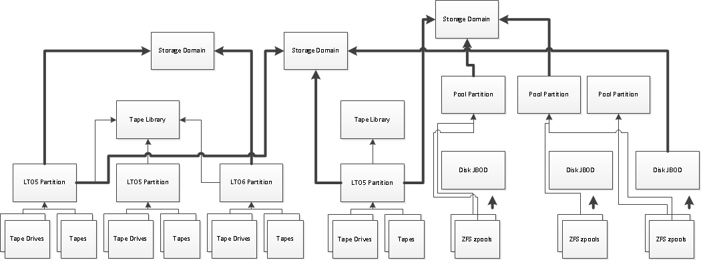

# Data Policies

A data policy defines data integrity policies, default job attributes, and persistence rules, which define where data should be persisted and for how long.

Rules surrounding data policies:

1.  A bucket must specify precisely one data policy to use at all times

2.  Multiple buckets can use the same data policy

3.  If a data policy is being used by any bucket, or if a bucket tries to use a data policy, that data policy must have at least one permanent persistent rule in state NORMAL (fully included)
    
    1.  It is acceptable for a data policy to have only permanent persistent rules that are degraded

4.  A data policy cannot be deleted so long as any buckets reference it

5.  Bucket creation
    
    1.  Optionally, a default data policy may be specified on a per-user basis
        
        1.  A user referencing a data policy as its default is not sufficient to prevent the policy’s deletion
        
        2.  If the user’s default data policy is deleted, the user’s default data policy shall become nothing / no default
    
    2.  If no data policies exist, an error shall occur saying that a data policy must be created first
    
    3.  If only one data policy has been defined (or if the user only has access to use a single data policy), specifying the data policy to use when creating a bucket is optional
    
    4.  If multiple data policies have been defined
        
        1.  And the user has a default data policy, specifying the data policy to use when creating a bucket is optional
        
        2.  And the user does not have a default data policy, specifying the data policy to use when creating a bucket is required

## Name

Data policies have a name. This can be modified at any time. The name is required and must be non-null and non-empty.

## Blobbing Enabled (Allow Objects to Span Media)

Data policies may specify whether or not blobbing is enabled (default is enabled). If enabled, an object can be broken up into multiple blobs. If disabled, an object must always have exactly one blob. Blobbing must be enabled to handle objects larger than 1TB, to use multi-part upload, or to break up an object into multiple blobs. Note that disabling blobbing guarantees that an object never spans multiple media, since a blob cannot span multiple media (e.g. tapes).

## Default Job Attributes

Data policies define default job attributes (default values for some of the job attributes, if they’re not specified). These can be modified at any time and are all optional upon data policy creation. Note that modifying these attributes while a job is in progress has no effect on the job. Specifically, the following is defined by the data policy:

1.  Default get job priority
    
    1.  The priority to set get jobs at if no priority is specified upon job creation
    
    2.  Cannot be null; defaults to HIGH

2.  Default put job priority
    
    1.  The priority to set put jobs at if no priority is specified upon job creation
    
    2.  Cannot be null; defaults to NORMAL

3.  Default verify job priority
    
    1.  The priority to set verify jobs at if no priority is specified upon job creation
    
    2.  Cannot be null; defaults to LOW

4.  Default blob size
    
    1.  The default blob size for blobbing purposes when creating put jobs
    
    2.  Can be null (if null and no blob size is specified upon job creation, the system default will be used)

## End-to-End CRC Required

If true, clients are required to compute and send an end-to-end CRC of the type that the data policy is configured to use (for example, if the data policy has a checksum type of CRC32, the client must sent a CRC32 for end-to-end CRC if the client sends a CRC at all).

If false, clients may optionally compute and send an end-to-end CRC of the type that the data policy is configured to use.

Note that modifying this attribute while a job is in progress has an indeterminate effect on the job i.e. the change could be applied at any point of the job moving and may be applied inconsistently for different parts of the job.

## Rebuild Priority

When a rebuild is necessary, the priority for rebuilding data is used to determine the relative rebuild priority compared to other jobs in the system. This priority can be modified at any time. The priority enum options are the same as the job priority enum options.

The default rebuild priority is LOW.

Note that the rebuild priority is also used for persistence rule inclusion priority and storage domain exclusion priority.

## 

## Always Force PUT Job Creation

Clients may specify a force flag when creating a PUT job. If the data policy has this flag, all PUT jobs are forcibly created. Without the force flag, we will fail to create the PUT job if one or more replication targets we must PUT to are unavailable.

See the “Replication Conflict Resolution and Force Flag Usage” section under DS3 targets for more information on the implications of using the force flag when replication is involved.

Default value: false

## Default Verify Data After Writes

Clients may specify whether or not to verify data after writes when creating a PUT job. If the client does not specify a policy for verification of data after writes, this default is used.

Enabling this flag reduces system write throughput by up to 50%.

On tape, if this flag is enabled, data shall be verified after it has been written and successfully quiesced.

On pool, if this flag is enabled, data shall be verified after it has been written.

This flag does not apply to any kind of replication target, including but not limited to DS3, Azure, and S3 targets.

Default value: false

## Always Minimize Spanning Across Media

Only applies to PUT jobs. Defaults value: false

Clients may specify whether or not to minimize spanning across media when creating a PUT job. If the data policy has this flag, all PUT jobs are created with the minimize spanning across media flag, regardless as to what the client requests when creating the PUT job.

By default, the system will dynamically compute a preferred blob size and preferred chunk size to balance many desired outcomes and minimize any significant adverse impact that might otherwise occur in the system. You can find an entire section devoted to dynamic preferred chunk size determination in this spec that details the issues involved and the solution employed. You can also go to the “Adverse Impact of Minimizing Spanning across Media” to get a sense of the issues you may be faced with by not deferring to the default system behavior.

Some customers will need to minimize spanning across media for their PUT jobs. This is especially true when it is likely that a job PUT will later be gotten verbatim and the media is being ejected, so that an external client would have to load multiple tapes versus a single one to get the data from a PUT job. Note that this is a slightly different requirement from disabling blobbing, which prevents an object from being spanned across media, but does not have any such guarantees or even biases for a job composed of many objects.

For customers who need to minimize spanning across media for entire PUT jobs, the minimize spanning across media flag comes into play.

For jobs less than or equal to 1TB in size, there is an absolute guarantee that the data in the job will never be spanned across multiple tapes.

For jobs greater than 1TB in size, attempts will be made to minimize spanning across media, although some spanning may occur. For these larger jobs, the probability of spanning across media can be further reduced by using the CAPACITY write optimization for the storage domains being persisted to, which indicates that capacity utilization is more important than increased performance through concurrent write operations. Note however that using the minimize spanning across media flag in combination with the CAPACITY write optimization does not guarantee serialization (for example, if we can see there’s 10TB of work and we have LTO 6 tapes, we may allocate 2 tapes and write to them from 2 drives concurrently since even with compression, we know we’ll need more than one tape).

### How Minimizing Spanning Across Media Works

The way minimizing spanning across media is achieved is by using a different preferred chunk size than the default one that is outlined elsewhere in this spec.

Specifically, when we are minimizing spanning across media, we will always max out the preferred chunk size at 1TB. Since a chunk must be written entirely to a media, this minimizes the number of chunks that can be split up.

### Adverse Impact of Minimizing Spanning Across Media

Minimizing spanning across media can have unintended adverse impact in the system (there is a reason that we don’t do this by default). The adverse impacts of minimizing spanning across media are outlined below.

#### Less Capacity Utilization on Media

Jobs that minimize spanning across media may waste a lot of space on media.

For example, assume that we have LTO 6 tapes with 2.5TB capacity each, and a workflow where 900GB jobs are created (and they’re always that size). In this scenario, we will only be able to use 1.8TB of each of the LTO 6 tapes. That means we’re wasting 28% of the available capacity of every tape.

The more varied job chunks are and the larger the individual media capacity, the more this issue is alleviated.

#### Increased Latency to Persist and Replicate

A chunk must be entirely in cache before it is scheduled to be persisted or replicated.

For example, if uploading 1TB at 1GB/sec using 60GB chunks, the first chunk is entirely uploaded after a minute, and at that time, we can schedule that chunk to be persisted and replicated, and start filling the second chunk. If however we are using 1TB chunks, then we’re waiting about 17 minutes before we can start persisting or replicating anything.

#### Decreased Concurrency to Persist and Replicate

A job that is broken up into multiple chunks can be worked on concurrently (for example, by multiple tape drives). A job that has a single, large 1TB chunk can take significantly longer to persist and replicate.

#### Increased Penalty for Failures and Retries

If a 60 GB chunk is written to LTO 6 tape and a failure to quiesce occurs, we lost about 7 mins and need to retry. If a 1TB chunk is written to LTO 6 tape and a failure to quiesce occurs, we lost about 2 hours and need to retry.

#### Longer Resource Reservations Reducing Responsiveness to Other Tasks

If a 60 GB chunk is written to LTO 6 tape, we tie up a tape drive for around 8 minutes. If a 1TB chunk is written to LTO 6 tapes, we tie up a tape drive for a couple hours.

There is no way to pre-empt an executing task, which means that we go from deciding what to work on every 8 minutes or so to every couple of hours or so. If a higher-priority job comes into the queue, it may have to wait quite a bit longer to be considered, waiting for a tape drive to free up.

## Checksum Type

All objects in every bucket using this data policy will have a checksum of this type computed and recorded for it. The checksum type may not be changed after creation, unless the data policy isn’t in use.

### Checksums Supported and Performance

Below are the checksum types / hash functions that we support, from least secure to most secure.

Performance numbers below are stated per data stream for the latest SuperMicro architecture we will be shipping on, or in other words, as the performance that can be achieved via a single stream of data, which will utilize a single logical CPU.

For example, assuming performance is 100MB/sec per data stream on a single 6-core CPU with hyperthreading, resulting in 12 logical CPUs:

For a single data stream, the throughput per data stream is no more than 100MB/sec and the aggregate throughput is no more than 100MB/sec (1:12 logical CPUs must be dedicated to checksum calculations)

For 10 data streams, the throughput per data stream is no more than 100MB/sec and the aggregate throughput is no more than 1000MB/sec (10:12 logical CPUs must be dedicated to checksum calculations)

For 100 data streams, the throughput per data stream is no more than 100MB/sec and the aggregate throughput is no more than 1200MB/sec (12:12 logical CPUs must be dedicated to checksum calculations)

#### CRC\_32

The CRC32 algorithm described in RFC 1952, using polynomial 0x04C11DB7, which is a non-cryptographic checksum (32 bits) limited to about 800MB/sec per data stream.

This algorithm is recommended for customers who do not require a cryptographically secure checksum, since it delivers the best performance.

#### CRC\_32C

The CRC32C algorithm described in RFC 3720 section B4, using polynomial 0x1EDC6F41, which is a non-cryptographic checksum (32 bits) limited to about 300MB/sec per data stream.

#### MD5

The MD5 cryptographic checksum (128 bits), which is limited to about 200MB/sec per data stream.

This is the default checksum type, as it is for AWS, and is recommended for customers who require AWS compatibility for etags and checksums.

Note that the MD5 cryptographic checksum is considered by most in the security community to not be a sufficiently strong cryptographic algorithm to provide real cryptographic protection.

#### SHA\_256

The SHA cryptographic checksum (256 bits), which is limited to about 75MB/sec per data stream.

#### SHA\_512

The SHA cryptographic checksum (512 bits), which is limited to about 100MB/sec per data stream.

This algorithm is recommended for customers who require a cryptographically secure checksum.

## Versioning

The following versioning modes are supported:

NONE

KEEP\_LATEST

FULL

The versioning mode can be upgraded at any time, but can never be downgraded.

### NONE

R1.x behavior (only one version of an object may exist at any time and the version number of objects is always 1).

This is the value for data policies created as a result of migrating from r1.x.

This is the only versioning mode that permits the data policy to be used with storage domains with LTFS file naming mode OBJECT\_NAME or OBJECT\_ID.

This is the default value for new data policies.

### KEEP\_LATEST

Only the most recent version of an object is exposed. In this mode, when writing a new version of an object, the old version is retained until the new version is fully persisted in compliance with the data policy, at which time the old version is deleted. This ensures that there is no window of vulnerability when replacing an object with a new version where Bluestorm has neither the old version nor the new version. This is important to NFI.

This versioning mode cannot be used with LTFS file naming mode OBJECT\_NAME.

### FULL

Full, AWS-style object versioning. This versioning mode will not be supported for a long time if ever.

This versioning mode cannot be used with LTFS file naming mode OBJECT\_NAME.

## Persistence Rules

Data policies define data persistence rules. A data persistence rule specifies a single data persistence target (e.g. storage domain), the rule type, the rule state, the data isolation level, and any additional attributes that are applicable given the rule type, such as the retention period.

### Rule Types

A persistence rule is one of the following types:

1.  Permanent
    
    1.  A copy of data shall be placed in the specified storage domain initially and maintained there permanently

2.  Temporary
    
    1.  A copy of data shall be placed in the specified storage domain initially and maintained there until the specified retention period expires
        
        1.  The retention period can be modified by the user at any time and is in the unit of days
        
        2.  Once the retention period has passed since an object’s creation date, that object is eligible for deletion

3.  Retired
    
    1.  Any data already maintained there is left untouched (we will not reclaim it) and this persistence rule may be used to service reads; however, no future writes shall go to this persistence rule
    
    2.  Retired persistence rules cannot be created (you must downgrade an existing persistence rule to be retired)

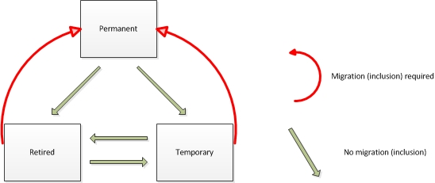

The persistence rule’s type can be changed after it is created according to the diagram above. If migration is required for the state transition made, then the persistence rule’s state will change from NORMAL to INCLUSION\_IN\_PROGRESS and will follow the steps in the persistence rule inclusion section for including a new permanent persistence rule.

### Persistence Rule Rules

1.  Data shall be persisted such that EVERY rule is in compliance rather than ANY rule being in compliance
    
    1.  For example, if you define 2 permanent persistence rules, data shall be persisted such that we have 2 copies at all times – one on each storage domain, or in other words, one copy for each persistence rule
    
    2.  If a persistence rule is created for a storage domain that contains multiple data partitions, the persistence rule is satisfied provided that a copy exists on one (and not all) of the data partitions in the storage domain, and furthermore, we will never migrate data from one data partition in a storage domain to another, unless the data partition we are migrating from is in the process of being excluded

2.  Any data policy being used by at least one bucket must have at least one permanent persistence rule in state NORMAL (fully included)

3.  A persistence rule specifies exactly one storage domain that is its target

4.  The same storage domain cannot be referred to multiple times via different persistence rules within the same data policy

5.  The same storage domain can be referred to across different data policies

6.  A TEMPORARY persistence rule can only target a storage domain that contains pool members only
    
    1.  Storage domains targeted by a temporary persistence rule cannot have tape members added to them
    
    2.  Temporary persistence rules cannot target replication targets, such as DS3 targets

### Persistence Target

Each persistence rule must target precisely one storage domain.

### State

Each persistence rule has a state:

NORMAL

INCLUSION\_IN\_PROGRESS

PENDING\_COMMIT\_INCLUSION

### Degraded Blobs

Each permanent persistence rule may have a set of degraded blobs associated with it. Each degraded blob record includes the bucket, persistence rule, and blob the degradation applies to. A persistence rule is said to be degraded if there are any degraded blob records associated with it.

### Isolation Level

Persistence rules define an isolation level. This can be:

BUCKET\_ISOLATED

STANDARD

In BUCKET\_ISOLATED, tapes and zpools will be allocated in their entirety to a bucket in addition to the storage domain. Or in other words, we will not allow other buckets to reside on the same physical media as the buckets using this data policy.

In STANDARD, tapes and zpools will be allocated to the storage domain with no bucket reservation or isolation. Or in other words, we will allow this bucket to reside on the same physical media as other buckets. Note that, for some workloads, the STANDARD isolation mode may be more performant. It is likely to be more efficient with regards to allocating fewer tapes and zpools for the same data being persisted.

The isolation mode can be reduced at any time without restriction but cannot be increased after the bucket is created unless the bucket contains no data. For example, once the bucket has data in it, it is possible to downgrade the isolation level from BUCKET\_ISOLATED to STANDARD; however, it is not possible to upgrade the isolation level from STANDARD to BUCKET\_ISOLATED.

Note that the UIs should provide some sort of discouragement from selecting any isolation level than STANDARD, since the STANDARD isolation level is usually sufficient and will provide the best capacity utilization and overall performance.

#### JBOD Spares and Secure Media Allocation

Pools allocated to storage domains with secure media allocation run into the issue of spare management. For example, if a spare is used due to a pool failure and the customer wants to physically destroy all pools a bucket ever touched, the spare must be included.

The customer will be required to destroy all spares in all JBODs where at least one pool in the JBOD was allocated to the bucket.

## DS3 Replication Rules

Data policies define DS3 data replication rules. A data replication rule specifies a single DS3 target, the rule type, and the rule state.

Note that, with replication rules, the replication to a target is being tracked – not the placement of data on the target. Or in other words, a replication target says that blobs should be replicated to the target, but it does not say how many copies of that data should be persisted or replicated where on the target, as this is controlled by the target by the target’s data policy. For example, BP instance A could replicate to BP instance B, in which case BP instance B may persist multiple copies plus replicate to BP instance C, and all BP instance A knows is that BP instance B has at least one copy somewhere.

### Rule Types

A persistence rule is one of the following types:

1.  Permanent
    
    1.  A copy of data shall be placed in the specified target initially and maintained there permanently

2.  Retired
    
    1.  Any data already maintained there is left untouched (we will not reclaim it) and this replication rule may be used to service reads; however, no future writes shall go to this replication rule
    
    2.  Retired persistence rules cannot be created (you must downgrade an existing replication rule to be retired)

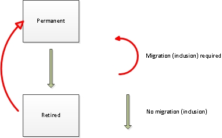

The replication rule’s type can be changed after it is created according to the diagram above. If migration is required for the state transition made, then the replication rule’s state will change from NORMAL to INCLUSION\_IN\_PROGRESS and will follow the steps in the data rule inclusion section for including a new permanent replication rule.

### Replication Rule Rules

1.  Data shall be persisted such that EVERY rule is in compliance rather than ANY rule being in compliance, just like with data persistence rules
    
    1.  For example, if you define 2 permanent replication rules, data shall be persisted such that we have 2 copies at all times – one on each target, or in other words, one copy for each replication rule
    
    2.  The target controls how many copies reside on itself and not the source, which means that if for example, 2 permanent replication rules are defined, at least 1 copy will be persisted per target; however, a target may persist multiple copies or even replicate multiple copies

2.  Unlike data persistence rules, there is no minimum number of permanent replication rules

3.  A replication rule specifies exactly one replication target that is its target

4.  The same replication target cannot be referred to multiple times via different replication rules within the same data policy

5.  The same replication target can be referred to across different data policies

### State

Each replication rule has a state:

NORMAL

INCLUSION\_IN\_PROGRESS

PENDING\_COMMIT\_INCLUSION

### Target Data Policy

Each replication rule may optionally specify a data policy to use on the target for any new bucket created. If this isn’t specified, we will attempt to create the bucket using the user’s default data policy on the target.

Note that the target data policy is a free-typed field, meaning that the user can specify a data policy that doesn’t exist, and that the configuration of a target data policy on the source does not prohibit deletion of that data policy on the target, nor does deletion of said data policy on the target replicate any changes back to the source. If the target data policy is invalid at the time we attempt to create a bucket, an error shall be raised that must be addressed.

## Always Replicate Deletes

If true, then any delete that is received locally will be replicated to the DS3 target synchronously. If one or more targets cannot be communicated with, the delete will fail.

### Degraded Blobs

Each permanent replication rule may have a set of degraded blobs associated with it. Each degraded blob record includes the bucket, replication rule, and blob the degradation applies to. A replication rule is said to be degraded if there are any degraded blob records associated with it.

## S3 Replication Rules

Data policies define S3 data replication rules. A data replication rule specifies a single DS3 target, the rule type, and the rule state.

### Rule Types

See the “Rule Types” section under DS3 replication rules. S3 replication rules behave the same way.

### Replication Rule Rules

See the “Replication Rule Rules” section under DS3 replication rules. S3 replication rules behave the same way.

### State

See the “State” section under DS3 replication rules. S3 replication rules behave the same way. 

### 

### Maximum Blob Part Size

A blob is limited to 1TB in size; however, reliably transmitting payloads to a public cloud provider of this size may be impossible. For this reason, blobs are designed to broken up into smaller, more manageable parts. The maximum blob part size is configurable by the customer. Smaller values optimize for slower, less reliable network links to the public cloud. Larger values can make public-cloud-based distribution workflows simpler.

### Replicate Deletes

If true, then full verify commands on the target will delete data that resides in the cloud that the BP is not aware of (e.g. objects deleted locally on the BP that are still in the cloud will be deleted).

Note that deletes are not replicated synchronously and are only replicated upon full verifies.

Note that data written to the cloud bucket illegally outside of BP may or may not be deleted (the behavior is indeterminate since it is illegal for a non-BP client to write data into a cloud bucket owned by BP).

### Degraded Blobs

See the “Degraded Blobs” section under DS3 replication rules. S3 replication rules behave the same way.

### Initial Data Placement

Each replication rule has an initial data placement. The initial data placement values permitted are the same as the storage classes defined in AWS.

The initial data placement policy applies only to blob parts. Metadata, index data, etc. is always stored with the standard storage class without any lifecycle management rules, unless the customer explicitly configures it otherwise via AWS, which is strongly discouraged and not a supported configuration.

Every initial data placement policy other than Glacier will result in the storage class being configured for any blob parts uploaded at upload time by specifying the storage class HTTP header. No lifecycle management rules shall be configured, modified, or changed in any way.

The Glacier initial data placement policy will result in the bucket being configured with a lifecycle management rule that moves all blob parts to Glacier immediately. Lifecycle management shall be configured at cloud bucket creation time only, so if either (i) the bucket already exists in the cloud, or (ii) the customer alters the lifecycle management rules of the bucket after it is created, lifecycle management shall not be modified.

The default is STANDARD\_IA.

## Azure Replication Rules

Data policies define Azure data replication rules. A data replication rule specifies a single DS3 target, the rule type, and the rule state.

### Rule Types

See the “Rule Types” section under DS3 replication rules. Azure replication rules behave the same way.

### Replication Rule Rules

See the “Replication Rule Rules” section under DS3 replication rules. Azure replication rules behave the same way.

### State

See the “State” section under DS3 replication rules. Azure replication rules behave the same way.

### Initial Data Placement

There is no way to configure initial data placement policies for Azure replication rules. This is because, unlike S3, Azure has its equivalent to S3 IA (infrequent access) on a management object higher than the blob container, calling this “cold blob storage.” Hot / cold blob storage must therefore be configured entirely in the cloud.

### Maximum Blob Part Size

A blob is limited to 1TB in size, which exceeds the Azure blob (Azure refers to an S3 object as a blob, and there are multiple types of blobs) maximum size restrictions in Azure for all except page blobs. Furthermore, even if such restrictions are lifted or don’t apply due to the use of page blobs, reliably transmitting payloads to a public cloud provider of this size may be impossible. For this reason, blobs are designed to broken up into smaller, more manageable parts. The maximum blob part size is configurable by the customer. Smaller values optimize for slower, less reliable network links to the public cloud. Larger values can make public-cloud-based distribution workflows simpler.

### Replicate Deletes

If true, then full verify commands on the target will delete data that resides in the cloud that the BP is not aware of (e.g. objects deleted locally on the BP that are still in the cloud will be deleted).

Note that deletes are not replicated synchronously and are only replicated upon full verifies.

Note that data written to the cloud bucket illegally outside of BP may or may not be deleted (the behavior is indeterminate since it is illegal for a non-BP client to write data into a cloud bucket owned by BP).

### Degraded Blobs

See the “Degraded Blobs” section under DS3 replication rules. Azure replication rules behave the same way.

## Data Rule Inclusion

Data replication and persistence rules may be added after the data policy is created. How the rule gets added depends on what type of persistence rule it is.

Temporary data persistence rules will show up immediately in a NORMAL state. Furthermore, it is not guaranteed that existing data (data that existed before the temporary persistence rule was created) will ever be copied into the storage domain that the persistence rule is for (even if there is existing data that should go to the temporary persistence rule according to the rule’s retention period), although there is also no guarantee that some or all existing data won’t be copied at some point in the future. For example, if blobs are gotten, we may decide to persist the gotten blobs according to the temporary persistence rule in case they are gotten again in the future.

Permanent persistence and replication rules show up immediately in an INCLUSION\_IN\_PROGRESS state. When this happens, the following will occur:

1.  The “Exclude” action will become available on this rule / storage domain / target
    
    1.  If invoked:
        
        1.  This rule will be removed from the data policy
        
        2.  All data copied over for the new rule will be released / deleted

2.  All data in this rule / storage domain will be copied from other storage domain(s) and target(s) whose rule’s state is NORMAL
    
    1.  If data cannot be copied in its entirety from other storage domains or targets, a data policy failure will be generated periodically until all data is copied over
        
        1.  The GUI will display these as system messages
        
        2.  Users can register for notifications of these failures

3.  The state of this rule will change to PENDING\_COMMIT\_INCLUSION

4.  The “Exclude” action will become unavailable on this rule / storage domain

5.  If there was no data that was copied from other storage domains, the next 2 steps shall be skipped

6.  The database will be backed up and the backup fully committed to backup database stores

7.  Older database backups before the previous steps shall be deleted from backup database stores
    
    1.  These are about to become incompatible since, if you were to restore to such a backup, the data will not be where Bluestorm expects it to be, which means you MIGHT have data you cannot find
        
        1.  At a minimum, restoring from such a backup would mean that you are restoring a state that will have degraded redundancy for data using this data policy (for example, if a second copy was added, the restored database would only know about the first copy)
    
    2.  User should be warned via a system message saying that external Bluestorm database backups have been invalidated

8.  This rule / storage domain / target will transist state to NORMAL

Note that, during inclusion of a rule / storage domain / target from a given data policy, that that storage domain / target is not locked or unavailable in any way to other data policies.

### Inclusion Priority

When a persistence rule is included, the priority for copying data onto it is the rebuild priority for the data policy. This priority can be modified once the inclusion starts. The priority enum options are the same as the job priority enum options.

## Persistence Rule Exclusion

Data persistence rules (and thus, storage domains) may be removed after the data policy is created via exclusion. When the “Exclude” action is made on a rule / storage domain within a data policy, the rule will be removed and all data persisted on that storage domain released / deleted.

## Performing Rebuilds

Rebuilds will be initiated automatically for data persistence rules that are degraded.

Note that, if there are no copies that data can be copied from to perform the rebuild, that the rule will not be able to enter into a non-degraded state ever, unless the data that has been lost is explicitly deleted by the user, signifying the user’s acceptance that data has been lost. If we cannot rebuild lost data, a failure will be generated.

## Converting Data Persistence Rules to DS3 Data Replication Rules

Customers need to be able to take a single Bluestorm instance where data policies employ multiple permanent persistence rules and convert them so that one or more of the permanent persistence rules become permanent replication rules. There are several reasons for this:

1.  If the customer has a significant amount of data to initially ingress onto Bluestorm and wants to have two sites but doesn’t want to saturate the pipe between these sites for initial data ingress, it may be useful to ingress all data at one site initially, and then re-distribute hardware as necessary to other sites

2.  Customers who want multi-site replication but were sold a system prior to replication support will need a way to convert permanent persistence rules to permanent replication rules

Note that it is the storage domain and not the persistence rule that receives a conversion action from the end user and the conversion will only be allowed if every data policy has at least one permanent persistence rule after the conversion. Converting a storage domain to a DS3 target may affect multiple or no data policies.

Once a storage domain is converted to a DS3 target, it cannot be converted back the other way. The reason why is that, by converting a storage domain to a DS3 target, specific physical placement information is dropped for the blob persistence records, since with replication rules, we only track that a blob is replicated on a given target.

To see what conversion needs to be done, consider the diagram below. This is how the customer would initially have configured their data policy and single site.

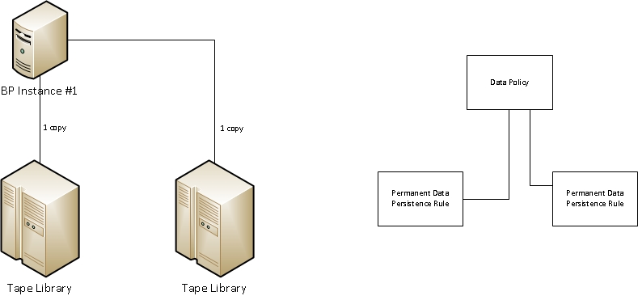

Next, consider the diagram below. This is what the customer needs to migrate / convert to.

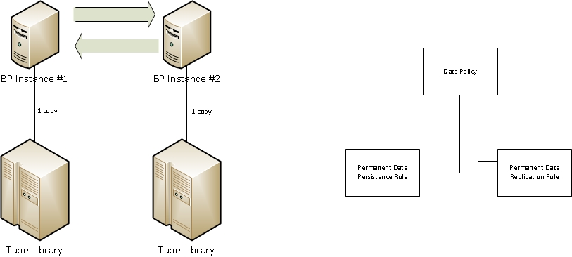

The conversion scenario is as follows:

1.  Stop driving any I/O through the system

2.  Wait for all jobs to complete

3.  Take a database backup on BP instance \#1

4.  Move the tape library for BP instance \#2 to its new physical location and hook it up to BP instance \#2

5.  Power on the BP instance \#2

6.  Restore the database backup from step \#3 onto BP instance \#2

7.  Reset the instance id on BP instance \#2

8.  Register BP instance \#2 as a target on BP instance \#1 and vice versa (optionally, to only have to do registration once on a single BP, use pair-back)

9.  Convert the now-remote storage domain to a DS3 target on each BP

10. Unquiesce and activate each BP

Note that, by converting a storage domain to a DS3 target, the following will occur:

1.  The storage domain will go away

2.  Any blobs stored via the tapes, pools, etc. for that storage domain will be updated to be stored via the replication target

3.  Any permanent persistence rules targeting the storage domain will be converted to permanent replication rules targeting the DS3 target

4.  Any temporary or retired persistence rules targeting the storage domain will be deleted

<!-- end list -->

1.  
## Bluestorm Database Backup Policy

Database backup buckets require a data policy – just like any other bucket.

### Data Policy Selection

The management path will provide a mechanism to configure the data policy for database backup. Until this is configured, database backup cannot occur. The management path may choose to auto-generate an empty data policy and select this policy, then inform the user they need to configure it. We can always generate a message that database backups require data policy configuration until it’s configured.

Once the data policy is configured for database backups, it can’t be changed via the DS3 API (note however that the GUI can permit this by using a security override flag in its delete request it makes). This is because all database backups will occur under the same bucket, and that bucket cannot be deleted or modified by any user. The GUI could allow the database backup bucket to have its data policy changed and do so as an internal request, but even in this case, the change would undergo the same scrutiny and validations as any data policy change for a bucket, verifying the new data policy is compatible with the old. Alternatively, the GUI could delete the old bucket, then create a new bucket for database backups under the new data policy. This would of course create a window of vulnerability. Another option would be to leave the old one there, then create a new temp one, put a backup there, then do the delete and create.

### Bucket Modification

The Bluestorm database backup bucket is a system bucket and cannot be modified or deleted by the user. Note that the management software stack may provide hooks for users to modify some things on the database backup bucket.

### Data Policy Modification

The Bluestorm database backup policy is a standard data policy and follows all standard rules of a data policy, including that it is fully modifiable by the user. Note that the only thing preventing the data policy from being deleted is that the Bluestorm database backup bucket cannot be deleted or modified and references this data policy.

### Performing Database Backups

Database backups will be initiated and managed entirely by the management software stack, excepting the database backup bucket and data policy creation. Database backups will be sent to Bluestorm internally as S3 objects and will follow all standard data path rules and contracts. Additionally, deletions of old backups will be controlled outside of the front end. As old backups are deleted, space will be reclaimed according to standard algorithms.

# End-to-end CRC

Black Pearl supports end-to-end CRC. The data policy section details configurable parameters related to end-to-end CRC and CRC types supported. This section describes how at a high level end-to-end CRC is achieved. Note that end-to-end CRC is not required, although it can be configured to be required on a per-data-policy basis.

Keep in mind that end-to-end CRC means that when we provide data back to a client, that we include a CRC with that data that came from the originating client. Or in other words, end-to-end refers to client-to-client, or from the beginning of inception of the data to the end of it coming back. The requirement behind end-to-end CRC is to provide an absolute guarantee that data, if retrieved, has not been corrupted and/or tampered with (for protection against tampering and not just corruption, a cryptographically secure checksum must be used).

The flow chart below demonstrates how end-to-end CRC functions as data is being written.

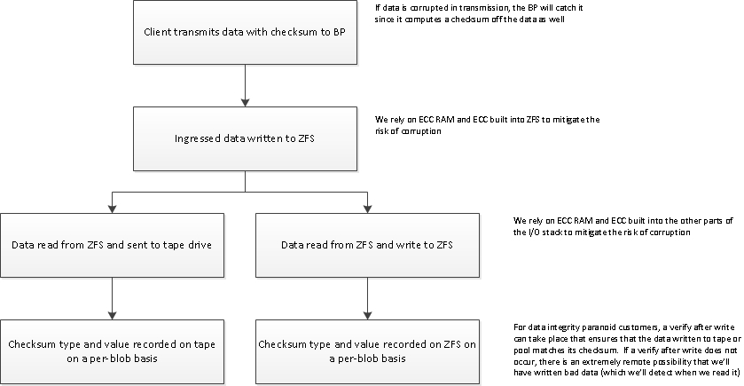

The flow chart below demonstrates how end-to-end CRC functions as data is being read.

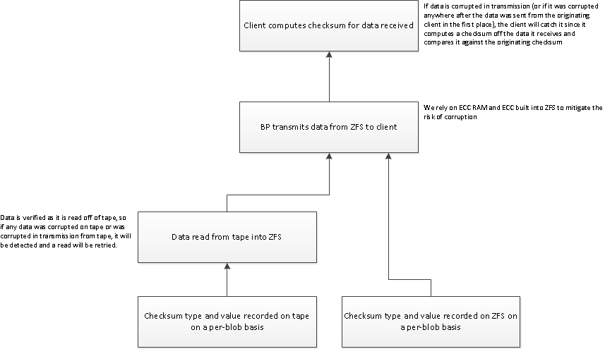

## Objects Broken Up into Blobs

Checksums are recorded and end-to-end CRC offered on a per-blob basis and not on a per-object basis. This means that for objects broken up into multiple blobs that there will be N CRCs, where N is the number of blobs making up the object.

## Partial Object GETs and End-to-End CRC

I order to achieve true end-to-end CRC for a partial object GET, an entire blob must be gotten so that its end-to-end CRC can be verified.

# Advanced Cache Management

There have been numerous proposals surrounding enhancements to cache management. This section describes how we want to enhance the cache and the specific cache enhancements planned.

## Cache Intended Design

First and foremost, the intended design of the cache is to cache data between the client and the tapes. Or in other words, we want the Bluestorm cache to be a cache in the same sense that ZFS has an in-memory cache of data on pool.

Specifically, we want to avoid any cache enhancements, features, or hooks that would complicate or violate the cache as being exactly that: a cache. Or, in other words, just as ZFS does not allow you to “pin” data into the cache, we will not. But, just as ZFS allows a client to advise it that some data may be accessed very soon, we may consider the same (although there are currently no plans to do so), understanding that, just as with ZFS, no guarantee would be provided to the user that the data would be pinned in the cache. It is just an advisement.

Furthermore, the cache is not intended to cache data going to or from pool partitions. Pool partitions do not require a cache, and using the cache for pool partitions will only reduce overall system performance.

## Cache Enhancements

These are the enhancements currently planned:

1.  Prefer retention of very small blobs over larger ones

2.  Prefer retention of frequently or recently accessed blobs over less frequently or recently accessed blobs

3.  Do not clear more data out of the cache than necessary to free up space needed

4.  Clear data in the cache on a separate thread from cache space allocation

## Staging Large Working Sets on Tape to Pool

For users who want to have a very deep “working set” (or in other words, want to stage a significant amount of data from tape to pool before it is actually needed and ensure it does not get prematurely released), a temporary persistence rule to pool should be used. There are numerous facilities (described elsewhere in this document) by which we can allow a user to perform such staging using a temporary persistence rule such that a user can take a large working set and copy it into pool before it is actually needed.

# Advanced Tape Management

There have been numerous proposals surrounding enhancements to tape management. This section describes how we want to enhance the management of tapes.

## Tape Compaction

If a tape has 2.5TB written to it, then 2TB of that data is deleted, that 2TB cannot be reclaimed on the tape. We can however reclaim this space by copying the 0.5TB of data not deleted to another tape, then formatting the entire original tape and re-using it.

There are numerous complexities to consider when designing and implementing this feature:

1.  The same database backup invalidation that we perform when a storage domain member is excluded applies to tape compaction. Consider the following events:
    
    1.  Data is written to tape A
    
    2.  Database backup is made
    
    3.  Data is compacted from tape A to tape B; tape A is re-formatted
    
    4.  Database is backup is restored
    
    5.  A GET request comes in for data that we think is on tape A, but it’s nowhere to be found – not that we’ll even get that far since we’ll get a checkpoint mismatch from the tape first

2.  Secure bucket isolation mode for data policies must strictly prohibit tape compaction, or re-allocate the original tape back to itself once a format is completed

3.  Taking the system down, which could occur by using all tape drives to ingest data to compact into the data planner cache, filling up the cache, and then having the system live lock must not be allowed

4.  Compaction should be prioritized such that it minimizes impact on any system I/O, preferably not adversely impacting it at all

## MLM Integration

By integrating with MLM, we will be able to determine tape health information and rebuild a tape that is going bad onto another tape before it’s too late. The tape going bad should be marked as being in an error state once the rebuild is completed so that we don’t try to use the tape in the future for anything.

## Bluescale Integration

Rather than requiring the customer to log into the tape library for some things and into Bluestorm for other things, it is better to support the full set of tape library capabilities and GUI screens from within Bluestorm.

This could be a significant undertaking in that the tape library management software stack needs to be architected to the level of decoupling necessary to enable integration in a highly maintainable manner, or we will likely suffer a significant entropy increase in the tape library management software stack, increasing the bug rate and long-term costs to maintain and support the code base. Specifically, there will need to be a very clean separation between GUI code and the API calls that the GUI makes to perform operations in the Bluescale management software stack.

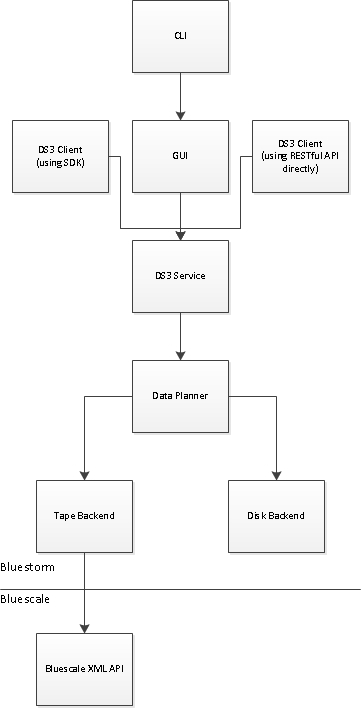

The diagram above shows the initial integration with Bluescale with the existing XML interface. If we attempt to fully integrate Bluestorm with Bluescale using this API and the Bluescale GUI does not use this API, then we’ve increased the maintenance burden of the Bluescale code base and will likely see inconsistencies between the API Bluestorm uses and the API the Bluescale GUI uses.

Accordingly, we probably want to move toward a more consistent, decoupled architecture, as shown in the diagram below.

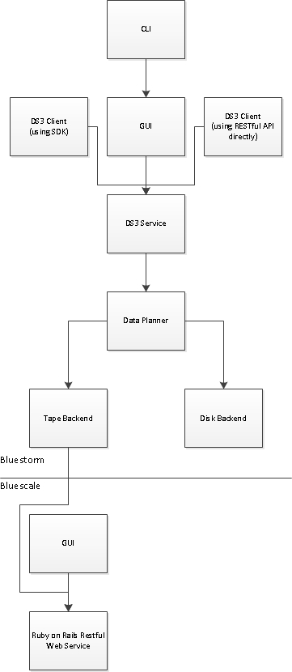

Note that, in the diagram above, both the Bluescale GUI and Bluestorm use the same API layer.

## Advanced Error Diagnostics

Scratch tapes may be used in a tape partition to diagnose tape drives that appear to be having problems.

How we allocate scratch tapes, which diagnostics to perform, and when are all things that need to be discussed further and outlined here.

# Auto-Generated Storage Domains and Data Policies

We believe that most (\>90%) customers will have one of the following data store configurations:

1.  Tape with a single tape partition

2.  Archive pool storage (Arctic Blue) with up to 4 JBODs

3.  Tape with a single tape partition combined with archive pool (Arctic Blue) with up to 4 JBODs

Given all of this, the data path will auto-generate storage domains and data policies for these common configurations. Since a storage domain cannot be created unless it includes at least one data partition member, we must wait to auto-generate these members until we can actually create them.

The data path may only create storage domains and data policies as a one-time event per data partition type that came online. For example, if storage domains and data policies are created for tape, then the customer deletes those policies, the data path cannot create them again.

Auto-generated storage domains and data policies may not be created all at once. For example, if the tape backend suddenly reports a single tape partition and there are no pool partitions at that time, only the storage domains and data policies for tape would be auto-generated. If a single pool partition comes on later, additional storage domains and data policies would be auto-generated.

## Auto-Generated Tape Storage Domains and Data Policies

If there is precisely one tape partition with one type of media, the data path shall auto-generate storage domains and data policies as follows:

Storage domains:

1.  Tape Storage

2.  Tape Storage - Second Copy

Data policies:

1.  Single Copy (Tape)
    
    1.  Permanent persistence rule using “Tape Storage”

2.  Double Copy (Tape)
    
    1.  Permanent persistence rule using “Tape Storage”, AND
    
    2.  Permanent persistence rule using “Tape Storage – Second Copy”

## Auto-Generated Pool Storage Domains and Data Policies

If there is precisely one pool partition, the data path shall auto-generate storage domains and data policies as follows:

Storage domains:

1.  Pool Storage

Data policies:

1.  Single Copy (Pool)
    
    1.  Permanent persistence rule using “Pool Storage”

## Auto-Generated Tape+Pool Storage Domains and Data Policies

If there is precisely one tape partition with one type of media, as well as precisely one pool partition, the data path shall auto-generate storage domains and data policies as follows:

Storage domains:

(none)

Data policies:

1.  Double Copy (Tape + Pool)
    
    1.  Permanent persistence rule using “Pool Storage”, AND
    
    2.  Permanent persistence rule using “Tape Storage”

# User Task Flows

This section details some user task flows that need to be handled and how they would be handled.

## Initial Setup Task Flows

### Customer Has Single LTO5 Partition and Wants to Setup Single Copy

Consider the case that a customer has:

1.  A single tape partition with LTO 5 media only

2.  LTO 5 tape drives only

The steps the customer would need to take to achieve the desired outcome are:

1.  Create a storage domain and include the single tape partition specifying LTO 5 as the media type to include

2.  Create a data policy with a single permanent persistence rule pointing to the storage domain just created

3.  Create buckets as necessary, referring to the data policy just created as the data policy to use for each bucket

### Customer Has Single LTO5 Partition and Wants to Setup Double Copy

Consider the case that a customer has:

1.  A single tape partition with LTO 5 media only

2.  LTO 5 tape drives only

The steps the customer would need to take to achieve the desired outcome are:

1.  Create a storage domain and include the single tape partition specifying LTO 5 as the media type to include
    
    1.  We will call this storage domain A

2.  Create a storage domain and include the single tape partition specifying LTO 5 as the media type to include
    
    1.  We will call this storage domain B

3.  Create a data policy with a two permanent persistence rules
    
    1.  One rule points to storage domain A
    
    2.  One rule points to storage domain B

4.  Create buckets as necessary, referring to the data policy just created as the data policy to use for each bucket

### Customer Has Single JBOD and Wants to Setup Single Copy

Consider the case that a customer has:

1.  A single JBOD

The steps the customer would need to take to achieve the desired outcome are:

1.  Create a pool partition, selecting the single JBOD’s zpools

2.  Create a storage domain and include the pool partition created in the previous step

3.  Create a data policy with a single permanent persistence rule pointing to the storage domain just created

4.  Create buckets as necessary, referring to the data policy just created as the data policy to use for each bucket

### Customer Has Single JBOD and Wants to Setup Double Copy

Consider the case that a customer has:

1.  A single JBOD

The customer wants each copy to go to a different zpool within the same enclosure. That way, if one zpool fails, hopefully the others are not impacted and the other copy will survive.

The steps the customer would need to take to achieve the desired outcome are:

1.  Create a pool partition, selecting the single JBOD’s zpools

2.  Create a storage domain and include the pool partition created in the first step
    
    1.  We will call this storage domain A

3.  Create a storage domain and include the pool partition created in the first step
    
    1.  We will call this storage domain B

4.  Create a data policy with a two permanent persistence rules
    
    1.  One rule points to storage domain A
    
    2.  One rule points to storage domain B

5.  Create buckets as necessary, referring to the data policy just created as the data policy to use for each bucket

### Customer Has Two JBODs and Wants to Setup Single Copy

Consider the case that a customer has:

1.  Two JBODs

The steps the customer would need to take to achieve the desired outcome are:

1.  Create a pool partition, selecting the both JBODs’ zpools

2.  Create a storage domain and include the pool partition created in the first step

3.  Create a data policy with a single permanent persistence rule pointing to the storage domain just created

4.  Create buckets as necessary, referring to the data policy just created as the data policy to use for each bucket

### Customer Has Two JBODs and Wants to Setup Double Copy

Consider the case that a customer has:

1.  Two JBODs

The customer wants one copy to go onto one JBOD and the other copy to go on the other JBOD. This improves the fault tolerance from surviving a zpool failure to surviving an entire JBOD failure i.e. if a zpool or JBOD fails, the hope is that the other JBOD with a different zpool holding the other copy will survive.

The steps the customer would need to take to achieve the desired outcome are:

1.  Create a pool partition, selecting one JBOD’s zpools
    
    1.  We will call this pool partition 1

2.  Create a pool partition, selecting the other JBOD’s zpools
    
    1.  We will call this pool partition 2

3.  Create a storage domain and include pool partition 1
    
    1.  We will call this storage domain A

4.  Create a storage domain and include pool partition 2
    
    1.  We will call this storage domain B

5.  Create a data policy with a two permanent persistence rules
    
    1.  One rule points to storage domain A
    
    2.  One rule points to storage domain B

6.  Create buckets as necessary, referring to the data policy just created as the data policy to use for each bucket

### Customer Has Single LTO 5 Tape Partition and Single JBOD and Desires Dual Copy on Tape Plus Temporary Pool Copy

Consider the case that a customer has:

1.  A single LTO 5 tape partition

2.  Only LTO 5 tape drives

3.  A single JBOD

The customer wants two copies going to tape permanently, but also wants one copy going to pool to reside there for 30 days. The pool copy is for performance reasons.

The steps the customer would need to take to achieve the desired outcome are:

1.  Create a pool partition, selecting the single JBOD’s zpools

2.  Create a storage domain and include the single tape partition specifying LTO 5 as the media type to include
    
    1.  We will call this storage domain A

3.  Create a storage domain and include the single tape partition specifying LTO 5 as the media type to include
    
    1.  We will call this storage domain B

4.  Create a storage domain and include the single pool partition
    
    1.  We will call this storage domain C

5.  Create a data policy
    
    1.  Specify two permanent persistence rules
        
        1.  One rule points to storage domain A
        
        2.  One rule points to storage domain B
    
    2.  Specify a single temporary persistence rule
        
        1.  Point to storage domain C
        
        2.  Specify 30 days as the retention period

6.  Create buckets as necessary, referring to the data policy just created as the data policy to use for each bucket

### Customer wants to back up the Bluestorm Database Onsite

Consider the case that a customer has:

1.  A tape partition with LTO 5 media only

2.  LTO 5 tape drives only

3.  Multiple storage domains defined

By default, we will back up the Bluestorm database to the first storage domain that the customer creates. But let’s say that the customer wants to have multiple copies of the backup onsite. The customer would need to configure the data policy for database backups the same way the customer would configure any other data policy.

The Bluestorm database backup data policy is configured as follows:

1.  Additional permanent persistence rules are created
    
    1.  One to each storage domain the customer would like a backup on

Note that this mechanism allows the customer to have 1, 2, 3, or more copies of the backup onsite.

### Customer wants to Physically Shred Tapes Belonging to Single Bucket Once Done

Consider the case that a customer has:

1.  A tape partition with LTO 5 media only

2.  LTO 5 tape drives only

3.  2 storage domains, each pointing to the single tape partition

4.  1 data policy (DP) that has 2 permanent persistence rules with STANDARD bucket isolation

5.  1 data policy (DPS) that has 2 permanent persistence rules with SECURE bucket isolation

6.  5 buckets (not yet created): A, B, C, D, and SecureBucket

The customer does not want data for SecureBucket to be mixed with any other bucket on any tapes. It is ok for data to be mixed on the same tape between buckets A, B, C, and D. Double redundancy is desired (hence, the 2 storage domains). The customer must shred all physical media that SecureBucket has touched when SecureBucket is deleted.

To meet the objectives above, the customer would:

1.  Create buckets A, B, C, and D
    
    1.  Use data policy DP

2.  Create bucket SecureBucket
    
    1.  Use data policy DPS

### Customer wants to Eject Media Associated with Single Bucket Without Affecting Other Buckets

Consider the case that a customer has:

1.  A tape partition with LTO 5 media only

2.  LTO 5 tape drives only

3.  2 storage domains, each pointing to the single tape partition

4.  1 data policy (DP) that has 2 permanent persistence rules with STANDARD bucket isolation

5.  1 data policy (DPS) that has 2 permanent persistence rules with BUCKET\_ISOLATED bucket isolation

6.  5 buckets (not yet created): A, B, C, D, and FrequentlyEjectedBucket

The customer does not want data for FrequentlyEjectedBucket to be mixed with any other bucket on any tapes. It is ok for data to be mixed on the same tape between buckets A, B, C, and D. Double redundancy is desired (hence, the 2 storage domains). The customer wants to be able to eject FrequentlyEjectedBucket without impacting other buckets’ data.

To meet the objectives above, the customer would:

1.  Create buckets A, B, C, and D
    
    1.  Use data policy DP

2.  Create bucket FrequentlyEjectedBucket
    
    1.  Use data policy DPS

## Replication Setup Task Flows

### Bi-Directional Replication with Two Sites

Consider the case that a customer has 2 sites. One is a primary and one is a secondary. The customer wants all data replicated between these 2 sites (P for primary, S for secondary). P will receive most of the writes and reads, and S will be used primarily for whenever P goes offline. There is a high-speed WAN between P and S. For this reason, the customer has:

1.  At site P, a single tape partition with LTO 5 media only (customer wants to store a single copy on tape)

2.  At site P, a number of Arctic Blue JBODs for faster data recall (customer wants to store a single copy on pool)

3.  At site S, a single tape partition with LTO 5 media only (customer wants to store dual copies on tape)

The steps the customer would need to take to achieve the desired outcome are:

1.  Create a storage domain at P and include the single tape partition specifying LTO 5 as the media type to include
    
    1.  We will call this storage domain PT

2.  Create a pool partition at P and include all Arctic Blue pools in it

3.  Create a storage domain and include the Arctic Blue pool partition created in the previous step
    
    1.  We will call this storage domain PP

4.  Create a storage domain at S and include the single tape partition specifying LTO 5 as the media type to include
    
    1.  We will call this storage domain SA

5.  Create a storage domain at S and include the single tape partition specifying LTO 5 as the media type to include
    
    1.  We will call this storage domain SB

6.  Create a DS3 target at P for S, and at S for P

7.  Create a data policy at P with three permanent persistence rules
    
    1.  One rule points to storage domain PT
    
    2.  One rule points to storage domain PP
    
    3.  One rule points to the DS3 target created for S at P

8.  Create a data policy at S with three permanent persistence rules
    
    1.  One rule points to storage domain SA
    
    2.  One rule points to storage domain SB
    
    3.  One rule points to the DS3 target created for P at S

9.  Create buckets as necessary, referring to the data policy just created as the data policy to use for each bucket
    
    1.  Buckets can be created at either site and will be auto-created at the DS3 target as necessary

##   

## Migration Task Flows

### Customer Has LTO5 and Wants to Upgrade to LTO6 without Migrating

Consider the case that a customer has:

1.  A tape partition with LTO 5 media only

2.  LTO 5 tape drives only

The customer has upgraded as follows:

1.  All LTO 5 tape drives have been replaced with LTO 6 tape drives

2.  Some LTO 6 tapes have been added into the partition

3.  Customer wants to continue to use LTO 5 and LTO 6

In this scenario, the customer started off with:

1.  A storage domain that contained the tape partition as a member for LTO 5 media

The customer would need to:

1.  Add the tape partition as a member to the storage domain for LTO 6 media

2.  If the customer desires LTO 5 or LTO 6 media to be preferred over the other for future data writes, customer must select the write preferences to use for each of the 2 members of the storage domain
    
    1.  For example, if the customer wants to use LTO 6 for future data, the customer could set the write preference for LTO 5 to NORMAL and LTO 6 to HIGH

### Customer Has LTO5 and Wants to Upgrade to LTO7 with Migration and No Reclaim

Consider the case that a customer has:

1.  A tape partition with LTO 5 media only

2.  LTO 5 tape drives only

The customer has upgraded as follows:

1.  All LTO 5 tape drives have been replaced with LTO 7 tape drives

2.  Some LTO 7 tapes have been added into the partition

3.  Customer wants to migrate to LTO 7

The customer wants the LTO 5 copy to be untouched, but wants all data copied over to LTO 7. Any new data coming in should go to LTO 7 only, but we should be able to read from LTO 5 if and when necessary.

In this scenario, the customer started off with:

1.  A storage domain that contained the tape partition as a member for LTO 5 media
    
    1.  We’ll call this storage domain “SD-LTO5”

2.  A data policy that contains a single permanent persistence rule for “SD-LTO5”

The customer would need to:

1.  Create another storage domain and add the tape partition as a member for LTO 7 media
    
    1.  We’ll call this storage domain “SD-LTO7”

2.  Create a new permanent persistence rule in the data policy for “SD-LTO7”

3.  Wait until the new permanent persistence rule’s state becomes NORMAL
    
    1.  Requires that all data from “SD-LTO5” is copied over to “SD-LTO7”

4.  Change the persistence rule for “SD-LTO5” from permanent to retired

The 4 steps above will work if no data is being ingressed during the process, but if data is being ingressed during this process, failures will be generated since there is only a single permanent persistence rule in state NORMAL and we can’t write to the LTO 5 media in that storage domain, or in other words, the data is not properly protected (the inclusion of “SD-LTO7” could be cancelled, in which case we’d lose this data if we released it in the Bluestorm cache). Thus, any ingressed data cannot be released by the Bluestorm cache.

If data does need to be ingressed during the process, we will add a step before \#3: Add the tape partition as a member to “SD-LTO5” for LTO 7 media, then after step \#4: Exclude the tape partition as a member from “SD-LTO5” for LTO 7 media. Note that these 2 extra steps do not require migrations, and thus, are very quick. Also note that the step we added before \#1 could be added at any time before step \#3, so if the user started off with the 4 steps above, then got the failures about not being able to write to “SD-LTO5”, the user could add this step at that time and things will be fine.

### Customer Has LTO5 and Wants to Upgrade to LTO7 with Migration and Reclaim

Consider the case that a customer has:

1.  A tape partition with LTO 5 media only

2.  LTO 5 tape drives only

The customer has upgraded as follows:

1.  All LTO 5 tape drives have been replaced with LTO 7 tape drives

2.  Some LTO 7 tapes have been added into the partition

3.  Customer wants to migrate to LTO 7

The customer does not care about the old LTO 5 copy of data and would like those tapes reclaimed. While these tapes cannot be used in this partition since the partition only has LTO 7 drives which can’t write to LTO 5 media, the customer can eject the media after the migration and use them for another purpose.

In this scenario, the customer started off with:

1.  A storage domain that contained the tape partition as a member for LTO 5 media

The customer would need to:

1.  Add the tape partition as a member to the storage domain for LTO 7 media

2.  Exclude the tape partition as a member to the storage domain for LTO 5 media

3.  Wait for the excluded partition to actually be excluded and removed from the storage domain

### Customer Has LTO5 and Wants to Upgrade to Pool without Migrating

Consider the case that a customer has:

1.  A tape partition with LTO 5 media only

2.  LTO 5 tape drives only

The customer has upgraded as follows:

1.  A JBOD has been purchased and attached to Bluestorm

2.  Customer wants to continue to use LTO 5, but for new data to go to pool

In this scenario, the customer started off with:

1.  A storage domain that contained the tape partition as a member for LTO 5 media

The customer would need to:

1.  Create a pool partition, selecting the single JBOD’s zpools

2.  Add the pool partition as a member to the storage domain

3.  Set the write preference of the pool partition higher than the LTO 5 partition

### Customer Has LTO5 and Wants to Upgrade to Pool with Migration

Consider the case that a customer has:

1.  A tape partition with LTO 5 media only

2.  LTO 5 tape drives only

The customer has upgraded as follows:

1.  A JBOD has been purchased and attached to Bluestorm

2.  Customer wants to migrate to pool

In this scenario, the customer started off with:

1.  A storage domain that contained the tape partition as a member for LTO 5 media

The customer would need to:

1.  Create a pool partition, selecting the single JBOD’s zpools

2.  Add the pool partition as a member to the storage domain

3.  Exclude the tape partition as a member to the storage domain for LTO 5 media

4.  Wait for the excluded partition to actually be excluded and removed from the storage domain
    
    1.  The exclusion is the step that initiates the data migration to pool

### Customer Has JBOD and Wants to Migrate to Newer JBOD

Consider the case that a customer has:

1.  A single JBOD

The customer has upgraded as follows:

1.  Purchased a new, higher-capacity, higher-performance JBOD

2.  Customer wants to migrate from the old JBOD to the new one

In this scenario, the customer started off with:

1.  A single pool partition, called pool partition 1, which contains all zpools in the original JBOD

2.  A storage domain that contained the single pool partition

The customer would need to:

1.  Create a pool partition, selecting the new JBOD’s zpools
    
    1.  We will call this pool partition 2

2.  Add pool partition 2 as a member to the storage domain

3.  Exclude pool partition 1 as a member to the storage domain

4.  Wait for the excluded partition to actually be excluded and removed from the storage domain

5.  Quiesce the old JBOD’s zpools

6.  Physically remove the old JBOD from Bluestorm

## Ejection Task Flows

### Customer wants to back up the Bluestorm Database Offsite

Consider the case that a customer has:

1.  A tape partition with LTO 5 media only

2.  LTO 5 tape drives only

The customer wants to have a single offsite backup of the Bluestorm database.

The Bluestorm database backup is configured as follows:

1.  Create a storage domain for the offsite backups of the Bluestorm database
    
    1.  SDE will be one rotating backup set and will have an ejected media policy of AUTO-EJECT

2.  Update the data policy for Bluestorm Database Backup by adding a permanent persistence rule pointing to the storage domain SDE

Task flow for rotating backups:

1.  Update the Bluestorm database backup data policy as described above

2.  (time passes)

3.  A number of tapes in SDE are queued for ejection
    
    1.  User physically ejects tapes for SDE
    
    2.  User ships ejected tapes for SDE to offsite facility

4.  (time passes)

5.  A number of tapes in SDE are queued for ejection
    
    1.  User physically ejects tapes for SDE
    
    2.  User ships ejected tapes for SDE to offsite facility

6.  (time passes)

7.  …

Note that the user could bring in very old tapes for the database backup from the offsite facility, at which point, they will be reclaimed and re-used for something else.

### Customer Has Single Backup for Disaster Recovery

Consider the case that a customer has:

1.  A tape partition with LTO 5 media only

2.  LTO 5 tape drives only

3.  A single copy of the data online in the library

4.  A single copy of the data at a secure, offsite facility
    
    1.  Data must reside at the offsite facility at all times, unless the disaster recovery plan is being executed

The customer wants media to be queued for ejection periodically, perhaps once tapes become full, or according to some periodic schedule.

The customer must:

1.  Create 2 storage domains for the tape partition
    
    1.  SDO will be the online storage domain and will have an ejected media policy of DISALLOWED
    
    2.  SDE will be one rotating backup set and will have an ejected media policy of AUTO-EJECT

2.  Create a data policy with 2 permanent persistence rules to each of the 2 storage domains

Task flow for rotating backups:

1.  Initial configuration

2.  (time passes)

3.  A number of tapes in SDE are queued for ejection
    
    1.  User physically ejects tapes for SDE
    
    2.  User ships ejected tapes for SDE to offsite facility

4.  (time passes)

5.  A number of tapes in SDE are queued for ejection
    
    1.  User physically ejects tapes for SDE
    
    2.  User ships ejected tapes for SDE to offsite facility

6.  (time passes)

7.  …

### Customer Has Rotating Backups for Disaster Recovery

Consider the case that a customer has:

1.  A tape partition with LTO 5 media only

2.  LTO 5 tape drives only

3.  A single copy of the data online in the library

4.  Two copies of the data that rotate at a secure, offsite facility
    
    1.  One copy of the data is required to be at the offsite facility at all times
    
    2.  The other copy can be in the tape library or in transit from the library to offsite facility

The customer must:

1.  Create 3 storage domains for the tape partition
    
    1.  SDO will be the online storage domain and will have an ejected media policy of DISALLOWED
    
    2.  SDE1 will be one rotating backup set and will have an ejected media policy of ALLOWED
    
    3.  SDE2 will be one rotating backup set and will have an ejected media policy of ALLOWED

2.  Create a data policy with 3 permanent persistence rules to each of the 3 storage domains

Task flow for rotating backups:

1.  Initial configuration

2.  (time passes)

3.  Eject SDE1, ship it to offsite facility

4.  (time passes)

5.  Eject SDE2, ship it to offsite facility

6.  Bring SDE1 back to library and bring it online
    
    1.  Note that SDE1 stayed online the entire time and new data was written to new tapes ready to be ejected for the rotating backup
    
    2.  Any tapes on SDE1 that have had all their objects deleted will be reclaimed

7.  (time passes)

8.  Eject SDE1, ship it to offsite facility

9.  Bring SDE2 back to library and bring it online
    
    1.  …

## Media Reclamation Task Flows

This section covers media reclamation from the perspective of data deletion only.

This section does not enumerate any migration, data policy modification, or storage domain modification task flows that would involve media reclamation, including but not limited to persistence rule inclusion and exclusion or storage domain membership inclusion or exclusion, as these task flows are covered in detail in the “Migration Task Flows” section.

### Customer Deletes Data from Bucket with STANDARD Isolation and Wants to Reclaim Space on Tape

Consider the case that a customer has:

1.  A single tape partition with LTO 6 media only

2.  LTO 6 tape drives only

3.  5 LTO 6 tapes

4.  A single storage domain “Tape” that includes the single tape partition for LTO 6 media

5.  Bucket “Engineering” using a data policy with a STANDARD isolation policy and a single permanent persistence rule going to storage domain “Tape”

When data is written to the bucket, tape(s) must be allocated to storage domain “Tape”. Let’s say that 10TB is written to the bucket and we allocate 4 tapes to storage domain “Tape” and write the data out there.

Now, the user deletes 4TB of data from the bucket. Let’s say that, out of our original 4 tapes with 2.5TB of data each, that data is deleted as follows for the 4 tapes:

1.  No data deleted (still has all 2.5TB of data)

2.  No data deleted (still has all 2.5TB of data)

3.  1.5TB data deleted (still has 1TB of data)

4.  All data deleted (has no data)

In this case, tapes 1-3 would not be reclaimed. Furthermore, tape 3 would not have any of the 1.5TB of data on it deleted. We would simply record that this 1.5TB of data has been deleted in the Bluestorm database. Tape 4 would be reclaimed (and re-formatted), its storage domain assignment released, and made available to any storage domain for allocation.

### Customer Deletes Data from Bucket with STANDARD Isolation and Wants to Reclaim Space on Pool

Consider the case that a customer has:

1.  A single JBOD

2.  5 zpools with a capacity of 2.5TB each

3.  A single pool partition, which includes all 5 zpools

4.  A single storage domain “Pool” that includes the single pool partition

5.  Bucket “Engineering” using a data policy with a STANDARD isolation policy and a single permanent persistence rule going to storage domain “Pool”

When data is written to the bucket, tape(s) must be allocated to storage domain “Pool”. Let’s say that 10TB is written to the bucket and we allocate 4 zpools to storage domain “Pool” and write the data out there.

Now, the user deletes 4TB of data from the bucket. Let’s say that, out of our original 4 zpools with 2.5TB of data each, that data is deleted as follows for the 4 zpools:

1.  No data deleted (still has all 2.5TB of data)

2.  No data deleted (still has all 2.5TB of data)

3.  1.5TB data deleted (still has 1TB of data)

4.  All data deleted (has no data)

In this case, zpools 1-2 would not be affected; however, zpool 3 would have the 1.5TB of data on it deleted. The now free 1.5TB on zpool 3 can be used by any bucket using storage domain “Pool” with an isolation level of STANDARD. Zpool 4 would be reclaimed, its storage domain assignment released, and made available to any storage domain for allocation.

### Customer Deletes Data from Bucket with BUCKET\_ISOLATED Isolation and Wants to Reclaim Space on Tape

Consider the case that a customer has:

1.  A single tape partition with LTO 6 media only

2.  LTO 6 tape drives only

3.  5 LTO 6 tapes

4.  A single storage domain “Tape” that includes the single tape partition for LTO 6 media

5.  Bucket “Engineering” using a data policy with a BUCKET\_ISOLATED isolation policy and a single permanent persistence rule going to storage domain “Tape”

When data is written to the bucket, tape(s) must be allocated to storage domain “Tape”. Furthermore, since the isolation level for the bucket is not STANDARD, the tapes must also be allocated specifically to the bucket, preventing other buckets from using them. Let’s say that 10TB is written to the bucket and we allocate 4 tapes to storage domain “Tape” (as well as the bucket) and write the data out there.

Now, the user deletes 4TB of data from the bucket. Let’s say that, out of our original 4 tapes with 2.5TB of data each, that data is deleted as follows for the 4 tapes:

1.  No data deleted (still has all 2.5TB of data)

2.  No data deleted (still has all 2.5TB of data)

3.  1.5TB data deleted (still has 1TB of data)

4.  All data deleted (has no data)

In this case, tapes 1-3 would not be reclaimed. Furthermore, tape 3 would not have any of the 1.5TB of data on it deleted. We would simply record that this 1.5TB of data has been deleted in the Bluestorm database. Tape 4 would be reclaimed (and re-formatted), its storage domain assignment released, and made available to any storage domain for allocation.

### Customer Deletes Data from Bucket with BUCKET\_ISOLATED Isolation and Wants to Reclaim Space on Pool

Consider the case that a customer has:

1.  A single JBOD

2.  5 zpools with a capacity of 2.5TB each

3.  A single pool partition, which includes all 5 zpools

4.  A single storage domain “Pool” that includes the single pool partition

5.  Bucket “Engineering” using a data policy with a BUCKET\_ISOLATED isolation policy and a single permanent persistence rule going to storage domain “Pool”

When data is written to the bucket, zpool(s) must be allocated to storage domain “Pool”. Furthermore, since the isolation level for the bucket is not STANDARD, the zpools must also be allocated specifically to the bucket, preventing other buckets from using them. Let’s say that 10TB is written to the bucket and we allocate 4 zpools to storage domain “Pool”(as well as the bucket) and write the data out there.

Now, the user deletes 4TB of data from the bucket. Let’s say that, out of our original 4 zpools with 2.5TB of data each, that data is deleted as follows for the 4 zpools:

1.  No data deleted (still has all 2.5TB of data)

2.  No data deleted (still has all 2.5TB of data)

3.  1.5TB data deleted (still has 1TB of data)

4.  All data deleted (has no data)

In this case, zpools 1-2 would not be affected; however, zpool 3 would have the 1.5TB of data on it deleted. The zpool’s assignment to the bucket is not released, which means that the now free 1.5TB on zpool 3 can only be used by the aforementioned bucket. Zpool 4 would be reclaimed, its storage domain and bucket assignments released, and made available to any storage domain for allocation.

### Customer Deletes Data from Bucket with BUCKET\_ISOLATED Isolation and Secure Media Allocation and Wants to Reclaim Space on Tape

Consider the case that a customer has:

1.  A single tape partition with LTO 6 media only

2.  LTO 6 tape drives only

3.  5 LTO 6 tapes

4.  A single storage domain “Tape” that includes the single tape partition for LTO 6 media

5.  Bucket “Engineering” using a data policy with a BUCKET\_ISOLATED isolation policy and a single permanent persistence rule going to storage domain “Tape”, which has secure media allocation enabled on it

When data is written to the bucket, tape(s) must be allocated to storage domain “Tape”. Furthermore, since the isolation level for the bucket is not STANDARD, the tapes must also be allocated specifically to the bucket, preventing other buckets from using them. Let’s say that 10TB is written to the bucket and we allocate 4 tapes to storage domain “Tape” (as well as the bucket) and write the data out there.

Now, the user deletes 4TB of data from the bucket. Let’s say that, out of our original 4 tapes with 2.5TB of data each, that data is deleted as follows for the 4 tapes:

1.  No data deleted (still has all 2.5TB of data)

2.  No data deleted (still has all 2.5TB of data)

3.  1.5TB data deleted (still has 1TB of data)

4.  All data deleted (has no data)

In this case, tapes 1-3 would not be reclaimed. Furthermore, tape 3 would not have any of the 1.5TB of data on it deleted. We would simply record that this 1.5TB of data has been deleted in the Bluestorm database. Tape 4 would be reclaimed (and re-formatted); however, neither its storage domain nor bucket assignment will be released, which means that the tape can only be reclaimed by the aforementioned bucket.

If the user desires to reclaim the tape for use by another bucket, the user would have to disable secure media allocation on the storage domain.

Alternatively, the user could reduce the data isolation level from BUCKET\_ISOLATED to STANDARD. This would not make the tape available system-wide, but it would make it available to other tapes using STANDARD data isolation targeting the same storage domain.

### Customer Deletes Data from Bucket with BUCKET\_ISOLATED Isolation and Secure Media Allocation and Wants to Reclaim Space on Pool

Consider the case that a customer has:

1.  A single JBOD

2.  5 zpools with a capacity of 2.5TB each

3.  A single pool partition, which includes all 5 zpools

4.  A single storage domain “Pool” that includes the single pool partition

5.  Bucket “Engineering” using a data policy with BUCKET\_ISOLATED isolation and a single permanent persistence rule going to storage domain “Pool”, which has secure media allocation enabled on it

When data is written to the bucket, zpool(s) must be allocated to storage domain “Pool”. Furthermore, since the isolation level for the bucket is not STANDARD, the zpools must also be allocated specifically to the bucket, preventing other buckets from using them. Let’s say that 10TB is written to the bucket and we allocate 4 zpools to storage domain “Pool”(as well as the bucket) and write the data out there.

Now, the user deletes 4TB of data from the bucket. Let’s say that, out of our original 4 zpools with 2.5TB of data each, that data is deleted as follows for the 4 zpools:

1.  No data deleted (still has all 2.5TB of data)

2.  No data deleted (still has all 2.5TB of data)

3.  1.5TB data deleted (still has 1TB of data)

4.  All data deleted (has no data)

In this case, zpools 1-2 would not be affected; however, zpool 3 would have the 1.5TB of data on it deleted. The zpool’s assignment to the bucket is not released, which means that the now free 1.5TB on zpool 3 can only be used by the aforementioned bucket. Zpool 4 would be reclaimed; however, neither its storage domain nor bucket assignment will be released, which means that the zpool can only be reclaimed by the aforementioned bucket. It cannot be used by any other bucket or storage domain.

# Features We Intend To Support That Require Scoping

This section details design and architectural proposals made that have been considered and deferred with cause.

## Retention Policies and WORM

There has been discussion surrounding WORM, WORM compliance, and retention policies. The customer requirements need to be developed before functional requirements can be developed to meet customer needs.

We already have WORM in the sense that we never write back over an object, except in the case of deleting the object. This means that meeting customer needs in this area could be as simple as defining a retention policy that prohibits objects from being deleted within the retention period. We could add the retention policy fields onto the data policy business domain, or possibly create a new business domain for it.

It is possible that automatic deletion upon retention period expiration is a requirement. It is possible that we want to define the retention period as a range where different objects can have different retention periods within the range. It is possible that we want a “compliant” retention policy mode where the retention policy cannot be reduced and no administrator operation may be performed that would cause deletion of protected data. Business justification via customer need must be made for these possible requirements prior to incorporating them.

## Regions

We need to organize data partitions and Bluestorm nodes into regions so that once we support clustering, we have an idea as to what the relative cost is of selecting one data store versus another, and can intelligently allocate resources within the same region. We will wait to develop these requirements until clustering requirements are developed.

## Quotas

We may need to limit the size of buckets, folders within buckets, or usage of media by particular buckets or storage domains. We will wait to develop these requirements until we have customer demand and feedback for such features.

## Charge Back

We may need to provide a mechanism for users to generate reports that charge back departments based on their capacity usage. It may be useful to assign a dollar cost per tape, pool, etc. that a user can generate a report based off of to different chargeback groups (in theory, you can imagine placing buckets into chargeback groups). We will wait to develop these requirements until we have customer demand and feedback for such features.

## Restore via Temporary Persistence Rule

We may need to provide a mechanism for users to specify that data that resides solely on tape should be temporarily persisted via a temporary persistence rule on pool. There are multiple mechanisms by which we could provide API support for this, including the Glacier way (<http://docs.aws.amazon.com/AmazonS3/latest/API/RESTObjectPOSTrestore.html>) and the S3 way using storage classes. We will wait to develop these requirements until we have customer demand and feedback for such features.

## Data Encryption

We need to provide a mechanism to encrypt data to tape and pool. Data encryption policies could reside on a data policy or on a bucket.

We will need to determine how to manage the key stores. It is likely that we will want Bluestorm to manage the encryption keys, which would likely be stored in the database.

It is possible to allow the client to manage the keys, but if the client wanted to manage them, the client would probably encrypt the data before sending it to Bluestorm and would be able to decrypt the data read from Bluestorm, taking Bluestorm out of the picture for doing anything wrt encryption, decryption, or key management.

## Object Versioning

Object versioning would require a significant amount of effort including but not limited to increased code complexity, increased state complexity, and increased permutations and code branches, increasing the cost to develop, maintain, and test Bluestorm.

NFI really needs object versioning to function properly. This is a hit, but it’s a hit we need to take.

## S3 Blob Store

A blob store is a physical store for persisting blobs. Currently, we support a tape and pool blob store. There is a desire to also support an AWS S3 blob store. Or in other words, we could support storing objects to AWS S3 as one of our persistence targets.

Depending on how the requirements are scoped for this, this could be a substantial amount of work. What happens if S3 loses data? Can it lose data? And if so, how do we reliably get those notifications? What happens on a database restore locally at Bluestorm? And how do we ensure consistency between S3 and Bluestorm when this happens? How do we handle interruptions during I/O? How do we translate DS3 content into native S3 content for various corner cases in how we handle things differently? How do we ensure Bluestorm is the only one writing to S3 blob stores it owns? And if it can’t, how do we handle cases where things get mucked up?

## DS3 Blob Store (Remote Bluestorm)

It would be nice to be able to replicate data from one Bluestorm to another in a remote location. This could be done by treating the remote Bluestorm as an S3 blob store (and this may indeed be what is necessary initially); however, we know that performance and scalability suffers using native S3 commands against Bluestorm, and so we may want to enhance the communication layer here to improve on those things.

The problems we’d face with a DS3 remote blob store are similar but not identical to the problems we’d face with an S3 blob store. We know we could lose data, and we also know the notification mechanism for this loss is not reliable in the sense that if the primary Bluestorm is down when the remote Bluestorm loses data, we won’t get a notification. Also, how do we ensure everything is sync’d across database restore? We need to ensure consistency. We could add protection against improper use of remote DS3 buckets, which would be a plus. We also wouldn’t have to worry about any cornercase translation issues for content. And we also have job mechanisms to help with transactional integrity of transmits.

## Redundant Array of Inexpensive Tapes (RAIT / RAID for Tape)

The idea of supporting RAID or erasure encoding is appealing, since it would allow us to achieve a measure of redundancy on tape without having to resort to mirroring, which requires 50% overhead. With RAID or erasure encoding, it would be possible to achieve fault protection in a manner similar to ZFS, where the overhead can be reduced significantly below 50%.

Tape RAID and erasure encoding is problematic due to numerous issues, including but not limited to:

1.  Instead of having to load up tapes one at a time (or two at a time in the case of mirroring) to write data, we would have to load up a RAID or erasure encoding tape set
    
    1.  Tape moves are very expensive
    
    2.  What if we only want to write 1GB? We might have to load up 8, 12, or more tapes into drives for the small I/O request

2.  Instead of having to load up tapes one at a time (even in the case of mirroring) to read data, we would have to load up a RAID or erasure encoding tape set
    
    1.  Tape moves are very expensive
    
    2.  What if we only want to read 1GB? We might have to load up 8, 12, or more tapes into drives for the small I/O request

3.  Tapes of the same type have varying lengths (and thus, varying amounts of raw data that can be written to them)
    
    1.  What happens if you hit the end of one tape in the RAID or erasure encoding tape set but not others?

4.  All tapes within a RAID group or erasure encoding tape set must be of the same density to achieve good capacity utilization

5.  The cost of many tape failure scenarios such as dirty heads on tape drives, bad tape drives, and bad tapes are compounded by the fact that we must use more tapes and tape drives to perform the same I/O request as compared to simple mirroring

Dave has come up with an innovative way to achieve RAIT without running into the issues above. A patent is being developed for this RAIT design. The basic idea is that we will be able to support parity RAID across tapes by composing the parity information incrementally on pool across a tape set. Once the desired number of data drives in a RAID has been met, the parity data on pool is written to tape.

When we support RAIT, we will add an attribute to a storage domain tape partition membership. This attribute will be a Boolean flag that determines whether RAIT or traditional tape allocation should occur. The user will see this as a “Tape Protection” field with choices “Parity” and “None”. This flag cannot be modified once the storage domain tape partition membership is created.

# Features Not Supported With No Intent of Ever Supporting

This section details design and architectural proposals made that have been considered and rejected with cause.

## Dedicated Tape Drives for Reads And/Or Writes

Tape drives are only one resource in contention in Bluestorm. Dedicating a tape drive for reads or writes or to a job without dedicating cache space means you may dedicate tape drives that will sit idle because, while there is work to do, they cannot move forward without other resources in contention. If we try to solve that problem, we create other problems. For example, do we dedicate part of the cache? Now, we could starve out jobs that don’t have dedicated resources.

The problem of job prioritization is already solved. Jobs take a priority which specifies how important it is relative to other jobs in the system. We have many facilities for customizing default job priorities via the data policy. We also have the ability to further enhance job prioritization schemes if we find the current approach is inadequate. This would allow us to provision resources internally in a more intelligent way, since it does not expose individual resources up to the API level for the customer to tweak. For example, we could add a “service by deadline” on the job to let Bluestorm know it needs to finish servicing the job by a certain time. We could also add “starvation prevention” attributes and algorithms.

## Read Preference across Multiple Copies

Just as ZFS doesn’t let an I/O reader specify its preference for where the read should occur, we do not provide such a knob in the API. We do provide such a knob for writes since a customer may have a legitimate use case for preferring one storage type over another for placement, but it is up to Bluestorm to optimize reads given the workload in the system, job priorities, etc.

## Identical Tape Layout

Supporting mirroring between tapes such that the physical tapes have an identical layout, or at a minimum, the exact same data on them, creates the advantage that if a tape is destroyed, that only a single tape is required to restore the destroyed data, provided that multiple copies of the data existed in the first place.

There are at least a couple of ways we could achieve identical tape layout:

1.  Add a “data protection” field to a persistence rule with the options of “Standard” and “Double”
    
    1.  “Standard” would behave as normal
    
    2.  “Double would result in mirroring within the storage domain

2.  Require that any copies that span multiple storage domains result in identical copy

Identical tape layout is problematic due to numerous issues, including but not limited to:

1.  Tapes of the same type have varying lengths (and thus, varying amounts of raw data that can be written to them)

2.  When writing data, performance may be adversely impacted since the most optimal way to write the data may not result in an identical tape layout

3.  When writing data, capacity utilization may be adversely impacted since the most optimal way to write the data may not result in an identical tape layout

4.  When reading data, performance may be adversely impacted since there is only one layout of the data

With solution (1), we have the added issue that the purpose of having identical tape layouts is thwarted in that it is most likely that a customer would have their ejected media in a separate storage domain from their online media. This is due to the very nature of what a storage domain is and the problems it can solve. Changing that would significantly alter and perhaps eliminate the very nature of what a storage domain is, requiring that we re-asses the design in ABM as a whole to ensure that we can still meet all the requirements of ABM that a customer has via other mechanisms, many of which we may have to create.

With solution (2), we have the issue that data written in one storage domain is not identical to data written in another storage domain. To introduce a constraint that the layouts are identical when the data is not would result in a far more complex data allocation algorithm, adversely impacting performance and capacity utilization.
